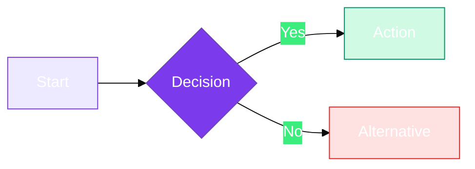

<div align="center" markdown>


# 🤝 Contributing to SaaSIQ Documentation

**Thank you for helping improve SaaSIQ documentation!**

This guide covers conventions, formatting standards, and the review process.

</div>

---

## Table of Contents

- [Getting Started](#getting-started)
- [File Structure Conventions](#file-structure-conventions)
- [Markdown Standards](#markdown-standards)
- [Badge System](#badge-system)
- [Admonition Callouts](#admonition-callouts)
- [Mermaid Diagrams](#mermaid-diagrams)
- [Navigation & Footer](#navigation-footer)
- [Review Process](#review-process)

---

## Getting Started

1. **Fork** the repository
2. **Clone** your fork locally
3. Create a **feature branch** — `docs/your-topic`
4. Make changes following the standards below
5. Submit a **Pull Request**

!!! important
    All documentation files live under `docs/`. Never modify files outside this directory for documentation changes.

---

## File Structure Conventions

### Folder Organization

| Folder | Purpose | Badge Color |
|:-------|:--------|:------------|
| `getting-started/` | Onboarding & first steps | `#7C3AED` Purple |
| `overview/` | Dashboard & high-level views | `#7C3AED` Purple |
| `intelligence/` | Discovery, Spend, Usage | `#7C3AED` Purple |
| `governance/` | Compliance, Contracts, Policies | `#059669` Green |
| `ai-features/` | AI Insights & Copilot | `#DB2777` Pink |
| `operations/` | Offboarding, Renewals, Benchmarks | `#2563EB` Blue |
| `administration/` | Alerts, Settings, Org Management | `#D97706` Amber |
| `reference/` | Glossary, Shortcuts, FAQ | `#0891B2` Teal |

### Naming Rules

- Use **kebab-case** for file names: `spend-intelligence.md` ✅
- Use `index.md` for module overview pages
- Never use spaces or uppercase in filenames

---

## Markdown Standards

### Header Template

Every documentation file **must** start with a centered header block:

```markdown
# 🎯 Page Title

**One-line description of this page's purpose**

```

### Heading Hierarchy

```markdown
# Page Title          ← Only ONE per file, inside the header block
## Major Section      ← Primary content divisions
### Sub-Section       ← Details within a section
#### Detail           ← Rarely needed; avoid deeper nesting
```

!!! warning
    Never skip heading levels (e.g., `#` → `###`). Always go in order.

### Tables

Use aligned tables with header separators:

```markdown
| Column A | Column B | Column C |
|:---------|:---------|:---------|
| Left     | Left     | Left     |
```

### Code Blocks

Always specify the language for syntax highlighting:

````markdown
```javascript
const config = { theme: 'dark' };
```
````

---

## Badge System

### Style

All badges use **`for-the-badge`** style from [Shields.io](https://shields.io/):

```
https://img.shields.io/badge/LABEL-MESSAGE-COLOR?style=for-the-badge&logo=ICON&logoColor=white
```

### Module Color Reference

| Module | Hex Code | Badge Preview |
|:-------|:---------|:-------------|
| Intelligence | `#7C3AED` |  |
| Governance | `#059669` |  |
| AI Features | `#DB2777` |  |
| Operations | `#2563EB` |  |
| Administration | `#D97706` |  |
| Reference | `#0891B2` |  |

### Common Badge Types

```markdown
<!-- Reading time -->

<!-- Updated marker -->

<!-- Difficulty level -->
```

---

## Admonition Callouts

Use **GitHub-native admonitions** — never emoji-based callouts:

### ✅ Correct

```markdown
!!! tip
    Helpful advice for better results.

!!! note
    Additional context or information.

!!! warning
    Potential issues to watch out for.

!!! important
    Critical information users must know.

!!! danger
    Dangerous actions that could cause problems.
```

### ❌ Incorrect (Do NOT use)

```markdown
> 💡 **Tip:** This is the old format
> ⚠️ **Warning:** Avoid this pattern
> 📌 **Note:** Not standard GitHub
```

---

## Mermaid Diagrams

### Theming

All mermaid diagrams **must** include the `%%{init}%%` theming directive:

```markdown
%%{init: {'theme': 'base', 'themeVariables': {
  'primaryColor': '#7C3AED',
  'primaryTextColor': '#FFFFFF',
  'primaryBorderColor': '#6D28D9',
  'lineColor': '#8B5CF6',
  'secondaryColor': '#F5F3FF',
  'tertiaryColor': '#EDE9FE'
}}}%%
```

### Color Conventions for Nodes

| Node Type | Fill Color | Use Case |
|:----------|:-----------|:---------|
| Problem / Issue | `#FEE2E2` (red) | Highlighting pain points |
| Solution / Success | `#D1FAE5` (green) | Positive outcomes |
| SaaSIQ Element | `#EDE9FE` (purple) | Platform components |
| Process Step | `#DBEAFE` (blue) | Workflow steps |
| Warning / Alert | `#FEF3C7` (amber) | Caution states |

### Example

````markdown

````

---

## Navigation & Footer

### Footer Template

Every file **must** end with a standardized footer:

```markdown
---

<div align="center" markdown>

**Was this helpful?** [👍 Yes](# "Helpful") · [👎 No](# "Not Helpful") · [✏️ Suggest Edit](# "Edit")
</div>
```

### Navigation Order

Files should link in this reading order:

```
README → Introduction → Quick Start → Onboarding → Dashboard
→ Intelligence (index → discovery → spend → usage)
→ Governance (index → compliance → contracts → policies)
→ AI Features (index → insights → copilot)
→ Operations (index → offboarding → renewals → benchmarks → dept-costs)
→ Administration (index → alerts → settings → org-management)
→ Reference (glossary → shortcuts → faq) → README
```

---

## Review Process

### Checklist

Before submitting a PR, verify:

- [ ] File starts with `<div align="center" markdown>` header block
- [ ] Badges use `for-the-badge` style with correct module color
- [ ] All callouts use GitHub-native admonitions (`> [!TIP]`, etc.)
- [ ] Mermaid diagrams include `%%{init}%%` theming
- [ ] Footer includes feedback links, prev/next navigation, and timestamp
- [ ] No broken internal links
- [ ] Heading hierarchy is sequential (no skipped levels)
- [ ] Tables are properly aligned
- [ ] Code blocks specify language

### Branch Naming

```
docs/add-new-feature-guide
docs/fix-broken-links
docs/update-glossary-terms
```

### Commit Messages

Follow conventional commits:

```
docs: add SSO configuration guide
docs: fix navigation links in governance module
docs: update mermaid diagram colors
```

---

<div align="center" markdown>

**Was this helpful?** [👍 Yes](# "Helpful") · [👎 No](# "Not Helpful") · [✏️ Suggest Edit](# "Edit")

<a href="CHANGELOG.md">📋 Changelog</a>&nbsp;&nbsp;•&nbsp;&nbsp;<a href="README.md">🏠 Documentation Home</a>
</div>
