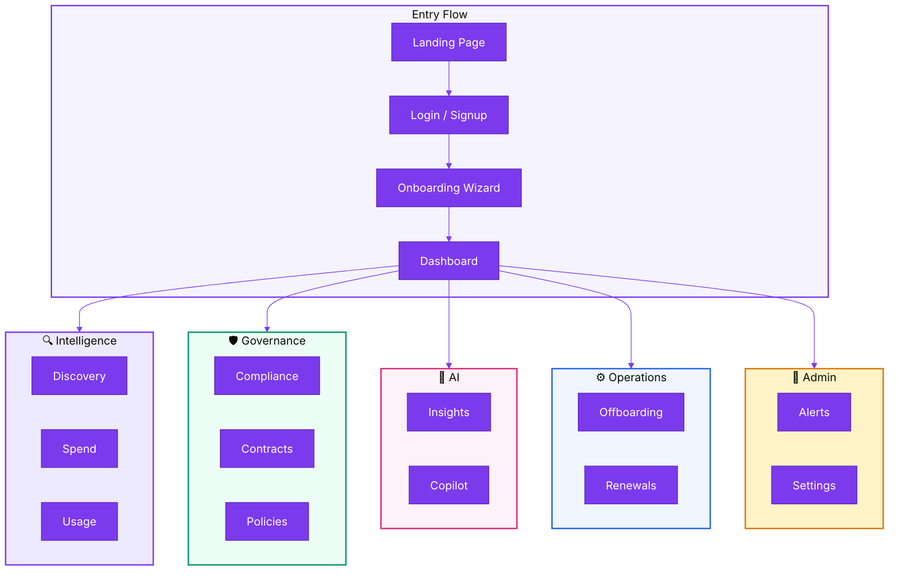

---
hide:
  - navigation
  - toc
---

# :sparkles: SaaSIQ Documentation

The complete guide to <strong>SaaSIQ</strong> — your AI-powered SaaS Management Platform. 
Discover apps, cut costs, stay compliant, and let AI do the heavy lifting.

<a href="getting-started/quick-start/" class="btn-primary">:rocket: Quick Start Guide</a>
<a href="https://saasiq.github.io/saasiq-ux-prototype/" class="btn-secondary" target="_blank">:computer: Try Live Demo</a>

---

## :dart: New here? Start with your role

:office:
IT Administrator
Discover all apps (including shadow IT), manage licenses, and control access across your org.
Start with → <a href="intelligence/saas-discovery/">SaaS Discovery</a>

:moneybag:
Finance & Procurement
Track SaaS spend by vendor, department, and category. Find savings with AI recommendations.
Start with → <a href="intelligence/spend-intelligence/">Spend Intelligence</a>

:shield:
Security & Compliance
Monitor SOC 2, GDPR, HIPAA, and ISO 27001. Enforce data policies automatically.
Start with → <a href="governance/compliance-and-risk/">Compliance & Risk</a>

:bar_chart:
C-Suite & Leadership
Executive dashboards, AI-generated insights, and department-level cost accountability.
Start with → <a href="overview/dashboard/">Dashboard</a>

---

## :zap: Platform at a Glance

156

Apps Discovered

₹42.5L

Monthly Spend

₹18L

Savings Found

67%

Avg Utilization

---

## :world_map: Explore the Documentation

### :blue_book: Getting Started

Everything you need to go from zero to a fully operational dashboard.

<a href="getting-started/introduction/" markdown>
:book:
Introduction
What is SaaSIQ, who it's for, and the core concepts you need to know.
</a>

<a href="getting-started/quick-start/" markdown>
:rocket:
Quick Start Guide
Access → Login → Onboarding → Dashboard in under 10 minutes.
</a>

<a href="getting-started/onboarding/" markdown>
:clipboard:
Onboarding Wizard
4-step setup: SSO, integrations, team invites, and preferences.
</a>

### :chart_with_upwards_trend: Dashboard & Overview

<a href="overview/dashboard/" markdown>
:bar_chart:
Dashboard
Your SaaS command center — KPIs, spend trends, alerts, and urgent actions all in one view.
156 apps · ₹42.5L/mo · 67% utilization
</a>

### :mag: Intelligence

Discover what's in your stack, what it costs, and who's actually using it.

<a href="intelligence/saas-discovery/" markdown>
:mag_right:
SaaS Discovery
Find every app in your org — including shadow IT apps adopted without approval.
148 managed · 8 shadow IT
</a>

<a href="intelligence/spend-intelligence/" markdown>
:dollar:
Spend Intelligence
AI-powered cost analysis with optimization recommendations to cut waste.
₹4.8Cr annual · ₹18L savings found
</a>

<a href="intelligence/usage-analytics/" markdown>
:chart_with_downwards_trend:
Usage Analytics
Who's using what? Identify underused licenses and reclaim wasted spend.
67% avg utilization · 23 unused licenses
</a>

### :shield: Governance

Stay compliant, manage contracts, and enforce policies.

<a href="governance/compliance-and-risk/" markdown>
:white_check_mark:
Compliance & Risk
Risk scoring, SOC 2/GDPR/HIPAA/ISO 27001 tracking, and remediation workflows.
B+ score (78/100)
</a>

<a href="governance/contracts/" markdown>
:page_facing_up:
Contracts
Contract lifecycle management — renewal timeline, cost tracking, and AI negotiation.
34 active · 8 renewing soon
</a>

<a href="governance/policies/" markdown>
:lock:
Policies
Build and enforce SaaS governance rules — trigger automated actions on violations.
3 active policies
</a>

### :robot: AI Features

Let AI do the heavy lifting — insights, predictions, and a conversational copilot.

<a href="ai-features/ai-insights/" markdown>
:bulb:
AI Insights
Machine learning recommendations for cost savings, renewals, and negotiations.
96% cost confidence · 89% renewal prediction
</a>

<a href="ai-features/ai-copilot/" markdown>
:speech_balloon:
AI Copilot
Ask questions in natural language and get instant, data-driven answers.
5 conversation topics
</a>

### :gear: Operations

Day-to-day SaaS lifecycle management.

<a href="operations/offboarding/" markdown>
:door:
Offboarding
Automatically revoke access when employees leave. Sync with HR systems.
8 pending · 45 completed
</a>

<a href="operations/renewals/" markdown>
:calendar:
Renewals
Track 30/60/90 day renewal windows. Get AI negotiation assistance.
₹12.8L savings YTD
</a>

<a href="operations/benchmarks/" markdown>
:scales:
Benchmarks
Compare your SaaS pricing against industry peers. Get negotiation leverage.
6 vendors benchmarked
</a>

<a href="operations/department-costs/" markdown>
:office:
Department Costs
Per-department spend breakdown, waste identification, and top tools.
6 departments · ₹7L waste
</a>

### :wrench: Administration

Platform settings, alerts, team management, and org-level controls.

<a href="administration/alerts-notifications/" markdown>
:bell:
Alerts & Notifications
Real-time alert feed — critical, warning, AI-recommended, and informational.
</a>

<a href="administration/settings/" markdown>
:gear:
Settings
8 configuration tabs: org info, integrations, team, security, billing, and more.
</a>

<a href="administration/organization-management/" markdown>
:busts_in_silhouette:
Organization Management
Multi-org switching, user profiles, and the help center.
</a>

### :books: Reference

<a href="reference/glossary/" markdown>
:capital_abcd:
Glossary
A–Z of SaaS management terminology. 50+ terms defined.
</a>

<a href="reference/keyboard-shortcuts/" markdown>
:keyboard:
Keyboard Shortcuts
Navigate SaaSIQ at lightning speed. 20+ shortcuts.
</a>

<a href="reference/faq/" markdown>
:question:
FAQ
Answers to 20+ common questions by category.
</a>

---

## :building_construction: How It All Connects

---

## :link: Quick Jump — "I want to…"

| Goal | Where to go |
|------|-------------|
| **Set up SaaSIQ for the first time** | [Quick Start Guide](getting-started/quick-start.md) |
| **See my SaaS dashboard** | [Dashboard](overview/dashboard.md) |
| **Find shadow IT apps** | [SaaS Discovery](intelligence/saas-discovery.md) |
| **Reduce SaaS costs** | [Spend Intelligence](intelligence/spend-intelligence.md) |
| **Check compliance status** | [Compliance & Risk](governance/compliance-and-risk.md) |
| **Ask SaaSIQ a question** | [AI Copilot](ai-features/ai-copilot.md) |
| **Offboard a departing employee** | [Offboarding](operations/offboarding.md) |
| **Prepare for a renewal** | [Renewals](operations/renewals.md) |
| **Look up a term** | [Glossary](reference/glossary.md) |

---

## :computer: Technical Details

| Property | Value |
|----------|-------|
| **Application Type** | Single-Page Application (SPA) |
| **Live URL** | [saasiq.github.io/saasiq-ux-prototype](https://saasiq.github.io/saasiq-ux-prototype/) |
| **Design System** | Primary `#7C3AED` · Font: Inter · Dark: `#0F0F1A` |
| **Demo Credentials** | `demo@saasiq.io` / `SaaSIQ2024!` |
| **Demo Company** | TechCorp India · Business Plan · Admin: Rahul Sharma |

---

**Built with :purple_heart: by the SaaSIQ Team** · [Changelog](CHANGELOG.md) · [Contributing](CONTRIBUTING.md)

© 2026 SaaSIQ · Documentation v1.0.0 · Last updated March 2026

