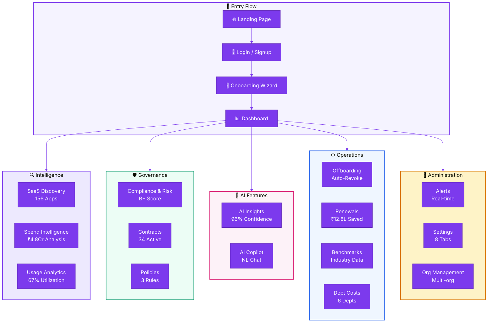

<div align="center">

<!-- HERO BANNER -->


<br /><br />

<picture>
  <source media="(prefers-color-scheme: dark)" srcset="https://readme-typing-svg.demolab.com?font=Inter&weight=700&size=36&duration=3000&pause=1000&color=7C3AED&center=true&vCenter=true&width=600&lines=SaaSIQ+Platform+Documentation;AI-Powered+SaaS+Management;Discover+%C2%B7+Optimize+%C2%B7+Govern">
  
</picture>

<br />

**The complete guide to mastering SaaSIQ — your AI-powered SaaS Management Platform.**
<br />
Eliminate shadow IT · Reduce SaaS spend by 30% · Automate compliance · Maximize license ROI

<br />

[](CHANGELOG.md)
[](#-documentation-map)
[](https://saasiq.github.io/saasiq-ux-prototype/)
[](#)
[](#)

<br />

[**🚀 Quick Start**](getting-started/quick-start.md) · [**📊 Dashboard**](overview/dashboard.md) · [**🤖 AI Copilot**](ai-features/ai-copilot.md) · [**🔍 Discovery**](intelligence/saas-discovery.md) · [**🛡️ Compliance**](governance/compliance-and-risk.md)

---

</div>

<br />

## 🎯 What is SaaSIQ?

<table>
<tr>
<td width="60%">

**SaaSIQ** is an **AI-powered SaaS Management Platform** that gives organizations complete visibility and control over their entire software-as-a-service portfolio.

It combines **intelligent discovery**, **spend analytics**, **compliance monitoring**, and a **conversational AI copilot** into one unified command center — helping IT, Finance, Security, and Leadership teams make smarter decisions about their SaaS investments.

</td>
<td width="40%">

```
   ╔═══════════════════╗
   ║     SaaSIQ        ║
   ║   ┌───┐ ┌───┐    ║
   ║   │🔍│ │💰│    ║
   ║   └───┘ └───┘    ║
   ║   ┌───┐ ┌───┐    ║
   ║   │🛡️│ │🤖│    ║
   ║   └───┘ └───┘    ║
   ╚═══════════════════╝
    Discover · Optimize
     Govern · Automate
```

</td>
</tr>
</table>

<br />

## ⚡ Key Capabilities

<table>
<tr>
<td align="center" width="25%">
<br />

<br /><br />
<strong>🔍 SaaS Discovery</strong>
<br /><br />
Find every app — including shadow IT adopted without IT approval
<br /><br />
<code>156 apps discovered</code>
<br /><br />
</td>
<td align="center" width="25%">
<br />

<br /><br />
<strong>💰 Spend Intelligence</strong>
<br /><br />
AI-powered cost analysis with optimization recommendations
<br /><br />
<code>₹18L/yr savings found</code>
<br /><br />
</td>
<td align="center" width="25%">
<br />

<br /><br />
<strong>🛡️ Compliance & Risk</strong>
<br /><br />
SOC 2, GDPR, HIPAA, ISO 27001 monitoring & policy enforcement
<br /><br />
<code>4 frameworks tracked</code>
<br /><br />
</td>
<td align="center" width="25%">
<br />

<br /><br />
<strong>🤖 AI Copilot</strong>
<br /><br />
Ask questions in natural language, get data-driven answers instantly
<br /><br />
<code>96% confidence score</code>
<br /><br />
</td>
</tr>
</table>

<br />

## 🚀 Get Started in 3 Steps

<table>
<tr>
<td align="center" width="33%">

### Step 1


Open the [**Live Platform**](https://saasiq.github.io/saasiq-ux-prototype/) and click **"Start Free Trial"**

</td>
<td align="center" width="33%">

### Step 2


Use demo credentials:
`demo@saasiq.io`
`SaaSIQ2024!`

</td>
<td align="center" width="33%">

### Step 3


Complete the [**Onboarding Wizard**](getting-started/onboarding.md) and land on your Dashboard

</td>
</tr>
</table>

> [!TIP]
> **First time here?** Start with the [Quick Start Guide](getting-started/quick-start.md) — you'll be up and running in under 10 minutes.

<br />

---

## 📖 How to Use This Documentation

This documentation mirrors the **SaaSIQ product structure** — organized by the same modules you see in the sidebar navigation. Each page includes:

<table>
<tr>
<td width="50%">

| Element | Purpose |
|---------|---------|
| 📍 **Breadcrumb** | Shows where you are in the doc hierarchy |
| 🏷️ **Badges** | Module, feature, and route identifiers |
| 📋 **Table of Contents** | Jump to any section quickly |
| 📊 **ASCII Layouts** | Visual representation of the UI |
| 📐 **Mermaid Diagrams** | Interactive flowcharts and architectures |

</td>
<td width="50%">

| Element | Purpose |
|---------|---------|
| 🎯 **Validation Checklist** | QA checklist for every feature |
| 🔗 **Cross References** | Links to related documentation |
| ⬅️➡️ **Prev/Next Navigation** | Sequential reading flow |
| 📱 **Scenarios** | Step-by-step interactive walkthroughs |
| 🗂️ **Collapsible Sections** | Expandable details for deep dives |

</td>
</tr>
</table>

### Callout Conventions

Throughout the documentation, you'll encounter these styled callout boxes:

> [!NOTE]
> Provides additional context or clarification about a feature.

> [!TIP]
> Helpful advice to get more out of a feature or workflow.

> [!IMPORTANT]
> Key information that affects how a feature works.

> [!WARNING]
> Important caution before performing a destructive or irreversible action.

> [!CAUTION]
> Critical alert — may cause data loss or security issues if ignored.

<br />

---

## 🗺️ Documentation Map

### 📘 Getting Started

> **Everything you need to go from zero to managing your SaaS portfolio.**

| # | Document | Description | Audience |
|---|----------|-------------|----------|
| 1 | [**Introduction**](getting-started/introduction.md) | What is SaaSIQ, who it's for, core concepts | Everyone |
| 2 | [**Quick Start Guide**](getting-started/quick-start.md) | Access → Login → Onboarding → Dashboard in 10 min | New Users |
| 3 | [**Onboarding Wizard**](getting-started/onboarding.md) | 4-step setup: SSO, Integrations, Team, Preferences | Admins |

---

### 📊 Overview

> **Your SaaS command center — the first screen after login.**

| # | Document | Description | Key Metrics |
|---|----------|-------------|-------------|
| 4 | [**Dashboard**](overview/dashboard.md) | KPIs, charts, urgent actions, floating navigator | 156 apps · ₹42.5L/mo · 67% utilization |

---

### 🔍 Intelligence

> **Discover what's in your stack and optimize every dollar spent.**

| # | Document | Description | Key Metrics |
|---|----------|-------------|-------------|
| 5 | [**Module Overview**](intelligence/index.md) | What Intelligence covers and when to use each feature | — |
| 6 | [**SaaS Discovery**](intelligence/saas-discovery.md) | App inventory, shadow IT detection, approve/block | 148 managed · 8 shadow IT |
| 7 | [**Spend Intelligence**](intelligence/spend-intelligence.md) | Cost analysis, AI recommendations, savings plans | ₹4.8Cr annual · ₹18L savings |
| 8 | [**Usage Analytics**](intelligence/usage-analytics.md) | Utilization rates, department usage, leaderboards | 67% avg · 23 unused licenses |

---

### 🛡️ Governance

> **Stay compliant, manage contracts, enforce policies.**

| # | Document | Description | Key Metrics |
|---|----------|-------------|-------------|
| 9 | [**Module Overview**](governance/index.md) | Governance lifecycle and module connections | — |
| 10 | [**Compliance & Risk**](governance/compliance-and-risk.md) | Risk scoring, SOC 2/GDPR/HIPAA/ISO tracking, remediation | B+ (78/100) |
| 11 | [**Contracts**](governance/contracts.md) | Contract lifecycle, renewal timeline, AI negotiation | 34 active · 8 renewing |
| 12 | [**Policies**](governance/policies.md) | Policy engine, rule builder, violation tracking | 3 active policies |

---

### 🤖 AI Features

> **Let AI do the heavy lifting — insights, predictions, and a conversational copilot.**

| # | Document | Description | Key Metrics |
|---|----------|-------------|-------------|
| 13 | [**Module Overview**](ai-features/index.md) | AI capabilities comparison (Insights vs Copilot) | — |
| 14 | [**AI Insights**](ai-features/ai-insights.md) | Cost savings (96%), renewal predictions (89%), negotiations (91%) | 3 insight cards |
| 15 | [**AI Copilot**](ai-features/ai-copilot.md) | Natural language chat, 5 topic responses, suggestions | 5 conversation topics |

---

### ⚙️ Operations

> **Day-to-day SaaS lifecycle management.**

| # | Document | Description | Key Metrics |
|---|----------|-------------|-------------|
| 16 | [**Module Overview**](operations/index.md) | Operations module connections | — |
| 17 | [**Offboarding**](operations/offboarding.md) | Revoke access, HR sync, bulk actions, wizard | 8 pending · 45 completed |
| 18 | [**Renewals**](operations/renewals.md) | 30/60/90 day renewals, negotiate, reminders | ₹12.8L savings YTD |
| 19 | [**Benchmarks**](operations/benchmarks.md) | Industry pricing comparison, negotiation tips | 6 vendors benchmarked |
| 20 | [**Department Costs**](operations/department-costs.md) | Per-department spend, waste analysis, top tools | 6 departments · ₹7L waste |

---

### 🔧 Administration

> **Platform settings, alerts, team management, and org-level controls.**

| # | Document | Description | Key Metrics |
|---|----------|-------------|-------------|
| 21 | [**Module Overview**](administration/index.md) | Admin module overview and role access matrix | 4 user roles |
| 22 | [**Alerts & Notifications**](administration/alerts-notifications.md) | Alert feed, 4 severity types, snooze/dismiss | Critical/Warning/AI/Info |
| 23 | [**Settings**](administration/settings.md) | 8 tabs: Org, Integrations, Team, Security, Billing… | 8 configuration tabs |
| 24 | [**Organization Management**](administration/organization-management.md) | Multi-org switching, user profiles, help center | 3 demo orgs |

---

### 📚 Reference

> **Quick-reference materials, glossary, and FAQs.**

| # | Document | Description | Content |
|---|----------|-------------|---------|
| 25 | [**Glossary**](reference/glossary.md) | A–Z of SaaS management terminology | 50+ terms |
| 26 | [**Keyboard Shortcuts**](reference/keyboard-shortcuts.md) | Navigate SaaSIQ at lightning speed | 20+ shortcuts |
| 27 | [**FAQ**](reference/faq.md) | Frequently asked questions by category | 20+ Q&As |

<br />

---

## 🏗️ Platform Architecture



<br />

---

## 🔗 Quick Links

<table>
<tr>
<td width="50%">

#### 🎯 I want to…

| Goal | Page |
|------|------|
| Set up SaaSIQ for the first time | [**Quick Start**](getting-started/quick-start.md) |
| Understand my dashboard | [**Dashboard**](overview/dashboard.md) |
| Find shadow IT apps | [**SaaS Discovery**](intelligence/saas-discovery.md) |
| Reduce SaaS spend | [**Spend Intelligence**](intelligence/spend-intelligence.md) |
| Check compliance status | [**Compliance & Risk**](governance/compliance-and-risk.md) |

</td>
<td width="50%">

#### ⚡ Common Tasks

| Task | Page |
|------|------|
| Ask SaaSIQ a question | [**AI Copilot**](ai-features/ai-copilot.md) |
| Offboard an employee | [**Offboarding**](operations/offboarding.md) |
| Manage renewals | [**Renewals**](operations/renewals.md) |
| Configure settings | [**Settings**](administration/settings.md) |
| Benchmark pricing | [**Benchmarks**](operations/benchmarks.md) |

</td>
</tr>
</table>

<br />

---

## 💻 Technical Reference

<table>
<tr>
<td>

| Property | Value |
|----------|-------|
| **Application Type** | Single-Page Application (SPA) |
| **Routing** | Hash-based (`#dashboard`, `#saas-discovery`, etc.) |
| **Hosting** | GitHub Pages |
| **Live URL** | [saasiq.github.io/saasiq-ux-prototype](https://saasiq.github.io/saasiq-ux-prototype/) |
| **Design System** | Primary `#7C3AED` · Font: Inter · Dark: `#0F0F1A` |
| **Demo Credentials** | `demo@saasiq.io` / `SaaSIQ2024!` |
| **Demo Company** | TechCorp India · Business Plan · Admin: Rahul Sharma |

</td>
</tr>
</table>

<br />

---

## 📝 Contributing & Versioning

<table>
<tr>
<td width="50%">

#### Contributing to Docs
See [**CONTRIBUTING.md**](CONTRIBUTING.md) for guidelines on:
- Documentation structure & naming
- Callout and admonition conventions
- Mermaid diagram standards
- Review process

</td>
<td width="50%">

#### Version History
See [**CHANGELOG.md**](CHANGELOG.md) for:
- Release notes
- New feature documentation
- Breaking changes
- Migration guides

</td>
</tr>
</table>

<br />

---

<div align="center">

<br />

**Built with 💜 by the SaaSIQ Team**

<br />

[](https://saasiq.github.io/saasiq-ux-prototype/)
[](#)

<br />

<sub>© 2026 SaaSIQ · All rights reserved · Documentation v1.0.0 · Last updated March 2026</sub>

</div>
