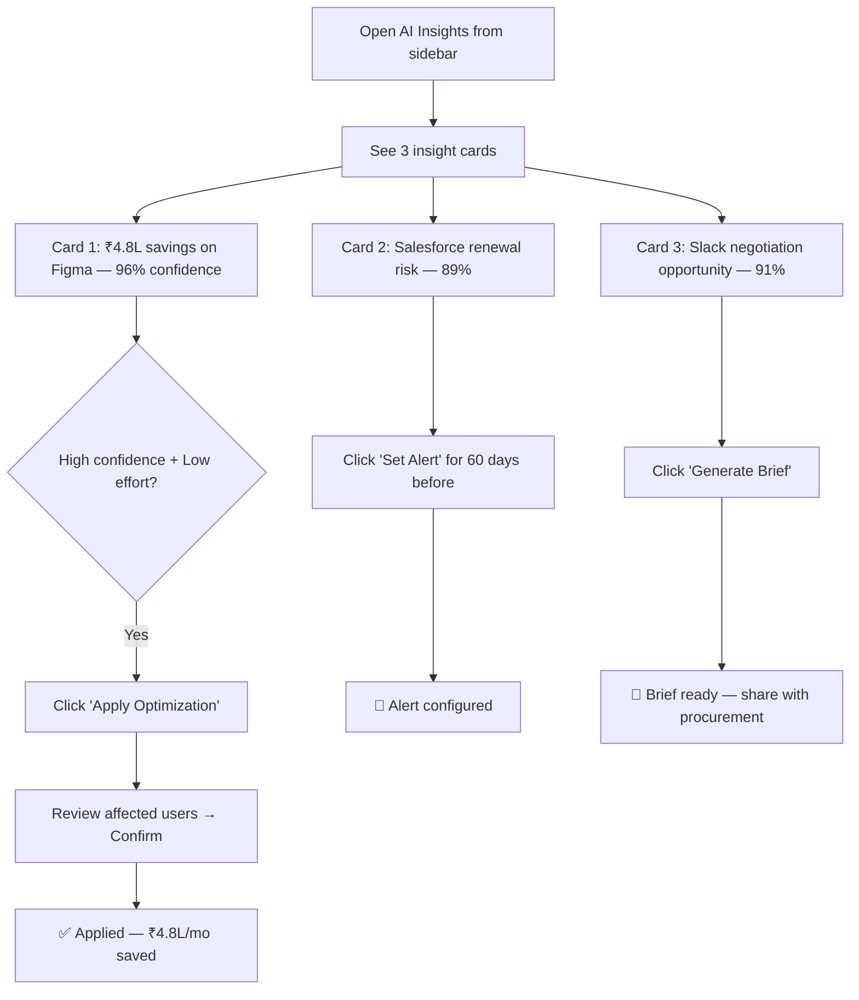

# 💡 AI Insights

**Machine-learning recommendations for cost savings, renewals, and negotiations**

`Home` · `AI Features` · **AI Insights**

> **Home** · AI Features · **AI Insights**

---

## Overview

AI Insights is SaaSIQ's **proactive recommendation engine**. It continuously analyzes your SaaS portfolio across spend, usage, compliance, and renewals — then surfaces the **highest-impact actions** you can take, each with a confidence score and a one-click action button.

Think of it as your AI advisor that tells you: *"Here's exactly what you should do, why, and how much it will save you."*

---

## In This Article

- [Insight Cards](#insight-cards)
- [Card Details & Actions](#card-details-actions)
- [How Confidence Scores Work](#how-confidence-scores-work)
- [Interactions & Workflows](#interactions-workflows)
- [Validation Checklist](#validation-checklist)

---

## Insight Cards

Each insight is presented as a prominent card with a category icon, recommendation, and action buttons.

### Card 1: Cost Savings Opportunity

<table markdown>
<tr markdown>
<td markdown>

**💰 COST SAVINGS** &nbsp;&nbsp;&nbsp;&nbsp;&nbsp;&nbsp;&nbsp;&nbsp;&nbsp;&nbsp;&nbsp;&nbsp;&nbsp;&nbsp;&nbsp;&nbsp;&nbsp;&nbsp;&nbsp;&nbsp;&nbsp;&nbsp;&nbsp;&nbsp;&nbsp;&nbsp;&nbsp;&nbsp;&nbsp;&nbsp;&nbsp;&nbsp; Confidence: **96%**

**Save ₹4.8L/month by optimizing Figma licenses**

We detected 57 Figma Enterprise licenses with zero activity in the last 90 days. Downgrading these to Viewer seats saves ₹4.8L/month (₹57.6L/year).

📊 Impact: **High** &nbsp;&nbsp; ⏱️ Effort: **Low** &nbsp;&nbsp; 👥 Users: **57**

`Apply Optimization` &nbsp; `Review Details` &nbsp; `Dismiss`

</td>
</tr>
</table>

| Property | Value |
|----------|-------|
| **Category** | 💰 Cost Savings |
| **Title** | Save ₹4.8L/month by optimizing Figma licenses |
| **Description** | 57 Figma Enterprise licenses inactive for 90+ days |
| **Confidence** | 96% |
| **Impact** | High |
| **Effort** | Low |
| **Affected Users** | 57 |
| **Annual Savings** | ₹57.6L |

### Card 2: Renewal Prediction

<table markdown>
<tr markdown>
<td markdown>

**📅 RENEWAL PREDICTION** &nbsp;&nbsp;&nbsp;&nbsp;&nbsp;&nbsp;&nbsp;&nbsp;&nbsp;&nbsp;&nbsp;&nbsp;&nbsp;&nbsp;&nbsp;&nbsp;&nbsp;&nbsp;&nbsp;&nbsp;&nbsp;&nbsp;&nbsp; Confidence: **89%**

**Salesforce renewal risk — projected 18% price increase**

Based on Salesforce's recent pricing announcements and your tier, we predict an 18% increase at next renewal. Starting negotiations now could lock in current rates.

📊 Impact: **High** &nbsp;&nbsp; ⏱️ Effort: **Medium** &nbsp;&nbsp; 📅 Due: **Apr 1**

`Set Alert` &nbsp; `View Negotiation Brief` &nbsp; `Dismiss`

</td>
</tr>
</table>

| Property | Value |
|----------|-------|
| **Category** | 📅 Renewal Prediction |
| **Title** | Salesforce renewal risk — projected 18% price increase |
| **Description** | AI predicts price increase based on market data + your tier |
| **Confidence** | 89% |
| **Impact** | High |
| **Effort** | Medium |
| **Renewal Date** | April 1, 2026 |
| **Projected Increase** | 18% (~₹4.32L additional/year) |

### Card 3: Negotiation Intelligence

<table markdown>
<tr markdown>
<td markdown>

**🤝 NEGOTIATION INTELLIGENCE** &nbsp;&nbsp;&nbsp;&nbsp;&nbsp;&nbsp;&nbsp;&nbsp;&nbsp;&nbsp;&nbsp;&nbsp;&nbsp;&nbsp;&nbsp; Confidence: **91%**

**Strong negotiation position for Slack renewal**

Your Slack utilization (62%) + market alternatives (Microsoft Teams in your M365 bundle) give you strong leverage. AI has generated a negotiation brief.

📊 Impact: **High** &nbsp;&nbsp; ⏱️ Effort: **Low** &nbsp;&nbsp; 💰 Savings: **₹3.6L**

`Generate Brief` &nbsp; `View Details` &nbsp; `Dismiss`

</td>
</tr>
</table>

| Property | Value |
|----------|-------|
| **Category** | 🤝 Negotiation Intelligence |
| **Title** | Strong negotiation position for Slack renewal |
| **Description** | Low utilization + available alternatives = leverage |
| **Confidence** | 91% |
| **Impact** | High |
| **Effort** | Low |
| **Potential Savings** | ₹3.6L/year |

---

## Card Details & Actions

### "Apply Optimization" (Card 1)

**Trigger:** Click on the Cost Savings card

Redirects to [Spend Intelligence → Apply Optimization](../intelligence/spend-intelligence.md#apply-optimization) with the Figma recommendation pre-selected.

**What happens:**
1. Modal opens pre-filled with Figma optimization details
2. Shows 57 affected users with last login dates
3. Select implementation timeline
4. Confirm → licenses are downgraded
5. ₹4.8L/month savings begin
6. Card changes to "✅ Applied" state

### "Set Alert" (Card 2)

**Trigger:** Click "Set Alert" on the Renewal Prediction card

| Field | Value |
|-------|-------|
| **Alert type** | Renewal price increase warning |
| **Application** | Salesforce CRM |
| **Trigger** | 60 days before renewal (Feb 1, 2026) |
| **Alert to** | IT Admin, CFO |
| **Message** | "Salesforce renewal due Apr 1 — projected 18% increase. Start negotiations." |

After setting: Card changes to "🔔 Alert Set" state.

### "Generate Brief" (Card 3)

**Trigger:** Click "Generate Brief" on the Negotiation Intelligence card

Redirects to [Contracts → Negotiate](../governance/contracts.md#negotiate-contract) with the Slack negotiation brief pre-generated.

**Brief includes:**
- Current pricing vs. benchmark
- Utilization data (62% — strong leverage)
- Alternative tools available (Microsoft Teams)
- Recommended target price (20% reduction)
- Talking points for the vendor call

---

## How Confidence Scores Work

<strong>📊 Understanding the confidence percentage</strong>

Each insight card shows a confidence score indicating how certain the AI is about the recommendation. Here's how it's computed:

| Signal | Weight | Example |
|--------|--------|---------|
| **Data completeness** | 25% | Do we have full usage + cost data? |
| **Historical pattern** | 25% | How consistent is the usage pattern? |
| **Benchmark alignment** | 20% | Does this match what similar companies see? |
| **Vendor reliability** | 15% | Is the vendor's pricing predictable? |
| **Time certainty** | 15% | How confident are we in the timeline? |

**Score interpretation:**

| Score | Meaning | Action Guidance |
|-------|---------|----------------|
| 95–100% | Near-certain | Apply immediately with confidence |
| 85–94% | Very likely | Review briefly, then apply |
| 75–84% | Probable | Review carefully, validate key assumptions |
| 65–74% | Possible | Investigate before acting |
| Below 65% | Speculative | Monitor, don't act yet |

---

## Interactions & Workflows

### Scenario 1: "Morning check — what should I act on today?"

### Scenario 2: "Presenting AI recommendations to leadership"

1. Open AI Insights → note all cards' savings amounts
2. Total opportunity: ₹4.8L (Figma) + ₹4.32L (Salesforce) + ₹3.6L (Slack) = ₹12.72L/month
3. Click "Review Details" on each card for supporting data
4. Download/export each brief or detail view
5. Present: "SaaSIQ AI identified ₹1.53Cr annualized savings with 89-96% confidence"

### Scenario 3: "I don't agree with a recommendation"

1. Read the insight card carefully
2. Click **"Review Details"** to see the AI's reasoning
3. If the recommendation doesn't apply (e.g., licenses are seasonal):
   - Click **"Dismiss"** → Confirmation: "Dismiss this insight?"
   - Optional: Provide a reason (helps AI learn)
   - Card is removed from the feed
4. The AI adjusts future recommendations based on your dismissals

---

## Validation Checklist

### Page Load
- [ ] At least 3 insight cards rendered
- [ ] Each card shows category icon, title, description, confidence, impact, effort
- [ ] Action buttons are visible on each card

### Card 1: Cost Savings
- [ ] Shows ₹4.8L savings and 96% confidence
- [ ] "Apply Optimization" navigates to Spend Intelligence apply flow
- [ ] "Review Details" shows user-level data
- [ ] "Dismiss" removes the card

### Card 2: Renewal Prediction
- [ ] Shows 89% confidence and projected 18% increase
- [ ] "Set Alert" opens alert configuration
- [ ] Alert creation shows success toast
- [ ] Card status changes to "🔔 Alert Set"

### Card 3: Negotiation Intelligence
- [ ] Shows 91% confidence and ₹3.6L savings
- [ ] "Generate Brief" navigates to Contracts negotiate flow
- [ ] Brief includes benchmark data and talking points
- [ ] "Dismiss" removes the card

### General
- [ ] Dismissed cards don't reappear
- [ ] Applied cards show "✅ Applied" state
- [ ] Cards are ordered by impact (highest first)

---

## Related Resources

- 🔗 [AI Copilot](ai-copilot.md) — Ask follow-up questions about any insight
- 🔗 [Spend Intelligence](../intelligence/spend-intelligence.md) — Detailed cost optimization
- 🔗 [Contracts](../governance/contracts.md) — Negotiation workflows
- 🔗 [Renewals](../operations/renewals.md) — Renewal calendar and management

---

---

**Was this page helpful?** 👍 Yes · 👎 No · [Suggest an edit](https://github.com/saasiq/saasiq-documentation/edit/main/docs/ai-features/ai-insights.md)

---

<a href="index.md">⬅️ AI Features Overview</a>&nbsp;&nbsp;·&nbsp;&nbsp;<a href="ai-copilot.md">AI Copilot ➡️</a>

Last updated: March 2026 · SaaSIQ Documentation v1.0.0

