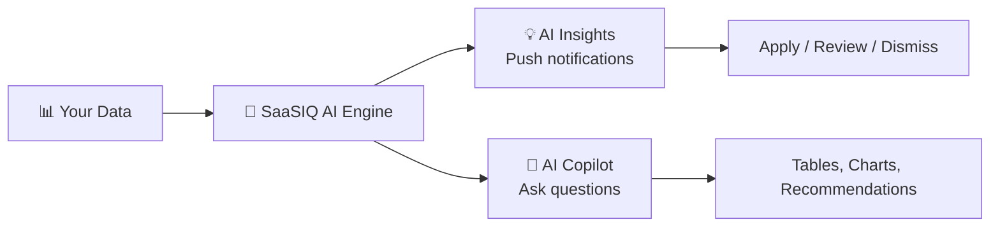

# 🤖 AI Features Module

**Let AI do the heavy lifting — insights, predictions, and a conversational copilot**

`Home` · **AI Features**

---

## Overview

The AI Features module provides **intelligent automation** across your SaaS portfolio. Instead of manually analyzing data, SaaSIQ's AI engine processes your usage patterns, contracts, and compliance data to deliver **proactive insights** and a **conversational assistant** you can query in natural language.

---

## What's Inside

| Feature | Purpose | Key Question It Answers |
|---------|---------|------------------------|
| [AI Insights](ai-insights.md) | Automated, proactive recommendations | *"What should I act on right now?"* |
| [AI Copilot](ai-copilot.md) | Natural-language conversational assistant | *"Let me ask a specific question about my SaaS data."* |

---

## AI Insights vs. AI Copilot

| Aspect | AI Insights | AI Copilot |
|--------|------------|------------|
| **Interaction** | Push (AI tells you) | Pull (you ask) |
| **Format** | Cards with actions | Chat conversation |
| **When to use** | Daily review of opportunities | Ad-hoc questions |
| **Action type** | One-click Apply/Dismiss | Conversational analysis |
| **Best for** | Executives & managers | Analysts & power users |

---

## Related Resources

- 🔗 [Spend Intelligence](../intelligence/spend-intelligence.md) — Data that powers AI recommendations
- 🔗 [Usage Analytics](../intelligence/usage-analytics.md) — Utilization data the AI analyzes
- 🔗 [Dashboard](../overview/dashboard.md) — KPIs influenced by AI insights

---

---

**Was this page helpful?** 👍 Yes · 👎 No · [Suggest an edit](https://github.com/saasiq/saasiq-documentation/edit/main/docs/ai-features/index.md)

---

<a href="../governance/policies.md">⬅️ Policies</a>&nbsp;&nbsp;·&nbsp;&nbsp;<a href="ai-insights.md">AI Insights ➡️</a>

Last updated: March 2026 · SaaSIQ Documentation v1.0.0

