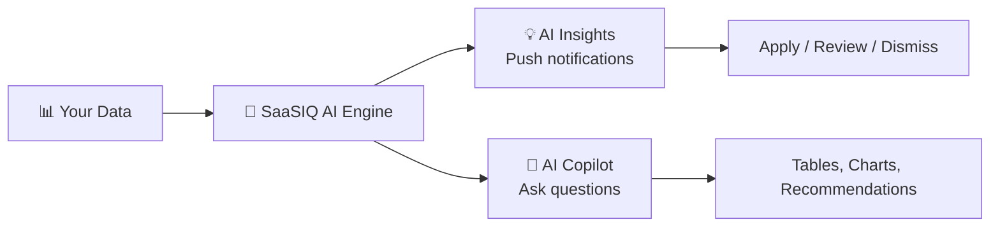

# :robot: AI Features Module

**Let AI do the heavy lifting — insights, predictions, and a conversational copilot.**

Instead of manually analyzing data, SaaSIQ's AI engine processes your usage patterns, contracts, and compliance data to deliver **proactive insights** and a **conversational assistant** you can query in natural language.

<a href="ai-insights/" markdown>
:bulb:
AI Insights
Automated, proactive recommendations. The AI tells you what to act on — cost savings, renewals, and risks.
96% cost confidence · 89% renewal prediction
</a>

<a href="ai-copilot/" markdown>
:speech_balloon:
AI Copilot
Ask questions in plain English. Get instant answers with tables, charts, and data-driven recommendations.
5 conversation topics · Natural language
</a>

---

## AI Insights vs. AI Copilot

| Aspect | AI Insights | AI Copilot |
|--------|------------|------------|
| **Interaction** | Push — AI tells you | Pull — you ask |
| **Format** | Cards with quick actions | Chat conversation |
| **When to use** | Daily review of opportunities | Ad-hoc questions |
| **Action type** | One-click Apply / Dismiss | Conversational analysis |
| **Best for** | Executives & managers | Analysts & power users |

---

## Related Resources

- :link: [Spend Intelligence](../intelligence/spend-intelligence.md) — Data that powers AI recommendations
- :link: [Usage Analytics](../intelligence/usage-analytics.md) — Utilization data the AI analyzes
- :link: [Dashboard](../overview/dashboard.md) — KPIs influenced by AI insights
