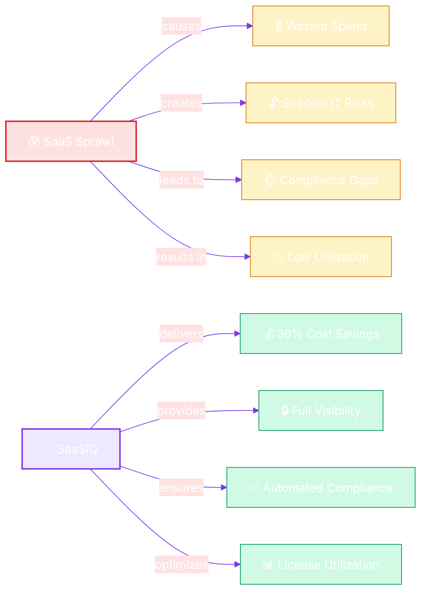

# 🚀 Introduction to SaaSIQ

**Everything you need to know about the platform before diving in**

---

## What is SaaSIQ?

SaaSIQ is an **AI-powered SaaS Management Platform** designed to give organizations complete visibility and control over their software-as-a-service portfolio. It solves the growing challenge of **SaaS sprawl** — where companies unknowingly accumulate dozens or hundreds of cloud applications, leading to wasted spend, security gaps, and compliance risks.

### The Problem SaaSIQ Solves

| Challenge | How SaaSIQ Helps |
|-----------|-----------------|
| **Shadow IT** — Employees adopt apps without IT approval | AI-powered discovery finds every app across your org |
| **Wasted licenses** — Paying for seats nobody uses | Usage analytics identifies underutilized licenses |
| **Overspending** — No visibility into total SaaS cost | Spend intelligence with AI-driven optimization |
| **Compliance risk** — Apps that don't meet security standards | Automated compliance monitoring against SOC 2, GDPR, HIPAA, ISO 27001 |
| **Manual renewals** — Contracts slip through the cracks | Proactive renewal calendar with negotiation assistance |
| **Offboarding gaps** — Former employees retain access | Automated license revocation tied to HR systems |

---

## Who is SaaSIQ For?

<table markdown>
<tr markdown>
<td width="50%" markdown>

<strong>🏢 IT Administrators & Managers</strong>

- Get a complete inventory of all SaaS applications
- Approve, block, or monitor applications
- Manage integrations with SSO, HRIS, and finance systems
- Control access and enforce security policies

**Start here →** [SaaS Discovery](../intelligence/saas-discovery.md)

<strong>💰 Finance & Procurement Teams</strong>

- Understand total SaaS spend by department, vendor, or category
- Identify cost savings through optimization recommendations
- Benchmark your pricing against industry peers
- Track ROI of SaaS investments

**Start here →** [Spend Intelligence](../intelligence/spend-intelligence.md)

</td>
<td width="50%" markdown>

<strong>🛡️ Security & Compliance Officers</strong>

- Monitor compliance with SOC 2, GDPR, HIPAA, ISO 27001
- Identify and remediate high-risk applications
- Enforce data residency and security policies
- Audit vendor certifications and DPA agreements

**Start here →** [Compliance & Risk](../governance/compliance-and-risk.md)

<strong>👔 C-Suite & Department Heads</strong>

- High-level dashboards showing SaaS health at a glance
- AI-generated insights and predictions
- Department-level cost accountability
- Strategic planning with benchmark data

**Start here →** [Dashboard](../overview/dashboard.md)

</td>
</tr>
</table>

---

## Core Concepts

!!! note
    These are the fundamental building blocks you'll see across every module. Understanding them first will make the rest of the documentation much clearer.

### 🔍 SaaS Discovery

SaaSIQ automatically discovers applications used across your organization by analyzing SSO logs, browser activity, expense reports, and API integrations. Apps are classified as **Managed** (IT-approved) or **Shadow IT** (unapproved).

### 💰 Spend Intelligence

AI analyzes your SaaS contracts, invoices, and usage data to calculate the **true cost** of each tool — then recommends optimizations like downgrading unused licenses, consolidating overlapping tools, or negotiating better pricing.

### 📊 Usage Analytics

Every application is tracked for **utilization rate** — the percentage of purchased licenses actively being used. Low utilization triggers recommendations for license reclamation or plan downgrades.

### 🛡️ Compliance & Risk

Each application receives a **risk score** based on its security certifications, data handling practices, and alignment with your compliance frameworks. High-risk apps are flagged for immediate review.

### 🤖 AI Copilot

A conversational AI assistant that understands your entire SaaS landscape. Ask questions in natural language — *"Which apps have the lowest utilization?"* or *"How much can we save on Slack?"* — and get data-driven answers instantly.

---

## Platform Architecture

SaaSIQ follows a **modular architecture** organized around six core pillars:

<table markdown>
<tr markdown>
<th align="center">🔍 Discovery</th>
<th align="center">💰 Spend Intelligence</th>
<th align="center">🛡️ Governance</th>
<th align="center">🤖 AI Features</th>
<th align="center">⚙️ Operations</th>
<th align="center">🔧 Admin</th>
</tr>
<tr markdown>
<td align="center" markdown>

App Inventory  
Approve / Block  
Re-scan

</td>
<td align="center" markdown>

Cost Analysis  
Optimizations  
Benchmarks

</td>
<td align="center" markdown>

Compliance  
Contracts  
Policies

</td>
<td align="center" markdown>

Insights  
Copilot

</td>
<td align="center" markdown>

Offboarding  
Renewals  
Benchmarks

</td>
<td align="center" markdown>

Alerts  
Settings  
Org Mgmt

</td>
</tr>
</table>

---

## What's Inside This Documentation

| Section | What You'll Learn |
|---------|------------------|
| [Quick Start Guide](quick-start.md) | How to get from zero to your first dashboard in under 10 minutes |
| [Onboarding Wizard](onboarding.md) | The 4-step setup process every new organization goes through |
| [Dashboard](../overview/dashboard.md) | Understanding your command center — KPIs, charts, and alerts |
| [Intelligence](../intelligence/index.md) | Discovering apps, optimizing spend, and tracking usage |
| [Governance](../governance/index.md) | Compliance monitoring, contract management, and policy enforcement |
| [AI Features](../ai-features/index.md) | AI Insights and the conversational AI Copilot |
| [Operations](../operations/index.md) | Offboarding, renewals, benchmarks, and department cost analysis |
| [Administration](../administration/index.md) | Alerts, settings, team management, and org controls |

---

## What's Next?

Ready to get started? Follow the path that fits your role:

| Your Role | Start Here |
|-----------|-----------|
| **First-time user** | → [Quick Start Guide](quick-start.md) |
| **Evaluating SaaSIQ** | → [Dashboard Overview](../overview/dashboard.md) |
| **IT Administrator** | → [SaaS Discovery](../intelligence/saas-discovery.md) |
| **Finance/Procurement** | → [Spend Intelligence](../intelligence/spend-intelligence.md) |
| **Security/Compliance** | → [Compliance & Risk](../governance/compliance-and-risk.md) |

---
