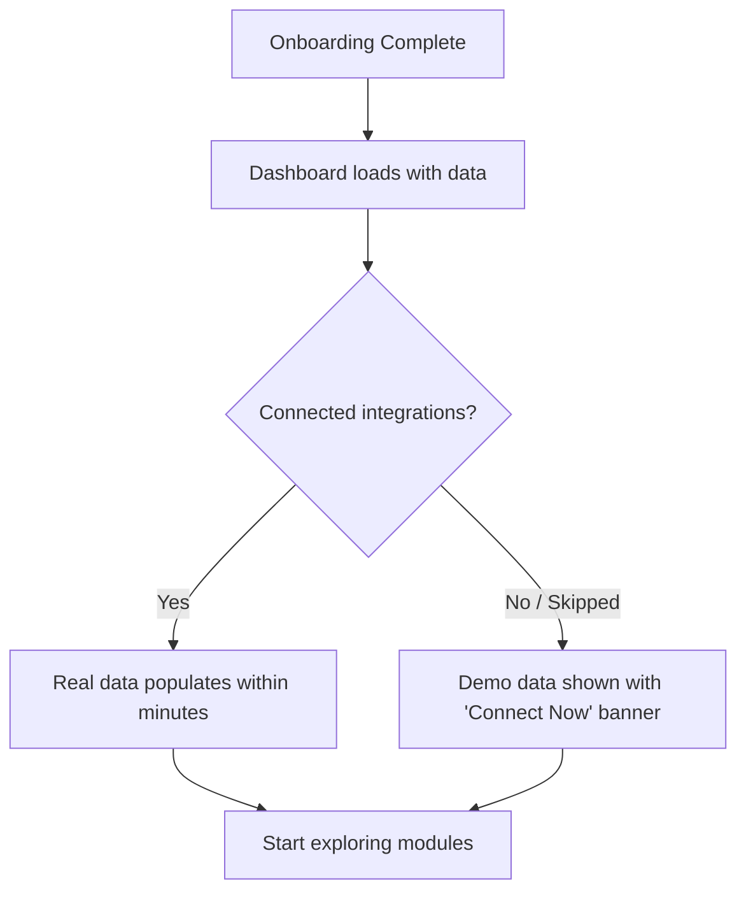

# 🌟 Onboarding Wizard

**Your guided 4-step setup for a perfect start with SaaSIQ**

`Home` · `Getting Started` · **Onboarding Wizard**

---

## Overview

The Onboarding Wizard is a **4-step guided setup** that appears on first login. It configures SaaSIQ to discover your SaaS applications, connect to your tools, and set your management preferences.

> [!NOTE]
> The wizard appears only on first login. After completion, you can modify all settings from **Administration → [Settings](../administration/settings.md)**.

---

## In This Article

- [Wizard Flow](#wizard-flow)
- [Step 1: SSO Configuration](#step-1-sso-configuration)
- [Step 2: Connect Integrations](#step-2-connect-integrations)
- [Step 3: Invite Your Team](#step-3-invite-your-team)
- [Step 4: Set Preferences](#step-4-set-preferences)
- [After Onboarding](#after-onboarding)

---

## Wizard Flow

```mermaid
%%{init: {'theme': 'base', 'themeVariables': {'primaryColor': '#7C3AED', 'primaryTextColor': '#fff', 'primaryBorderColor': '#5B21B6', 'lineColor': '#7C3AED', 'fontFamily': 'Inter'}}}%%
graph LR
    S["🚀 First Login"] --> A["1️⃣ SSO"]
    A -->|Next| B["2️⃣ Integrations"]
    B -->|Next| C["3️⃣ Team"]
    C -->|Next| D["4️⃣ Preferences"]
    D -->|Complete| E["🎉 Dashboard"]
    
    A -->|Skip| B
    B -->|Skip| C
    C -->|Skip| D
    D -->|Skip| E

    style S fill:#FEF3C7,stroke:#D97706,stroke-width:2px
    style A fill:#EDE9FE,stroke:#7C3AED,stroke-width:2px
    style B fill:#EDE9FE,stroke:#7C3AED,stroke-width:2px
    style C fill:#EDE9FE,stroke:#7C3AED,stroke-width:2px
    style D fill:#EDE9FE,stroke:#7C3AED,stroke-width:2px
    style E fill:#D1FAE5,stroke:#059669,stroke-width:2px
```

**Key behaviors:**
- Progress bar at the top shows steps 1–4 with the current step highlighted
- Each step has a **"Next"** and **"Skip"** button
- Steps can be skipped individually — you won't lose access to any features
- Skipped steps use demo/default data until configured later

---

## Step 1: SSO Configuration

**Purpose:** Connect your identity provider so SaaSIQ can discover which applications your employees use.

### What You See

| Element | Description |
|---------|-------------|
| **Title** | "Connect Your Identity Provider" |
| **Description** | "SaaSIQ uses your SSO logs to discover applications" |
| **Google Workspace** button | OAuth integration with Google |
| **Microsoft Entra ID** button | OAuth integration with Microsoft (Azure AD) |
| **Status indicator** | Shows "Connected ✓" or "Not connected" per provider |

### How to Connect

1. Click **"Connect Google Workspace"** or **"Connect Microsoft Entra ID"**
2. A modal or OAuth popup will appear requesting authorization
3. Grant read-only access to directory and SSO logs
4. On success, the button changes to **"Connected ✓"** with a green indicator
5. Click **"Next"** to proceed

> [!TIP]
> You can connect **both** providers if your organization uses mixed environments. SaaSIQ will deduplicate discovered applications.

> [!WARNING]
> This step is the **most important** — without an SSO connection, SaaSIQ cannot auto-discover your applications and will rely on manual entry or demo data.

<strong>🔧 What permissions does SaaSIQ request?</strong>

**Google Workspace:**
- `admin.directory.user.readonly` — Read user directory
- `admin.reports.audit.readonly` — Read SSO login reports
- `admin.directory.orgunit.readonly` — Read org structure

**Microsoft Entra ID:**
- `User.Read.All` — Read all user profiles
- `AuditLog.Read.All` — Read sign-in audit logs
- `Directory.Read.All` — Read organizational structure

SaaSIQ never writes to or modifies your identity provider data.

---

## Step 2: Connect Integrations

**Purpose:** Connect your productivity, development, and communication tools for deeper visibility.

### Available Integrations

| Integration | Category | What SaaSIQ Gains |
|------------|----------|-------------------|
| **Slack** | Communication | Workspace usage, channel activity, app installations |
| **Jira** | Project Management | Project utilization, license usage, active users |
| **AWS** | Cloud Infrastructure | Service usage, cost data, IAM users |
| **Salesforce** | CRM | License utilization, seat count, contract details |
| **GitHub** | Development | Repository activity, seat usage, SSO data |
| **Figma** | Design | Active editors, viewer seats, project usage |

### How to Connect

1. Each integration shows as a card with the app logo and a **"Connect"** button
2. Click **"Connect"** on any integration
3. Authorize via the app's OAuth flow
4. On success, the card shows **"Connected ✓"**
5. Repeat for additional tools or click **"Next"**

> [!TIP]
> You don't need to connect everything now. Integrations can be added anytime from **Administration → [Settings → Integrations](../administration/settings.md#integrations)**.

> [!NOTE]
> Each connected integration increases SaaSIQ's visibility. The more integrations you connect, the more accurate your spend analysis, usage metrics, and shadow IT detection become.

---

## Step 3: Invite Your Team

**Purpose:** Add team members who will use SaaSIQ alongside you.

### What You See

| Element | Description |
|---------|-------------|
| **Email input field** | Enter colleague's email address |
| **"+ Add Another"** button | Add more email fields |
| **Role selector** | Admin, Manager, or Viewer (per invite) |
| **"Send Invites"** button | Sends invitation emails to all entered addresses |

### Roles Explained

| Role | Can View Data | Can Edit Settings | Can Manage Users | Can Delete |
|------|:------------:|:-----------------:|:----------------:|:----------:|
| **Admin** | ✅ | ✅ | ✅ | ✅ |
| **Manager** | ✅ | ✅ | ❌ | ❌ |
| **Viewer** | ✅ | ❌ | ❌ | ❌ |

### How to Invite

1. Type a colleague's email address in the input field
2. Select their role from the dropdown (default: Viewer)
3. Click **"+ Add Another"** to invite multiple people
4. Click **"Send Invites"**
5. A toast notification confirms: *"Invitations sent successfully!"*

> [!TIP]
> Invite at least one other admin — this ensures someone else can manage SaaSIQ if you're unavailable.

<strong>📧 What does the invitation email look like?</strong>

Recipients receive an email containing:
- A welcome message with your company name
- A brief description of SaaSIQ
- A **"Join [Company Name] on SaaSIQ"** button
- A link that expires in 7 days

If the recipient doesn't have a SaaSIQ account, they'll be directed to the signup flow. If they do, they're added to your organization immediately.

---

## Step 4: Set Preferences

**Purpose:** Tell SaaSIQ what matters most to your organization so it can prioritize insights.

### Focus Area Selection

| Focus Area | What SaaSIQ Prioritizes |
|-----------|------------------------|
| **💰 Cost Optimization** | Spend analysis, savings recommendations, benchmark comparisons |
| **🔒 Security & Compliance** | Risk scores, compliance frameworks, shadow IT alerts |
| **📊 Usage & Adoption** | License utilization, department usage, adoption trends |
| **🎯 All Areas** *(recommended)* | Balanced focus across all dimensions |

### Alert Threshold

Configure when SaaSIQ should notify you:

| Setting | Options | Default |
|---------|---------|---------|
| **Spending alerts** | >₹50K, >₹1L, >₹5L, >₹10L per month | >₹1L |
| **Utilization warnings** | <30%, <50%, <70% | <50% |
| **Risk notifications** | Critical only, High+, Medium+, All | High+ |

### How to Configure

1. Select one or more **focus areas** (cards are toggleable)
2. Set your **alert thresholds** using the dropdown selectors
3. Click **"Complete Setup"**
4. SaaSIQ shows a brief loading animation: *"Setting up your workspace…"*
5. You're redirected to the **Dashboard**

> [!IMPORTANT]
> Start with **"All Areas"** to get a holistic view. You can narrow your focus later in **Administration → Settings → Notifications**.

---

## After Onboarding

### What Happens Next

### First Things to Explore

| Action | Where | Why |
|--------|-------|-----|
| Check your KPIs | [Dashboard](../overview/dashboard.md) | See the big picture — total apps, spend, savings potential |
| Find shadow IT | [SaaS Discovery](../intelligence/saas-discovery.md) | Identify unapproved applications |
| Review spend | [Spend Intelligence](../intelligence/spend-intelligence.md) | See where money is going |
| Ask the AI | [AI Copilot](../ai-features/ai-copilot.md) | *"What should I focus on first?"* |

---

## Validation Checklist

- [ ] Onboarding wizard loads on first login
- [ ] Progress bar shows 4 steps (1 highlighted)
- [ ] SSO connect buttons respond to clicks
- [ ] "Skip" button advances to next step
- [ ] Integration cards show connect/connected states
- [ ] Team invite accepts email input and sends
- [ ] Focus area cards are selectable/toggleable
- [ ] "Complete Setup" redirects to Dashboard
- [ ] All 4 steps are navigable via back/next
- [ ] Skipping all steps still reaches the Dashboard with demo data

---

## Troubleshooting

<strong>The onboarding wizard doesn't appear</strong>

The wizard only shows on **first login** for a new organization. If you've logged in before (even briefly), the wizard won't reappear. To re-trigger onboarding:
1. Go to **Administration → Settings → Organization**
2. Click **"Reset Onboarding"** (if available)
3. Or contact support at support@saasiq.io

<strong>SSO connection fails</strong>

- Verify you're using an **admin account** for your identity provider
- Check that third-party app access isn't blocked in your Google/Microsoft admin console
- Ensure popups are allowed for `saasiq.github.io` in your browser
- Try a different browser or clear cookies

<strong>Invitations aren't received</strong>

- Check spam/junk folders
- Verify the email address was entered correctly
- Invitation emails may take up to 5 minutes
- Try resending from **Administration → Settings → [Team Members](../administration/settings.md#team-members)**

---

## Related Resources

- 🔗 [Settings — Full Configuration Reference](../administration/settings.md)
- 🔗 [Dashboard — Your Command Center](../overview/dashboard.md)
- 🔗 [FAQ](../reference/faq.md)

---

---

**Was this page helpful?** 👍 Yes · 👎 No · [Suggest an edit](https://github.com/saasiq/saasiq-documentation/edit/main/docs/getting-started/onboarding.md)

---

<a href="quick-start.md">⬅️ Quick Start Guide</a>&nbsp;&nbsp;·&nbsp;&nbsp;<a href="../overview/dashboard.md">Dashboard ➡️</a>

Last updated: March 2026 · SaaSIQ Documentation v1.0.0

