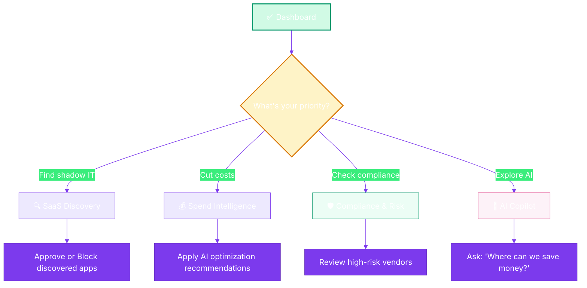

<div align="center">


# ⚡ Quick Start Guide

**Go from zero to a fully operational SaaS dashboard in under 10 minutes**

`Home` · `Getting Started` · **Quick Start Guide**

</div>

---

## Overview

This guide walks you through SaaSIQ from **first visit to a fully operational dashboard** in under 10 minutes. Follow these steps in order.

---

## Prerequisites

| Requirement | Details |
|-------------|---------|
| **Browser** | Chrome 90+, Firefox 88+, Safari 14+, or Edge 90+ |
| **Credentials** | An email address and password — or SSO via Google/Microsoft |
| **Admin access** | Organization admin rights (for initial setup) |

> [!TIP]
> For a quick demo without signing up, use the pre-filled demo credentials on the login page: `demo@saasiq.io` / `SaaSIQ2024!`

---

## Step-by-Step Setup

### Step 1: Access the Platform

Navigate to the SaaSIQ platform:

```
https://saasiq.github.io/saasiq-ux-prototype/
```

You'll land on the **Landing Page** showcasing SaaSIQ's capabilities.

**What you'll see:**
- Hero section with "Start Free Trial" and "Watch Demo" CTAs
- Feature overview, pricing plans, and customer testimonials
- Navigation bar with Login and Start Free Trial buttons

**Actions available:**

| Action | What Happens |
|--------|-------------|
| Click **"Start Free Trial"** | → Navigates to Signup page |
| Click **"Watch Demo"** | → Opens interactive 6-step product demo |
| Click **"Login"** | → Navigates to Login page |

> [!TIP]
> Watch the demo first to understand what SaaSIQ can do before creating your account.

---

### Step 2: Create Your Account

**Option A — Email Signup**

1. Click **"Start Free Trial"** from the landing page
2. Fill in the registration form:

   | Field | Example Value | Required |
   |-------|--------------|----------|
   | Full Name | Rahul Sharma | ✅ |
   | Work Email | rahul@techcorp.in | ✅ |
   | Password | (min 8 chars) | ✅ |
   | Company Name | TechCorp India | ✅ |
   | Company Size | 201–500 | ✅ |
   | Job Title | IT Manager | ✅ |

3. Click **"Create Free Account"**

**Option B — SSO Signup**

1. Click **"Sign up with Google"** or **"Sign up with Microsoft"**
2. Authorize SaaSIQ in the OAuth consent screen
3. Company details will be auto-populated from your SSO profile

> [!NOTE]
> Both options lead to a 14-day free Business Plan trial. No credit card required.

---

### Step 3: Login

If you already have an account:

1. Click **"Login"** from the landing page
2. Enter your credentials or use SSO
3. Click **"Sign In"**

**Demo fast-track:** The login form comes pre-filled with demo credentials:
- Email: `demo@saasiq.io`
- Password: `SaaSIQ2024!`

Just click **"Sign In"** to explore immediately.

<details>
<summary><strong>🔐 Forgot your password?</strong></summary>

1. Click the **"Forgot password?"** link below the password field
2. Enter your registered email address
3. Click **"Send Reset Link"**
4. Check your email and follow the reset instructions
5. You'll see a confirmation: *"If this email is registered, you'll receive a reset link shortly."*

</details>

---

### Step 4: Complete the Onboarding Wizard

After first login, the **4-step Onboarding Wizard** guides your initial setup:

```mermaid
%%{init: {'theme': 'base', 'themeVariables': {'primaryColor': '#7C3AED', 'primaryTextColor': '#fff', 'primaryBorderColor': '#5B21B6', 'lineColor': '#7C3AED', 'secondaryColor': '#EDE9FE', 'tertiaryColor': '#F5F3FF', 'fontFamily': 'Inter'}}}%%
graph LR
    A["1️⃣ SSO Setup"] --> B["2️⃣ Integrations"]
    B --> C["3️⃣ Team Invite"]
    C --> D["4️⃣ Preferences"]
    D --> E["🎉 Dashboard"]

    style A fill:#EDE9FE,stroke:#7C3AED,stroke-width:2px
    style B fill:#EDE9FE,stroke:#7C3AED,stroke-width:2px
    style C fill:#EDE9FE,stroke:#7C3AED,stroke-width:2px
    style D fill:#EDE9FE,stroke:#7C3AED,stroke-width:2px
    style E fill:#D1FAE5,stroke:#059669,stroke-width:2px
```



| Step | What to Do | Can Skip? |
|------|-----------|-----------|
| **1. SSO Configuration** | Connect Google Workspace or Microsoft Entra ID | Yes |
| **2. Connect Integrations** | Add Slack, Jira, AWS, Salesforce, GitHub, Figma | Yes |
| **3. Invite Team** | Enter team email addresses or skip for later | Yes |
| **4. Set Preferences** | Choose focus area (Cost, Security, Usage, All) and alert threshold | Yes |

> [!TIP]
> At minimum, connect **one SSO provider** in Step 1 — this is how SaaSIQ discovers your applications. You can always add more integrations later from Settings.

> [!WARNING]
> Skipping all steps means SaaSIQ will load with **demo data only**. Connect at least one integration to see your real SaaS landscape.

**See:** [Onboarding Wizard — Detailed Guide](onboarding.md) for full instructions on each step.

---

### Step 5: Explore Your Dashboard

After onboarding, you land on the **Dashboard** — your SaaS command center.

```
┌──────────────────────────────────────────────────────────────┐
│  🟣 SaaSIQ        🔍 Search          🔔 Alerts   👤 Profile │  ← Top Bar
├────────────┬─────────────────────────────────────────────────┤
│            │                                                 │
│  📊 Dash   │   ┌─────┐ ┌─────┐ ┌─────┐ ┌─────┐            │
│  🔍 Intel  │   │ KPI │ │ KPI │ │ KPI │ │ KPI │            │
│  🛡️ Gov    │   │  1  │ │  2  │ │  3  │ │  4  │            │
│  🤖 AI     │   └─────┘ └─────┘ └─────┘ └─────┘            │
│  ⚙️ Ops    │                                                │
│  🔧 Admin  │   ┌──────────────┐  ┌─────────────┐           │
│            │   │  Line Chart  │  │ Donut Chart │           │
│            │   └──────────────┘  └─────────────┘           │
│            │                                                │
│            │   ┌──────────────────────────────┐             │
│            │   │  Urgent Actions / Tables     │             │
│            │   └──────────────────────────────┘             │
│            │                                                 │
├────────────┴─────────────────────────────────────────────────┤
│  🧭 Floating Navigator                                       │
└──────────────────────────────────────────────────────────────┘
```

**What to check first:**

1. **KPI Cards** — Total Apps, Monthly Spend, Potential Savings, Avg Utilization
2. **Urgent Actions** — Critical items needing immediate attention
3. **Upcoming Renewals** — Contracts expiring soon
4. **Top Apps by Spend** — Where your money goes

**See:** [Dashboard — Full Documentation](../overview/dashboard.md)

---

## What to Do Next

Now that you're set up, here's a suggested exploration path:



| Priority | Recommended Path | Time |
|----------|-----------------|------|
| **Reduce costs immediately** | Dashboard → [Spend Intelligence](../intelligence/spend-intelligence.md) → [Benchmarks](../operations/benchmarks.md) | 5 min |
| **Secure the organization** | Dashboard → [SaaS Discovery](../intelligence/saas-discovery.md) → [Compliance](../governance/compliance-and-risk.md) | 5 min |
| **Get AI recommendations** | Dashboard → [AI Insights](../ai-features/ai-insights.md) → [AI Copilot](../ai-features/ai-copilot.md) | 3 min |
| **Full exploration** | Dashboard → Intelligence → Governance → AI → Operations | 15 min |

---

## Validation Checklist

Use this checklist to confirm your setup is complete:

- [ ] Landing page loads at `#landing`
- [ ] Account created (signup) or demo login successful
- [ ] Onboarding wizard completed (or intentionally skipped)
- [ ] Dashboard loads with KPI cards visible
- [ ] Sidebar navigation expands to show all modules
- [ ] At least one integration connected (or using demo data)
- [ ] Alert bell icon visible in top bar
- [ ] Profile menu accessible via avatar dropdown

---

---

<div align="center">

**Was this page helpful?** 👍 Yes · 👎 No · [Suggest an edit](https://github.com/saasiq/saasiq-documentation/edit/main/docs/getting-started/quick-start.md)

---

<a href="introduction.md">⬅️ Introduction</a>&nbsp;&nbsp;·&nbsp;&nbsp;<a href="onboarding.md">Onboarding Wizard ➡️</a>

<sub>Last updated: March 2026 · SaaSIQ Documentation v1.0.0</sub>

</div>
