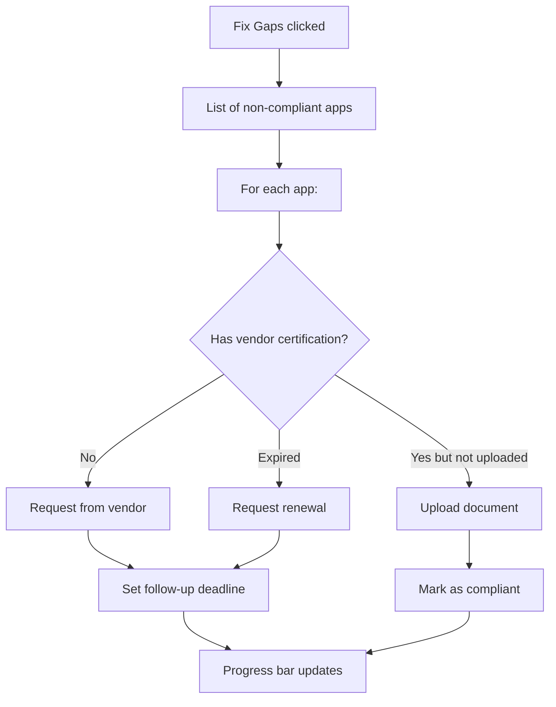
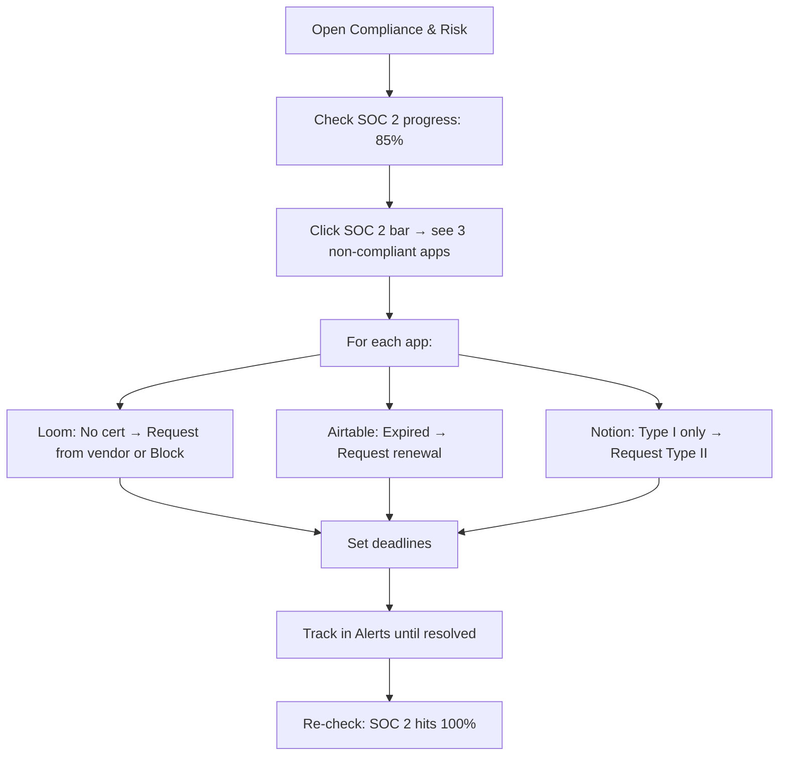

<div align="center">


# 🛡️ Compliance & Risk

**Monitor frameworks, assess vendor risk, and maintain audit readiness**

`Home` · `Governance` · **Compliance & Risk**

</div>

> **Home** · Governance · **Compliance & Risk**

---

## Overview

The Compliance & Risk dashboard monitors your organization's adherence to **security frameworks** (SOC 2, GDPR, HIPAA, ISO 27001), calculates an overall **risk score**, and flags **high-risk applications** that need immediate attention. It's your central hub for audit readiness and vendor risk management.

---

## In This Article

- [Risk Score Summary](#risk-score-summary)
- [Compliance Framework Progress](#compliance-framework-progress)
- [High-Risk Applications](#high-risk-applications)
- [Operations: Review, Remediate, Export](#operations)
- [Workflows & Scenarios](#workflows--scenarios)
- [Validation Checklist](#validation-checklist)

---

## Risk Score Summary

At the top of the page, a large card shows your overall organizational risk posture.

| Property | Demo Value | Description |
|----------|-----------|-------------|
| **Overall Risk Grade** | B+ | Letter grade from A+ (best) to F (critical) |
| **Numeric Score** | 78/100 | Composite score across all frameworks |
| **Trend** | ↑ +3 from last month | Improving or declining |
| **Last Assessment** | Mar 1, 2026 | When the score was last calculated |

<div align="center">

| | |
|:--:|:--|
| **Overall Risk Score** | |
| **B+** | |
| 78 / 100 | ↑ +3 from last month |
| | Last assessed: March 1, 2026 |

</div>

<details>
<summary><strong>📊 How is the Risk Score calculated?</strong></summary>

The risk score is a weighted average of four compliance frameworks:

| Framework | Weight | Factors Analyzed |
|-----------|--------|-----------------|
| SOC 2 | 30% | Type II certification, audit recency, control coverage |
| GDPR | 25% | DPA agreements, data location, consent mechanisms |
| HIPAA | 20% | BAA in place, PHI handling, access controls |
| ISO 27001 | 25% | Certification status, last audit date, scope coverage |

**Grade mapping:**

| Score | Grade | Meaning |
|-------|-------|---------|
| 90–100 | A+ / A | Excellent — audit-ready |
| 80–89 | B+ / B | Good — minor gaps to address |
| 70–79 | C+ / C | Fair — several areas need attention |
| 60–69 | D | Poor — significant compliance gaps |
| Below 60 | F | Critical — immediate action required |

</details>

---

## Compliance Framework Progress

Four progress bars showing your coverage across each major framework.

| Framework | Coverage | Status | Missing Items |
|-----------|----------|--------|--------------|
| **SOC 2 Type II** | 85% | 🟡 Good | 3 apps lack SOC 2 certification |
| **GDPR** | 91% | 🟢 Excellent | 2 apps missing DPA agreements |
| **HIPAA** | 72% | 🟠 Needs Work | 5 apps need BAA, 2 lack encryption |
| **ISO 27001** | 68% | 🟠 Needs Work | 7 apps not ISO certified, 3 expired |

```
SOC 2 Type II   ████████████████████████████████████████████░░░░░░░ 85%  🟡
GDPR            █████████████████████████████████████████████████░░ 91%  🟢
HIPAA           ████████████████████████████████████░░░░░░░░░░░░░░ 72%  🟠
ISO 27001       ██████████████████████████████████░░░░░░░░░░░░░░░░ 68%  🟠
```

**Interactions:**

| Action | Result |
|--------|--------|
| Click any progress bar | Expands to show the list of non-compliant apps |
| Hover on bar | Tooltip: "SOC 2: 132 of 156 apps compliant (85%)" |
| Click **"View Report"** | Downloads a framework-specific compliance report |
| Click **"Fix Gaps"** | Opens a guided remediation flow |

<details>
<summary><strong>🔍 What does the expanded view show?</strong></summary>

Clicking on the SOC 2 bar (85%) expands to reveal:

| App | SOC 2 Status | Issue | Action |
|-----|-------------|-------|--------|
| Loom | ❌ No certification | No SOC 2 Type II report available | [Review] [Block] |
| Airtable | ❌ Expired | SOC 2 expired Dec 2025 | [Review] [Request Update] |
| Notion | ⚠️ Partial | SOC 2 Type I only (not Type II) | [Review] |

</details>

---

## High-Risk Applications

A highlighted section showing applications that pose the greatest risk to your organization.

| Application | Risk Level | Risk Factors | Users | Data Sensitivity | Action |
|------------|-----------|-------------|-------|-----------------|--------|
| **Loom** | 🔴 High | No SOC 2, No DPA, data stored outside India | 45 | Contains meeting recordings (may include PII) | [Review] [Block] |
| **Airtable** | 🔴 High | Expired SOC 2, No BAA, No ISO 27001 | 22 | Contains project data and client information | [Review] [Block] |
| **ChatGPT Plus** | 🔴 Critical | Shadow IT, No enterprise agreement, data training concerns | 67 | Employees may paste sensitive code/data | [Block] [Review] |

### Risk Level Definitions

| Level | Color | Meaning | Recommended Action |
|-------|-------|---------|-------------------|
| 🟢 Low | Green | Fully compliant, all certifications current | Monitor regularly |
| 🟡 Medium | Yellow | Minor gaps (e.g., one certification pending renewal) | Review within 30 days |
| 🟠 High | Orange | Multiple compliance gaps or expired certifications | Review within 7 days |
| 🔴 Critical | Red | No certifications + data sensitivity + shadow IT | Immediate action required |

---

## Operations

### Review Application Risk

**Trigger:** Click **"Review"** on any high-risk application

**Modal: Risk Assessment Detail**

| Section | Content |
|---------|---------|
| **Overview** | App name, vendor, category, user count |
| **Compliance Status** | Per-framework status (SOC 2 ✅/❌, GDPR ✅/❌, HIPAA ✅/❌, ISO ✅/❌) |
| **Risk Factors** | Itemized list of every identified risk |
| **Data Assessment** | What types of data this app processes (PII, financial, health, etc.) |
| **Vendor Security** | Encryption status, data center locations, incident history |
| **Recommendations** | AI-generated remediation steps |
| **History** | Timeline of risk score changes |

**Actions in modal:**

| Button | Result |
|--------|--------|
| **"Request Vendor Certification"** | Sends email template to vendor requesting SOC 2/ISO proof |
| **"Add DPA Agreement"** | Upload or link a DPA document |
| **"Block Application"** | Opens block flow (see [SaaS Discovery](../intelligence/saas-discovery.md)) |
| **"Accept Risk"** | Acknowledges the risk with a documented reason (requires admin approval) |
| **"Set Remediation Deadline"** | Creates a calendar reminder for follow-up |

---

### Remediate Compliance Gap

**Trigger:** Click **"Fix Gaps"** on any framework progress bar

**Modal: Guided Remediation**



---

### Export Compliance Report

**Trigger:** Click **"Export Report"** button (top-right of the page)

| Format | Content |
|--------|---------|
| **PDF** | Full compliance report with risk scores, framework coverage, high-risk apps, and recommendations |
| **CSV** | Raw data export — all apps with their compliance status per framework |
| **Email** | Sends the report directly to specified email addresses |

> [!IMPORTANT]
> Generate a compliance report **monthly** and share it with your security team and leadership. This creates an audit trail and demonstrates ongoing governance.

---

## Workflows & Scenarios

### Scenario 1: "Preparing for a SOC 2 audit"



1. Open **Compliance & Risk**
2. Check SOC 2 Type II progress (85%)
3. Click the progress bar to see the 3 non-compliant apps
4. For Loom: Click **"Review"** → decide to Block (no enterprise SOC 2 available)
5. For Airtable: Click **"Request Vendor Certification"** → set 14-day deadline
6. For Notion: Click **"Request Vendor Certification"** → request Type II upgrade
7. Monitor via Alerts until vendors respond
8. Upload received certifications → SOC 2 coverage increases

### Scenario 2: "A data breach is reported for a vendor"

> Breaking news: Loom reports a data breach affecting user recordings.

1. Open **Compliance & Risk** → find Loom in High-Risk Apps
2. Click **"Review"** → check data assessment (meeting recordings, possibly PII)
3. Check user count (45 users) and departments affected
4. Click **"Block Application"** → Reason: Active data breach
5. Enable **"Notify Users"** → message: "Loom temporarily suspended due to security incident"
6. Navigate to [Policies](policies.md) → create a temporary "Loom Blocked" policy
7. Monitor vendor's breach response → unblock when remediated

### Scenario 3: "GDPR compliance for EU expansion"

1. Open **Compliance & Risk**
2. Click GDPR progress bar (91%)
3. Identify 2 apps missing DPA agreements
4. For each: Click **"Add DPA Agreement"** → upload the signed DPA
5. Check data residency compliance (are any apps storing EU data outside EU?)
6. Cross-reference with [Policies](policies.md) for data residency policy enforcement
7. GDPR coverage reaches 100%

---

## Validation Checklist

### Page Load
- [ ] Risk Score card shows grade (B+) and numeric score (78/100)
- [ ] Trend indicator shows direction (↑/↓)
- [ ] Last assessment date is visible
- [ ] 4 framework progress bars render

### Framework Progress
- [ ] SOC 2, GDPR, HIPAA, ISO 27001 bars show correct percentages
- [ ] ColorHousing matches status (green ≥90%, yellow 80-89%, orange 70-79%, red <70%)
- [ ] Hover shows tooltip with app count
- [ ] Click expands non-compliant app list
- [ ] "View Report" triggers download
- [ ] "Fix Gaps" opens remediation modal

### High-Risk Apps
- [ ] At least 2 high-risk apps displayed
- [ ] Risk level colors are correct
- [ ] Risk factors are listed per app
- [ ] "Review" opens detailed modal
- [ ] "Block" triggers block workflow

### Operations
- [ ] Review modal shows all 6 sections
- [ ] "Request Vendor Certification" works
- [ ] "Accept Risk" requires confirmation
- [ ] "Set Remediation Deadline" creates reminder
- [ ] Export generates PDF/CSV

---

## Related Resources

- 🔗 [Contracts](contracts.md) — Check if vendor contracts include compliance clauses
- 🔗 [Policies](policies.md) — Create policies that enforce compliance standards
- 🔗 [SaaS Discovery](../intelligence/saas-discovery.md) — View risk levels on discovered apps
- 🔗 [Alerts & Notifications](../administration/alerts-notifications.md) — Compliance violation alerts

---

---

<div align="center">

**Was this page helpful?** 👍 Yes · 👎 No · [Suggest an edit](https://github.com/saasiq/saasiq-documentation/edit/main/docs/governance/compliance-and-risk.md)

---

<a href="index.md">⬅️ Governance Overview</a>&nbsp;&nbsp;·&nbsp;&nbsp;<a href="contracts.md">Contracts ➡️</a>

<sub>Last updated: March 2026 · SaaSIQ Documentation v1.0.0</sub>

</div>
