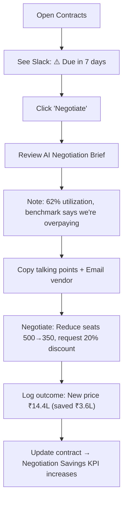

<div align="center">


# 📝 Contracts

**Track contract lifecycles, renewal timelines, and AI-powered negotiation briefs**

`Home` · `Governance` · **Contracts**

</div>

> **Home** · Governance · **Contracts**

---

## Overview

The Contracts page provides a **visual timeline** of all SaaS contracts, their renewal dates, costs, and statuses. It helps you plan ahead — knowing exactly when each contract comes up for renewal and what action to take (negotiate, auto-renew, or cancel).

---

## In This Article

- [KPI Summary Cards](#kpi-summary-cards)
- [Renewal Timeline](#renewal-timeline)
- [Contract Table](#contract-table)
- [Operations: Negotiate, Review, Export](#operations)
- [Workflows & Scenarios](#workflows--scenarios)
- [Validation Checklist](#validation-checklist)

---

## KPI Summary Cards

| # | Metric | Demo Value | Description |
|---|--------|-----------|-------------|
| 1 | **Active Contracts** | 48 | Total number of active SaaS contracts |
| 2 | **Upcoming (30 days)** | 3 | Contracts renewing within 30 days |
| 3 | **Annual Contract Value** | ₹5.1 Cr | Total committed annual SaaS spend |
| 4 | **Negotiation Savings** | ₹38L (YTD) | Savings achieved through renegotiations this year |

> [!TIP]
> Click **"Upcoming (30 days): 3"** to filter the timeline to only show contracts renewing within a month — these are the ones needing immediate attention.

---

## Renewal Timeline

A horizontal, month-based visual timeline showing when each contract comes up for renewal.

```
     March 2026          April 2026          May 2026
    ┌───────────────┐  ┌───────────────┐  ┌───────────────┐
    │ Slack ⚠️      │  │ Salesforce    │  │ Figma         │
    │ Mar 15        │  │ Apr 1         │  │ May 1         │
    │ ₹18L/yr       │  │ ₹24L/yr       │  │ ₹8.4L/yr      │
    │               │  │ AWS           │  │ Notion        │
    │               │  │ Apr 15        │  │ May 20        │
    │               │  │ ₹36L/yr       │  │ ₹4.9L/yr      │
    └───────────────┘  └───────────────┘  └───────────────┘

     June 2026          July 2026          August 2026
    ┌───────────────┐  ┌───────────────┐  ┌───────────────┐
    │ HubSpot       │  │ Jira          │  │ Zoom          │
    │ Jun 10        │  │ Jul 1         │  │ Aug 15        │
    │ ₹12L/yr       │  │ ₹10.2L/yr     │  │ ₹6L/yr        │
    └───────────────┘  └───────────────┘  └───────────────┘
```

**Color coding:**

| Color | Meaning |
|-------|---------|
| 🔴 Red | Renewing within 7 days — urgent |
| 🟡 Yellow | Renewing within 30 days — plan now |
| 🟢 Green | Renewing in 30+ days — on track |
| 🔵 Blue | Auto-renewal enabled — no action needed |

**Interactions:**

| Action | Result |
|--------|--------|
| Click any contract card | Opens contract detail modal |
| Hover on card | Shows full contract name, vendor, owner, and notes |
| Use period selector | Filter: Next 30 days / 60 days / 90 days / All |
| Scroll horizontally | Navigate through future months |

---

## Contract Table

Below the timeline, a sortable/filterable table provides a detailed list view.

| Application | Vendor | Annual Cost | Renewal Date | Status | Owner | Actions |
|------------|--------|------------|-------------|--------|-------|---------|
| Slack Enterprise | Slack Technologies | ₹18,00,000 | Mar 15, 2026 | ⚠️ Due in 7 days | IT Admin | [Negotiate] [Review] |
| Salesforce CRM | Salesforce Inc. | ₹24,00,000 | Apr 01, 2026 | 🟢 24 days | Sales Ops | [Review] |
| AWS | Amazon | ₹36,00,000 | Apr 15, 2026 | 🟢 38 days | DevOps | [Review] |
| Figma | Figma Inc. | ₹8,40,000 | May 01, 2026 | 🟢 54 days | Design Lead | [Review] |
| Notion | Notion Labs | ₹4,89,600 | May 20, 2026 | 🟢 73 days | Engineering | [Review] |
| HubSpot | HubSpot Inc. | ₹12,00,000 | Jun 10, 2026 | 🟢 94 days | Marketing | [Review] |
| Jira | Atlassian | ₹10,20,000 | Jul 01, 2026 | 🟢 115 days | Engineering | [Review] |
| Zoom | Zoom Communications | ₹6,00,000 | Aug 15, 2026 | 🔵 Auto-renew | IT Admin | [Review] |

**Table features:**

| Feature | Description |
|---------|-------------|
| **Sort** | Click column header to sort (default: Renewal Date ascending) |
| **Filter** | Status dropdown, Owner dropdown, Cost range slider |
| **Search** | Search by application or vendor name |
| **Pagination** | 10 per page with page navigation |
| **Export** | Download as CSV or PDF |

---

## Operations

### Negotiate Contract

**Trigger:** Click **"Negotiate"** on contracts nearing renewal (within 30 days)

**Modal: Negotiate Contract**

| Section | Content |
|---------|---------|
| **Contract Summary** | App name, current cost, renewal date, term length |
| **Usage Data** | Current utilization %, active users, historical trend |
| **Benchmark Data** | What similar companies pay for this vendor (from [Benchmarks](../operations/benchmarks.md)) |
| **AI Negotiation Brief** | SaaSIQ-generated talking points and suggested price |
| **Negotiation History** | Previous negotiations with this vendor |

**AI Negotiation Brief (Example for Slack):**

```
┌──────────────────────────────────────────────────────────────┐
│  🤖 AI Negotiation Brief — Slack Enterprise                  │
│                                                              │
│  Current: ₹18L/yr (₹3,600/user/yr for 500 seats)           │
│  Recommended Target: ₹14.4L/yr (₹2,880/user/yr)            │
│  Potential Savings: ₹3.6L/yr (20% reduction)                │
│                                                              │
│  Talking Points:                                             │
│  1. Utilization is only 62% (312/500 seats active)           │
│  2. Industry benchmark: ₹2,700–3,200/user/yr                │
│  3. Reduce seats from 500 → 350 (match active users + 10%)  │
│  4. Multi-year discount opportunity (3-year = 25% off)       │
│  5. Competitor alternative: Microsoft Teams (already in M365)│
│                                                              │
│  [Copy to Clipboard]  [Email to Vendor]  [Download PDF]      │
└──────────────────────────────────────────────────────────────┘
```

**Actions:**

| Button | Result |
|--------|--------|
| **"Copy to Clipboard"** | Copies negotiation brief to clipboard |
| **"Email to Vendor"** | Opens email template addressed to vendor's sales team |
| **"Download PDF"** | Exports a formatted negotiation document |
| **"Mark as Negotiating"** | Updates contract status to "In Negotiation" |
| **"Log Outcome"** | Record the negotiation result (new price, new terms) |

---

### Review Contract

**Trigger:** Click **"Review"** on any contract

**Modal: Contract Details**

| Tab | Content |
|-----|---------|
| **Overview** | Vendor, start date, term, renewal type, payment schedule |
| **Cost History** | Chart showing cost changes over renewals |
| **Usage** | Utilization data linked from Usage Analytics |
| **Compliance** | Vendor's compliance status from Compliance & Risk |
| **Documents** | Uploaded contract PDFs, DPA, SLA |
| **Notes** | Internal notes and comments from team members |

**Actions:**

| Button | Result |
|--------|--------|
| **"Set Reminder"** | Create an alert X days before renewal |
| **"Upload Document"** | Attach contract PDF or amendment |
| **"Toggle Auto-Renew"** | Enable/disable automatic renewal |
| **"Cancel Contract"** | Initiate cancellation workflow |
| **"Add Note"** | Add an internal comment |

> [!WARNING]
> Toggling Auto-Renew OFF means you must manually act before the renewal date, or the contract may lapse. Always set a reminder when disabling auto-renew.

---

## Workflows & Scenarios

### Scenario 1: "Slack renewal is in 7 days"



### Scenario 2: "Annual contract review for finance planning"

1. Open **Contracts** → note Annual Contract Value: ₹5.1 Cr
2. Filter to **"Next 90 days"** → 5 contracts totaling ₹92.29L
3. For each: Check utilization (from Usage Analytics crosslink)
4. Flag underutilized contracts for negotiation or cancellation
5. Export table as CSV → share with Finance for budgeting

### Scenario 3: "Ensure all vendors have current DPAs"

1. Open each contract via **"Review"**
2. Go to **"Documents"** tab → check for DPA upload
3. If missing: Navigate to [Compliance & Risk](compliance-and-risk.md) to check vendor status
4. Contact vendor for DPA → upload when received
5. Update compliance status

---

## Validation Checklist

### Page Load
- [ ] 4 KPI cards render with correct values
- [ ] Renewal timeline shows contracts in correct months
- [ ] Contract table loads with all entries
- [ ] Color coding matches renewal urgency

### Timeline
- [ ] Cards are positioned in correct months
- [ ] Color coding: red (<7 days), yellow (<30 days), green (30+), blue (auto-renew)
- [ ] Clicking a card opens contract detail
- [ ] Period filter works (30/60/90/All)
- [ ] Horizontal scrolling works

### Table
- [ ] All columns visible (Application, Vendor, Cost, Date, Status, Owner, Actions)
- [ ] Sort works on each column
- [ ] Filter by status works
- [ ] Search by app/vendor name works
- [ ] Pagination works

### Negotiate
- [ ] "Negotiate" button visible only on contracts within 30 days
- [ ] Modal shows AI Negotiation Brief with talking points
- [ ] "Copy to Clipboard" works
- [ ] "Email to Vendor" opens email template
- [ ] "Download PDF" triggers download
- [ ] "Log Outcome" saves and updates KPI

### Review
- [ ] All 6 tabs are navigable
- [ ] "Set Reminder" creates an alert
- [ ] "Upload Document" accepts file upload
- [ ] "Toggle Auto-Renew" switches state
- [ ] "Add Note" saves comment

---

## Related Resources

- 🔗 [Compliance & Risk](compliance-and-risk.md) — Vendor compliance status for each contract
- 🔗 [Renewals](../operations/renewals.md) — Operational renewal tracking and actions
- 🔗 [Benchmarks](../operations/benchmarks.md) — Industry pricing data for negotiations
- 🔗 [Spend Intelligence](../intelligence/spend-intelligence.md) — Cost context for contract decisions

---

---

<div align="center">

**Was this page helpful?** 👍 Yes · 👎 No · [Suggest an edit](https://github.com/saasiq/saasiq-documentation/edit/main/docs/governance/contracts.md)

---

<a href="compliance-and-risk.md">⬅️ Compliance & Risk</a>&nbsp;&nbsp;·&nbsp;&nbsp;<a href="policies.md">Policies ➡️</a>

<sub>Last updated: March 2026 · SaaSIQ Documentation v1.0.0</sub>

</div>
