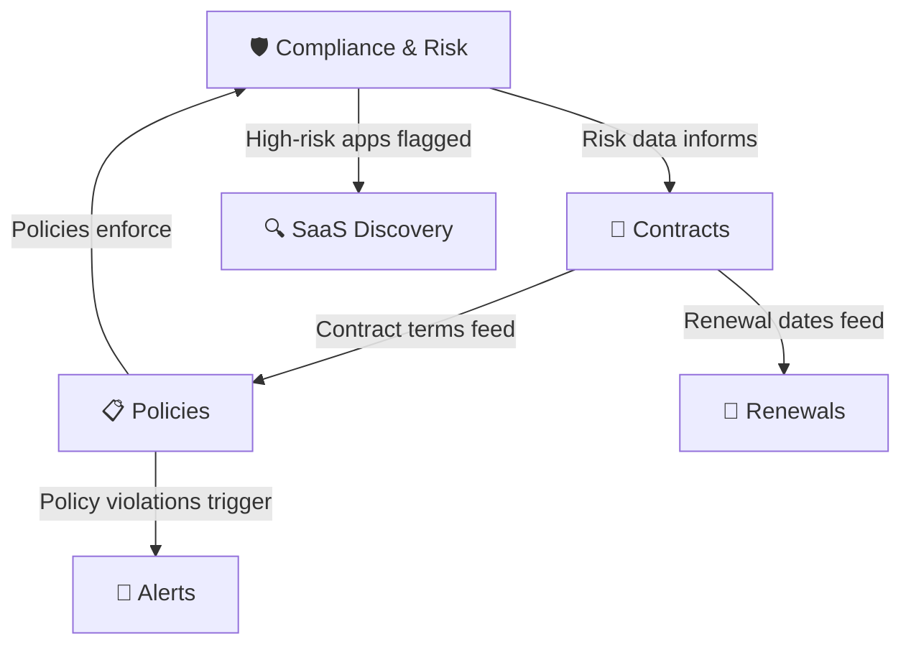

# 🛡️ Governance Module

**Stay compliant, manage contracts, and enforce organizational policies**

`Home` · **Governance**

---

## Overview

The Governance module ensures your SaaS portfolio is **secure, compliant, and contractually managed**. It provides three integrated features that work together to protect your organization from risk while maintaining control over vendor relationships.

---

## What's Inside

| Feature | Purpose | Key Question It Answers |
|---------|---------|------------------------|
| [Compliance & Risk](compliance-and-risk.md) | Monitor compliance frameworks and vendor risk | *"Are our apps secure and compliant?"* |
| [Contracts](contracts.md) | Track contract lifecycles and renewals | *"When do our contracts expire and what needs renegotiating?"* |
| [Policies](policies.md) | Define and enforce organizational policies | *"What rules govern our SaaS usage?"* |

---

## How These Features Connect

**Governance lifecycle:**
1. **Compliance & Risk** scores each vendor's security posture
2. **Contracts** manages the commercial relationship and renewal timeline
3. **Policies** enforces organizational rules (spend limits, data residency, security standards)
4. Violations and risks trigger **Alerts** and inform **SaaS Discovery** decisions

---

## When to Use Each Feature

<strong>🛡️ Compliance & Risk — "Am I exposed to regulatory risk?"</strong>

**Use when:**
- Preparing for an audit (SOC 2, ISO 27001, etc.)
- Evaluating a new vendor's security posture
- A data breach is reported for a vendor you use
- You need to identify apps without DPA agreements

**Go to:** [Compliance & Risk →](compliance-and-risk.md)

<strong>📄 Contracts — "What's coming up for renewal?"</strong>

**Use when:**
- Reviewing the upcoming 30/60/90-day renewal pipeline
- Preparing for a vendor negotiation
- Checking if a contract is still within terms
- Creating a renewal calendar for finance planning

**Go to:** [Contracts →](contracts.md)

<strong>📋 Policies — "What rules does our org enforce?"</strong>

**Use when:**
- Setting up SaaS governance rules for the first time
- Defining spending thresholds that trigger approvals
- Configuring data residency requirements
- Creating security policies for vendor evaluation

**Go to:** [Policies →](policies.md)

---

## Related Resources

- 🔗 [SaaS Discovery](../intelligence/saas-discovery.md) — Risk levels feed from Compliance data
- 🔗 [Renewals](../operations/renewals.md) — Operational renewal management
- 🔗 [Alerts & Notifications](../administration/alerts-notifications.md) — Policy violation alerts

---

---

**Was this page helpful?** 👍 Yes · 👎 No · [Suggest an edit](https://github.com/saasiq/saasiq-documentation/edit/main/docs/governance/index.md)

---

<a href="../intelligence/usage-analytics.md">⬅️ Usage Analytics</a>&nbsp;&nbsp;·&nbsp;&nbsp;<a href="compliance-and-risk.md">Compliance & Risk ➡️</a>

Last updated: March 2026 · SaaSIQ Documentation v1.0.0

