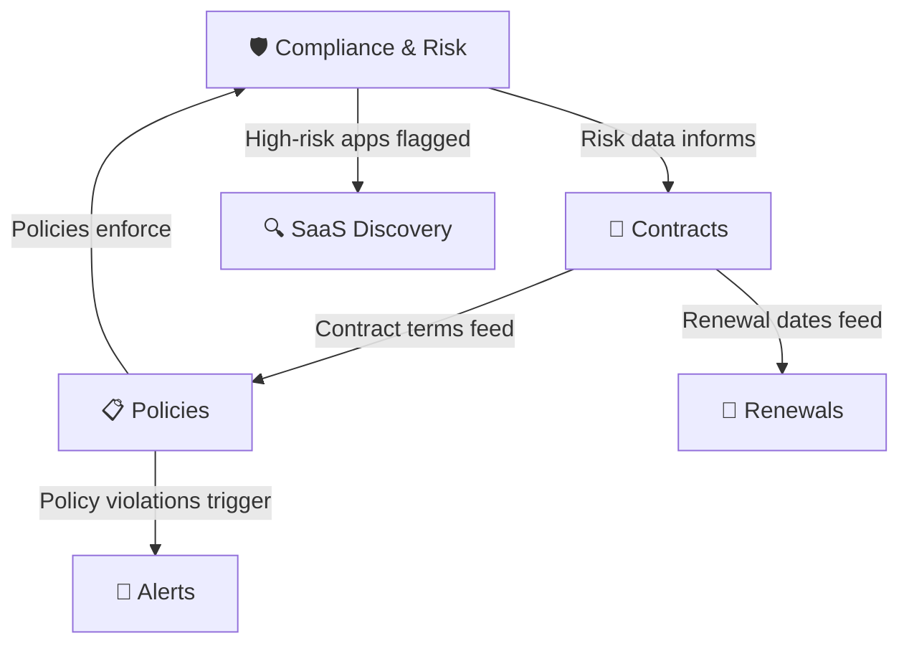

# :shield: Governance Module

**Stay compliant, manage contracts, and enforce organizational policies.**

The Governance module ensures your SaaS portfolio is **secure, compliant, and contractually managed**. Three integrated features work together to protect your organization from risk while keeping vendor relationships under control.

<a href="compliance-and-risk/" markdown>
:white_check_mark:
Compliance & Risk
Are our apps secure and compliant? Monitor frameworks, score vendor risk, and remediate issues.
B+ score (78/100) · SOC 2, GDPR, HIPAA, ISO 27001
</a>

<a href="contracts/" markdown>
:page_facing_up:
Contracts
When do contracts expire? Track lifecycles, costs, and get AI negotiation help.
34 active · 8 renewing in 90 days
</a>

<a href="policies/" markdown>
:lock:
Policies
What rules govern SaaS usage? Define spend limits, data residency, and security standards.
3 active policies · 2 violations this month
</a>

---

## How These Features Connect

**Governance lifecycle:**

1. **Compliance & Risk** scores each vendor's security posture
2. **Contracts** manages the commercial relationship and renewal timeline
3. **Policies** enforces organizational rules (spend limits, data residency, security standards)
4. Violations and risks trigger **Alerts** and inform **SaaS Discovery** decisions

---

## When to Use Each Feature

??? tip "Compliance & Risk — *Am I exposed to regulatory risk?*"

    **Use when:**

    - Preparing for an audit (SOC 2, ISO 27001, etc.)
    - Evaluating a new vendor's security posture
    - A data breach is reported for a vendor you use
    - You need to identify apps without DPA agreements

    **Go to:** [Compliance & Risk →](compliance-and-risk.md)

??? tip "Contracts — *What's coming up for renewal?*"

    **Use when:**

    - Reviewing the upcoming 30/60/90-day renewal pipeline
    - Preparing for a vendor negotiation
    - Checking if a contract is still within terms
    - Creating a renewal calendar for finance planning

    **Go to:** [Contracts →](contracts.md)

??? tip "Policies — *What rules does our org enforce?*"

    **Use when:**

    - Setting up SaaS governance rules for the first time
    - Defining spending thresholds that trigger approvals
    - Configuring data residency requirements
    - Creating security policies for vendor evaluation

    **Go to:** [Policies →](policies.md)

---

## Related Resources

- :link: [SaaS Discovery](../intelligence/saas-discovery.md) — Risk levels feed from Compliance data
- :link: [Renewals](../operations/renewals.md) — Operational renewal management
- :link: [Alerts & Notifications](../administration/alerts-notifications.md) — Policy violation alerts
