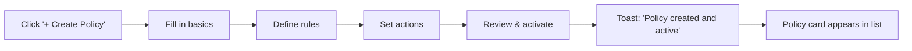

<div align="center" markdown>


# 📜 Policies

**Define and enforce organizational rules for security, spend, and data residency**

`Home` · `Governance` · **Policies**

</div>

> **Home** · Governance · **Policies**

---

## Overview

Policies are **organizational rules** that SaaSIQ enforces across your SaaS portfolio. They define what's allowed, what triggers alerts, and what requires approval — covering security standards, spending thresholds, and data residency requirements.

!!! note
    Policies are evaluated continuously. When a violation is detected, SaaSIQ triggers an alert and can optionally block the offending action.

---

## In This Article

- [Active Policies](#active-policies)
- [Policy Cards](#policy-cards)
- [Create New Policy](#create-policy)
- [Operations: Edit, Disable, Delete](#operations)
- [Workflows & Scenarios](#workflows-scenarios)
- [Validation Checklist](#validation-checklist)

---

## Active Policies

A summary bar shows the current state of your policy engine:

| Metric | Demo Value | Description |
|--------|-----------|-------------|
| **Active Policies** | 3 | Policies currently being enforced |
| **Violations (This Month)** | 7 | Number of policy violations detected |
| **Auto-Blocked** | 2 | Actions automatically blocked by policies |

---

## Policy Cards

Each active policy appears as a card with its status, scope, and violation count.

### Policy 1: SOC 2 Compliance Required

<table markdown>
<tr markdown>
<td markdown>

**🛡️ SOC 2 Compliance Required** &nbsp;&nbsp;&nbsp;&nbsp;&nbsp;&nbsp;&nbsp;&nbsp;&nbsp;&nbsp;&nbsp;&nbsp;&nbsp;&nbsp;&nbsp;&nbsp;&nbsp;&nbsp;&nbsp;&nbsp; ✅ Active

All SaaS applications processing customer data must have a valid SOC 2 Type II certification.

| Scope | Action on Violation | Violations | Last Triggered |
|:--|:--|:--|:--|
| All apps with "Customer Data" tag | Alert + Block new procurement | 3 this month | Mar 5, 2026 |

`Edit` &nbsp; `View Violations` &nbsp; `Disable`

</td>
</tr>
</table>

| Property | Value |
|----------|-------|
| **Name** | SOC 2 Compliance Required |
| **Type** | Security / Compliance |
| **Scope** | All applications tagged "Customer Data" |
| **Rule** | Must have valid SOC 2 Type II certification |
| **On Violation** | Alert IT Admin + Block new procurement |
| **Violations** | 3 this month (Loom, Airtable, Custom CRM) |
| **Created** | Jan 15, 2026 |
| **Last Modified** | Feb 28, 2026 |

### Policy 2: Spend Threshold Approval

<table markdown>
<tr markdown>
<td markdown>

**💰 Spend Threshold Approval** &nbsp;&nbsp;&nbsp;&nbsp;&nbsp;&nbsp;&nbsp;&nbsp;&nbsp;&nbsp;&nbsp;&nbsp;&nbsp;&nbsp;&nbsp;&nbsp;&nbsp;&nbsp;&nbsp;&nbsp;&nbsp;&nbsp;&nbsp;&nbsp; ✅ Active

Any SaaS purchase or renewal exceeding ₹5L/year requires CFO approval before processing.

| Scope | Action on Violation | Violations | Last Triggered |
|:--|:--|:--|:--|
| All procurement and renewal actions | Require approval workflow | 2 this month | Mar 3, 2026 |

`Edit` &nbsp; `View Violations` &nbsp; `Disable`

</td>
</tr>
</table>

| Property | Value |
|----------|-------|
| **Name** | Spend Threshold Approval |
| **Type** | Financial / Spend |
| **Scope** | All procurement and renewal actions |
| **Rule** | Purchases > ₹5L/year require CFO approval |
| **On Violation** | Pause action + Route to CFO for approval |
| **Violations** | 2 this month (Salesforce renewal, New tool request) |

### Policy 3: Data Residency — India

<table markdown>
<tr markdown>
<td markdown>

**🌍 Data Residency — India** &nbsp;&nbsp;&nbsp;&nbsp;&nbsp;&nbsp;&nbsp;&nbsp;&nbsp;&nbsp;&nbsp;&nbsp;&nbsp;&nbsp;&nbsp;&nbsp;&nbsp;&nbsp;&nbsp;&nbsp;&nbsp;&nbsp;&nbsp;&nbsp;&nbsp;&nbsp;&nbsp;&nbsp;&nbsp;&nbsp;&nbsp;&nbsp; ✅ Active

All SaaS applications must store primary data within India (or have India data center option enabled).

| Scope | Action on Violation | Violations | Last Triggered |
|:--|:--|:--|:--|
| All apps processing Indian user PII | Alert + Flag for review | 2 this month | Mar 7, 2026 |

`Edit` &nbsp; `View Violations` &nbsp; `Disable`

</td>
</tr>
</table>
```

| Property | Value |
|----------|-------|
| **Name** | Data Residency — India |
| **Type** | Data / Privacy |
| **Scope** | All applications processing Indian user PII |
| **Rule** | Primary data must be stored in India |
| **On Violation** | Alert + Flag for compliance review |
| **Violations** | 2 this month (Loom — US only, Airtable — US only) |

---

## Create New Policy

**Trigger:** Click the **"+ Create Policy"** button (top-right of page)

**Modal: Create Policy**

### Step 1: Policy Basics

| Field | Type | Description | Required |
|-------|------|-------------|----------|
| **Policy Name** | Text | Descriptive name for the policy | ✅ |
| **Description** | Textarea | Detailed explanation of what and why | ✅ |
| **Type** | Dropdown | Security, Financial, Data, Usage, Custom | ✅ |
| **Priority** | Dropdown | Critical, High, Medium, Low | ✅ |

### Step 2: Rules & Conditions

| Field | Type | Description |
|-------|------|-------------|
| **Scope** | Multi-select | Which apps/categories/departments this applies to |
| **Condition** | Rule builder | IF [field] [operator] [value] (e.g., IF cost > ₹5L) |
| **Additional conditions** | AND/OR logic | Add multiple conditions with logical operators |

**Rule builder example:**

```
IF   [Application Category] [equals] [Cloud Infrastructure]
AND  [SOC 2 Status]         [is not] [Certified]
AND  [Data Sensitivity]     [equals] [High]
THEN [Action]
```

### Step 3: Actions & Enforcement

| Field | Type | Options |
|-------|------|---------|
| **On Violation** | Multi-select | Alert Admin, Alert Owner, Block Action, Require Approval, Log Only |
| **Alert Recipients** | Email/user select | Who gets notified on violation |
| **Enforcement** | Toggle | Active (enforced) or Monitor-only (track but don't block) |
| **Auto-remediation** | Toggle | Auto-block or auto-escalate without manual intervention |

### Step 4: Review & Activate

| Element | Description |
|---------|-------------|
| **Policy Summary** | Read-only review of all configured values |
| **Affected Apps** | Preview: "This policy applies to 23 applications" |
| **Existing Violations** | "4 apps currently violate this policy" |
| **Activate** | Toggle — activate immediately or save as draft |

**Workflow:**


!!! important
    Start with **"Monitor-only"** mode for new policies. This lets you see what would be flagged without disrupting workflows. Switch to enforcement after validating the rule scope.

---

## Operations

### Edit Policy

**Trigger:** Click **"Edit"** on any policy card

Opens the same multi-step modal as "Create Policy" but pre-filled with the current values. Changes take effect immediately upon saving.

!!! warning
    Editing a policy's scope or conditions may trigger new violations immediately. Review the "Affected Apps" preview before saving.

### View Violations

**Trigger:** Click **"View Violations"** on any policy card

**Violation List:**

| Column | Example |
|--------|---------|
| **Application** | Loom |
| **Violation** | No SOC 2 Type II certification |
| **Detected** | Mar 5, 2026 |
| **Status** | 🔴 Unresolved |
| **Owner** | IT Admin |
| **Action** | [Resolve] [Exempt] [Escalate] |

**Resolution actions:**

| Action | Description |
|--------|-------------|
| **Resolve** | Mark as fixed (provide evidence) |
| **Exempt** | Grant an exception with reason and expiry date |
| **Escalate** | Route to a specific person for review |

### Disable Policy

**Trigger:** Click **"Disable"** on any policy card

| Step | Description |
|------|-------------|
| 1 | Confirmation dialog: "Disable SOC 2 Compliance Required?" |
| 2 | Optional reason field |
| 3 | Click "Disable" → Policy card shows "⏸️ Disabled" badge |
| 4 | All active violations for this policy are paused (not deleted) |
| 5 | Can re-enable anytime with one click |

---

## Workflows & Scenarios

### Scenario 1: "Create a policy to block apps without encryption"

1. Click **"+ Create Policy"**
2. **Basics:** Name = "Encryption Required", Type = Security, Priority = Critical
3. **Rules:** IF [Encryption at Rest] [is not] [Enabled] AND [Data Sensitivity] [equals] [High or Critical]
4. **Actions:** Alert Admin + Block new procurement + Auto-remediation ON
5. **Review:** Shows 5 apps currently violating
6. **Activate:** Toggle ON → Policy enforced immediately
7. 5 existing apps are flagged for review

### Scenario 2: "Set spend approval thresholds by department"

1. Create Policy: "Engineering Spend Cap"
2. Rule: IF [Department] = Engineering AND [Annual Cost] > ₹10L → Require Engineering VP approval
3. Create another: "Marketing Spend Cap"
4. Rule: IF [Department] = Marketing AND [Annual Cost] > ₹5L → Require CMO approval
5. Both policies create approval workflows before procurement can proceed

### Scenario 3: "Investigate existing policy violations"

1. On the SOC 2 policy card, click **"View Violations"** → 3 violations listed
2. Loom: No certification → Decision: **Escalate** to CISO
3. Airtable: Expired → Decision: **Exempt** (renewal pending, expires in 14 days)
4. Custom CRM: No SOC 2 → Decision: **Resolve** (vendor provided cert, upload it)
5. Monitor: Violations decrease from 3 → 1

---

## Validation Checklist

### Page Load
- [ ] Summary bar shows Active Policies, Violations, Auto-Blocked counts
- [ ] 3 policy cards render with correct data
- [ ] Each card shows name, description, scope, violations, and action buttons

### Policy Cards
- [ ] Status badge shows "Active" or "Disabled"
- [ ] Violation count matches
- [ ] "Edit", "View Violations", "Disable" buttons present
- [ ] Last triggered date updates

### Create Policy
- [ ] "+" button opens creation modal
- [ ] 4 steps are navigable (Basics → Rules → Actions → Review)
- [ ] Rule builder accepts conditions with AND/OR logic
- [ ] "Affected Apps" preview shows correct count
- [ ] "Existing Violations" shows current violators
- [ ] Activating shows success toast
- [ ] New policy card appears in list

### Operations
- [ ] Edit opens pre-filled modal
- [ ] View Violations shows violation list with resolve/exempt/escalate
- [ ] Disable shows confirmation, then updates card badge
- [ ] Re-enable works from disabled state

---

## Related Resources

- 🔗 [Compliance & Risk](compliance-and-risk.md) — Framework compliance that policies enforce
- 🔗 [Contracts](contracts.md) — Contract terms that may be policy-controlled
- 🔗 [Alerts & Notifications](../administration/alerts-notifications.md) — How policy violations appear as alerts
- 🔗 [Settings — Security](../administration/settings.md) — Organization security settings

---

---

<div align="center" markdown>

**Was this page helpful?** 👍 Yes · 👎 No · [Suggest an edit](https://github.com/saasiq/saasiq-documentation/edit/main/docs/governance/policies.md)

---

<a href="contracts.md">⬅️ Contracts</a>&nbsp;&nbsp;·&nbsp;&nbsp;<a href="../ai-features/index.md">AI Features ➡️</a>

<sub>Last updated: March 2026 · SaaSIQ Documentation v1.0.0</sub>

</div>
