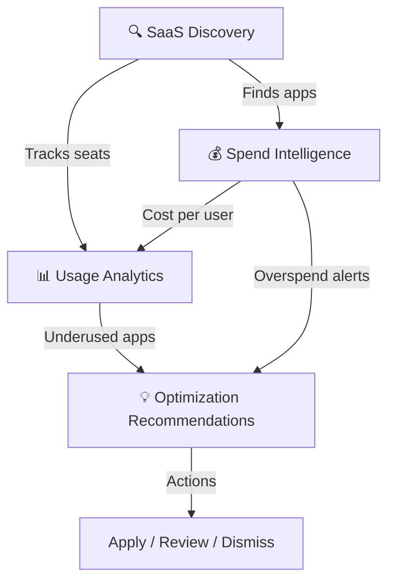

# 🔍 Intelligence Module

**Discover what’s in your stack, what it costs, and who’s actually using it**

`Home` · **Intelligence**

---

## Overview

The Intelligence module is the **analytical engine** of SaaSIQ. It answers three fundamental questions about your SaaS portfolio:

| Question | Feature | Link |
|----------|---------|------|
| **What apps do we have?** | SaaS Discovery & Shadow IT | [→ Open](saas-discovery.md) |
| **How much are we spending?** | Spend Intelligence | [→ Open](spend-intelligence.md) |
| **Are people actually using them?** | Usage Analytics | [→ Open](usage-analytics.md) |

---

## How These Features Connect

**Typical workflow:**
1. **Discovery** identifies all applications (including shadow IT)
2. **Spend Intelligence** calculates the cost of each app and finds savings
3. **Usage Analytics** shows which licenses are actually being used
4. Together, they power the **AI optimization engine** that generates recommendations

---

## Module at a Glance

| Feature | Key Metrics | Primary Actions |
|---------|------------|----------------|
| **SaaS Discovery** | 156 total apps · 8 shadow IT · 12 new this month | Approve, Block, Re-Scan |
| **Spend Intelligence** | ₹42.5L/mo · ₹12.8L savings · 67% utilization | Apply, Review, Create Plan |
| **Usage Analytics** | 67% avg utilization · 23 underused licenses | Reclaim, Downgrade, Alert |

---

## When to Use Each Feature

<strong>🔍 SaaS Discovery — "I want to know what apps we have"</strong>

**Use when:**
- You suspect employees are using unapproved tools
- A new employee joins and you need to provision apps
- You want a complete software inventory for audit
- A security incident requires identifying all data-holding apps

**Go to:** [SaaS Discovery & Shadow IT →](saas-discovery.md)

<strong>💰 Spend Intelligence — "I want to reduce SaaS costs"</strong>

**Use when:**
- Budget review season is coming
- You need to justify SaaS spend to leadership
- AI has identified potential savings you want to review
- A contract is up for renewal and you need negotiation data

**Go to:** [Spend Intelligence →](spend-intelligence.md)

<strong>📊 Usage Analytics — "I want to see if people are using what we pay for"</strong>

**Use when:**
- License counts seem high relative to headcount
- You want to reclaim unused licenses
- A department is over/under-adopting a tool
- You need utilization data for renewal negotiations

**Go to:** [Usage Analytics →](usage-analytics.md)

---

## Related Resources

- 🔗 [Dashboard](../overview/dashboard.md) — KPI summary of all Intelligence metrics
- 🔗 [AI Insights](../ai-features/ai-insights.md) — AI-generated recommendations based on Intelligence data
- 🔗 [Benchmarks](../operations/benchmarks.md) — Compare your metrics against industry peers

---

---

**Was this page helpful?** 👍 Yes · 👎 No · [Suggest an edit](https://github.com/saasiq/saasiq-documentation/edit/main/docs/intelligence/index.md)

---

<a href="../overview/dashboard.md">⬅️ Dashboard</a>&nbsp;&nbsp;·&nbsp;&nbsp;<a href="saas-discovery.md">SaaS Discovery ➡️</a>

Last updated: March 2026 · SaaSIQ Documentation v1.0.0

