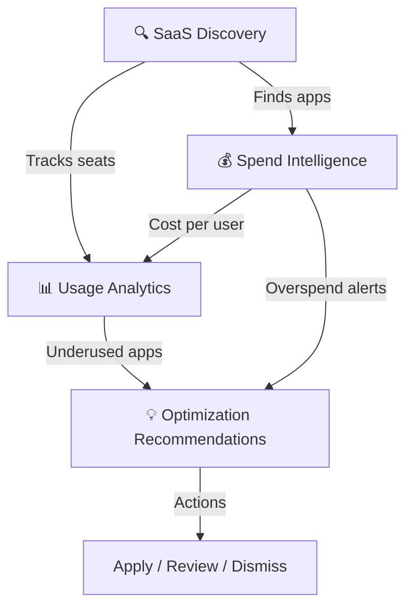

# :mag: Intelligence Module

**Discover what's in your stack, what it costs, and who's actually using it.**

The Intelligence module is the **analytical engine** of SaaSIQ. It answers three fundamental questions about your SaaS portfolio:

<a href="saas-discovery/" markdown>
:mag_right:
SaaS Discovery
What apps do we have? Find every tool — including shadow IT adopted without approval.
156 apps · 8 shadow IT · 12 new this month
</a>

<a href="spend-intelligence/" markdown>
:dollar:
Spend Intelligence
How much are we spending? AI-powered cost analysis with optimization recommendations.
₹42.5L/mo · ₹12.8L savings · 67% utilization
</a>

<a href="usage-analytics/" markdown>
:bar_chart:
Usage Analytics
Are people actually using them? Identify underused licenses and reclaim wasted spend.
67% avg utilization · 23 underused licenses
</a>

---

## How These Features Connect

**Typical workflow:**

1. **Discovery** identifies all applications (including shadow IT)
2. **Spend Intelligence** calculates the cost of each app and finds savings
3. **Usage Analytics** shows which licenses are actually being used
4. Together, they power the **AI optimization engine** that generates recommendations

---

## Module at a Glance

| Feature | Key Metrics | Primary Actions |
|---------|------------|----------------|
| **SaaS Discovery** | 156 total apps · 8 shadow IT · 12 new this month | Approve, Block, Re-Scan |
| **Spend Intelligence** | ₹42.5L/mo · ₹12.8L savings · 67% utilization | Apply, Review, Create Plan |
| **Usage Analytics** | 67% avg utilization · 23 underused licenses | Reclaim, Downgrade, Alert |

---

## When to Use Each Feature

??? tip "SaaS Discovery — *I want to know what apps we have*"

    **Use when:**

    - You suspect employees are using unapproved tools
    - A new employee joins and you need to provision apps
    - You want a complete software inventory for audit
    - A security incident requires identifying all data-holding apps

    **Go to:** [SaaS Discovery & Shadow IT →](saas-discovery.md)

??? tip "Spend Intelligence — *I want to reduce SaaS costs*"

    **Use when:**

    - Budget review season is coming
    - You need to justify SaaS spend to leadership
    - AI has identified potential savings you want to review
    - A contract is up for renewal and you need negotiation data

    **Go to:** [Spend Intelligence →](spend-intelligence.md)

??? tip "Usage Analytics — *I want to see if people are using what we pay for*"

    **Use when:**

    - License counts seem high relative to headcount
    - You want to reclaim unused licenses
    - A department is over/under-adopting a tool
    - You need utilization data for renewal negotiations

    **Go to:** [Usage Analytics →](usage-analytics.md)

---

## Related Resources

- :link: [Dashboard](../overview/dashboard.md) — KPI summary of all Intelligence metrics
- :link: [AI Insights](../ai-features/ai-insights.md) — AI-generated recommendations based on Intelligence data
- :link: [Benchmarks](../operations/benchmarks.md) — Compare your metrics against industry peers
