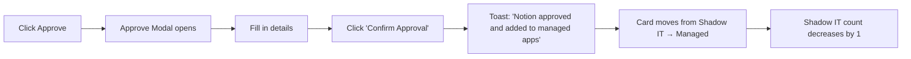
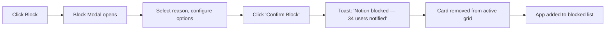

# 🔍 SaaS Discovery & Shadow IT

**Find every app in your organization — including the ones nobody told you about**

`Home` · `Intelligence` · **SaaS Discovery & Shadow IT**

---

## Overview

SaaS Discovery is SaaSIQ's **application inventory engine**. It automatically discovers every SaaS application in use across your organization — including **shadow IT** apps that were adopted without IT approval — and gives you the tools to approve, block, or investigate each one.

> [!NOTE]
> Discovery runs continuously. Every time a new app is detected via SSO logs, API integrations, or browser signals, it appears here with a "New" badge on the sidebar.

---

## In This Article

- [Key Metrics Bar](#key-metrics-bar)
- [Filters & Search](#filters--search)
- [Application Cards](#application-cards)
- [Operations: Approve, Block, Re-Scan](#operations)
- [Workflows & Scenarios](#workflows--scenarios)
- [Validation Checklist](#validation-checklist)

---

## Key Metrics Bar

A stats bar at the top provides an instant summary:

| Metric | Demo Value | Description |
|--------|-----------|-------------|
| **Total Discovered** | 156 | All applications found across the organization |
| **Managed** | 148 | IT-approved and tracked applications |
| **Shadow IT** | 8 | Unapproved applications discovered in use |
| **New This Month** | 12 | Applications first detected in the current month |

| 📦 Total Discovered | ✅ Managed | ⚠️ Shadow IT | 🆕 New / Month |
|:--:|:--:|:--:|:--:|
| **156** | **148** | **8** | **12** |

> [!TIP]
> Click any metric to filter the card grid below. For example, clicking "Shadow IT: 8" filters to show only shadow IT apps.

---

## Filters & Search

| Filter | Type | Options |
|--------|------|---------|
| **Search** | Text input | Search by application name |
| **Status** | Dropdown | All, Managed, Shadow IT, Under Review |
| **Category** | Dropdown | All, Productivity, Development, Communication, Security, Design, Cloud |
| **Department** | Dropdown | All, Engineering, Marketing, Sales, HR, Finance, Design |
| **Sort** | Dropdown | Name A–Z, Name Z–A, Spend High→Low, Users High→Low, Newest First |

**Interaction:** Filters apply immediately — the card grid updates in real-time as you change any filter.

---

## Application Cards

Each discovered application is rendered as a card. Cards come in two variants:

### Managed App Card

<table>
<tr>
<td>

**Slack Enterprise** &nbsp; ✅ Managed · Communication

| Users | Monthly | Utilization |
|:--|:--|:--|
| 312/500 | ₹1,50,000 | ████████████░░░░░░ 62% |

`View Details`

</td>
</tr>
</table>

### Shadow IT Card

<table>
<tr>
<td>

**Notion** &nbsp; 🔴 Shadow IT · Productivity &nbsp; ⚠️

| Users (detected) | Est. Cost | Risk | Department |
|:--|:--|:--|:--|
| 34 | ₹40,800/mo | Medium | Engineering |

`Approve` &nbsp; `Block` &nbsp; `Details`

</td>
</tr>
</table>

### Card Data Fields

| Field | Managed Apps | Shadow IT Apps |
|-------|:----------:|:-------------:|
| App logo + name | ✅ | ✅ |
| Status badge | ✅ Managed | 🔴 Shadow IT |
| Category | ✅ | ✅ |
| Licensed users / total | ✅ | ❌ (shows detected users) |
| Monthly cost | ✅ (from contract) | ✅ (estimated) |
| Utilization bar | ✅ | ❌ |
| Risk level | ❌ | ✅ |
| Department origin | ❌ | ✅ |

### Demo Data — Managed Apps

| App | Category | Users | Monthly Cost | Utilization |
|-----|----------|-------|-------------|-------------|
| Slack Enterprise | Communication | 312/500 | ₹1,50,000 | 62% |
| Salesforce CRM | CRM | 145/200 | ₹2,00,000 | 73% |
| Jira | Project Mgmt | 89/120 | ₹85,000 | 74% |
| Figma | Design | 23/80 | ₹70,000 | 29% |
| GitHub Enterprise | Development | 156/200 | ₹1,20,000 | 78% |
| Google Workspace | Productivity | 480/500 | ₹2,40,000 | 96% |

### Demo Data — Shadow IT

| App | Category | Detected Users | Est. Cost | Risk | Department |
|-----|----------|---------------|-----------|------|------------|
| Notion | Productivity | 34 | ₹40,800/mo | Medium | Engineering |
| Canva Pro | Design | 18 | ₹21,600/mo | Low | Marketing |
| Loom | Communication | 45 | ₹54,000/mo | High | Sales |
| Airtable | Productivity | 22 | ₹26,400/mo | High | Operations |
| ChatGPT Plus | AI | 67 | ₹80,400/mo | Critical | Multiple |
| Miro | Collaboration | 15 | ₹18,000/mo | Low | Design |
| Grammarly | Productivity | 28 | ₹16,800/mo | Low | Marketing |
| Linear | Development | 19 | ₹22,800/mo | Medium | Engineering |

---

## Operations

### Approve Application

**Trigger:** Click **"Approve"** on a shadow IT card

**Modal: Approve Application**

| Field | Description |
|-------|-------------|
| **App Name** | Pre-filled (read-only) |
| **Assign Category** | Dropdown — Productivity, Development, etc. |
| **Assign Owner** | Team member responsible for this app |
| **License Tier** | Free, Pro, Business, Enterprise |
| **Budget Allocation** | Department budget to charge |
| **Notes** | Optional — reason for approval |

**Workflow:**

> [!IMPORTANT]
> Always assign an **owner** and **budget** when approving. This ensures accountability and spend tracking from day one.

---

### Block Application

**Trigger:** Click **"Block"** on a shadow IT card

**Modal: Block Application**

| Field | Description |
|-------|-------------|
| **App Name** | Pre-filled (read-only) |
| **Block Reason** | Dropdown — Security Risk, Non-Compliant, Duplicate Tool, Budget, Other |
| **Notify Users** | Toggle — send email to detected users explaining the block |
| **Effective Date** | Immediate or scheduled (date picker) |
| **Alternative App** | Optional — suggest an approved alternative |
| **Notes** | Optional — additional context |

**Workflow:**

> [!WARNING]
> Blocking an app with **"Notify Users"** enabled will send an email to all detected users. Make sure the alternative app suggestion is ready before blocking.

---

### Re-Scan

**Trigger:** Click the **"Re-Scan"** button in the top actions area

| Behavior | Description |
|----------|-------------|
| **Button text** | "🔄 Re-Scan Now" |
| **Click** | Initiates a new discovery scan across all connected integrations |
| **Animation** | Spinning icon with progress: *"Scanning... 23% — Analyzing SSO logs"* |
| **Duration** | 3–5 seconds (simulated) |
| **Completion** | Toast: *"Scan complete — 2 new apps discovered"* |
| **Result** | New apps appear in the grid with "New" badges |

---

## Workflows & Scenarios

### Scenario 1: "Security flagged unauthorized AI tools"

> Your CISO asks: *"Are employees using unauthorized AI tools?"*

1. Navigate to **SaaS Discovery** from the sidebar
2. Open the **Category** filter → select **"AI"**
3. Open the **Status** filter → select **"Shadow IT"**
4. Result: ChatGPT Plus (67 users, Critical risk) appears
5. Click **"Block"** → Reason: Security Risk
6. Enable **"Notify Users"** → Suggest "Microsoft Copilot" as alternative
7. Click **"Confirm Block"**
8. Report to CISO: *"Blocked 1 unauthorized AI tool affecting 67 users"*

### Scenario 2: "Department is using a tool that should be official"

> Engineering is using Notion (34 users) and it's working well. Time to make it official.

1. Find Notion in the shadow IT cards
2. Click **"Approve"**
3. Set: Category = Productivity, Owner = Engineering Lead, Tier = Business
4. Assign to Engineering budget
5. Click **"Confirm Approval"**
6. Notion moves to Managed apps with full spend tracking

### Scenario 3: "Monthly discovery audit"

> It's the first Monday of the month. Time to review new discoveries.

1. Click **"New This Month: 12"** in the metrics bar
2. Sort by **"Newest First"**
3. For each app:
   - ✅ If legitimate business need → **Approve**
   - 🚫 If unnecessary or risky → **Block**
   - 🔍 If unclear → Click **"Details"** to investigate

---

## Validation Checklist

### Page Load
- [ ] Metrics bar shows 4 stats (Total, Managed, Shadow IT, New)
- [ ] Application cards render in a responsive grid
- [ ] Managed and Shadow IT cards have distinct visual styling
- [ ] Sidebar badge shows correct count for new apps

### Filters
- [ ] Search filters cards by app name in real-time
- [ ] Status dropdown filters correctly (Managed / Shadow IT)
- [ ] Category filter works
- [ ] Department filter works
- [ ] Sort options reorder cards correctly

### Approve Flow
- [ ] "Approve" button appears only on Shadow IT cards
- [ ] Modal opens with app name pre-filled
- [ ] All form fields accept input
- [ ] "Confirm Approval" shows success toast
- [ ] Card moves from Shadow IT section to Managed
- [ ] Shadow IT count decrements

### Block Flow
- [ ] "Block" button appears only on Shadow IT cards
- [ ] Modal opens with all fields
- [ ] Block reason dropdown has multiple options
- [ ] "Notify Users" toggle works
- [ ] "Confirm Block" shows success toast with user count
- [ ] Card is removed from active grid

### Re-Scan
- [ ] "Re-Scan Now" button is visible
- [ ] Click shows scanning animation
- [ ] Completion toast shows number of new apps
- [ ] New apps appear with "New" badges

---

## Related Resources

- 🔗 [Spend Intelligence](spend-intelligence.md) — See cost data for discovered apps
- 🔗 [Usage Analytics](usage-analytics.md) — Check utilization of discovered apps
- 🔗 [Compliance & Risk](../governance/compliance-and-risk.md) — Deep dive into risk scoring
- 🔗 [AI Insights](../ai-features/ai-insights.md) — AI recommendations based on discovery data
- 🔗 [Settings — Integrations](../administration/settings.md) — Add more data sources for better discovery

---

---

**Was this page helpful?** 👍 Yes · 👎 No · [Suggest an edit](https://github.com/saasiq/saasiq-documentation/edit/main/docs/intelligence/saas-discovery.md)

---

<a href="index.md">⬅️ Intelligence Overview</a>&nbsp;&nbsp;·&nbsp;&nbsp;<a href="spend-intelligence.md">Spend Intelligence ➡️</a>

Last updated: March 2026 · SaaSIQ Documentation v1.0.0

