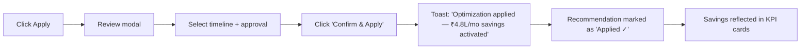
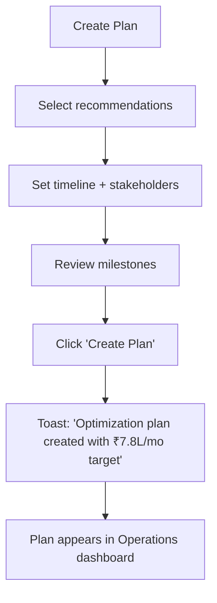
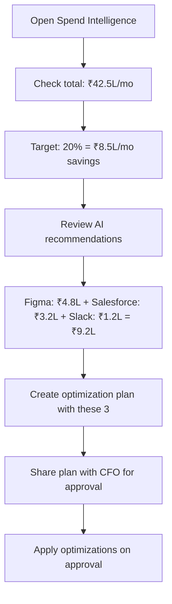

# 💰 Spend Intelligence

**AI-powered cost analysis to optimize every dollar of your SaaS budget**

`Home` · `Intelligence` · **Spend Intelligence**

> **Home** · Intelligence · **Spend Intelligence**

---

## Overview

Spend Intelligence is SaaSIQ's **AI-powered cost analysis engine**. It aggregates all SaaS spending, breaks it down by department and application, and generates **actionable optimization recommendations** — each with a projected savings amount and a one-click "Apply" action.

!!! note
    All savings projections are calculated by SaaSIQ's AI engine using your actual contract data, usage patterns, and industry benchmark pricing.

---

## In This Article

- [KPI Summary Cards](#kpi-summary-cards)
- [Department Spend Breakdown](#department-spend-breakdown)
- [AI Optimization Recommendations](#ai-optimization-recommendations)
- [Operations: Apply, Review, Create Plan](#operations)
- [Workflows & Scenarios](#workflows-scenarios)
- [Validation Checklist](#validation-checklist)

---

## KPI Summary Cards

| # | Metric | Demo Value | Description |
|---|--------|-----------|-------------|
| 1 | **Total Annual Spend** | ₹5.1 Cr | Sum of all SaaS contracts for the current fiscal year |
| 2 | **Monthly Average** | ₹42.5L | Average monthly SaaS expenditure |
| 3 | **AI-Identified Savings** | ₹12.8L/month | Total potential savings across all recommendations |
| 4 | **Optimization Score** | 67% | Percentage of spend that is optimally allocated |

| 📊 Annual Spend | 📈 Monthly Avg | 💰 Savings | 🎯 Optimized |
|:--:|:--:|:--:|:--:|
| **₹5.1 Cr** | **₹42.5L** | **₹12.8L** | **67%** |

!!! tip
    The Optimization Score tells you how efficiently your SaaS budget is being used. Below 70% means significant room for improvement.

---

## Department Spend Breakdown

A horizontal bar chart showing spend by department, sorted from highest to lowest.

| Department | Monthly Spend | % of Total | Top App |
|-----------|--------------|-----------|---------|
| **Engineering** | ₹14.2L | 33% | GitHub Enterprise |
| **Sales** | ₹9.8L | 23% | Salesforce CRM |
| **Marketing** | ₹6.4L | 15% | HubSpot |
| **Product** | ₹5.1L | 12% | Jira + Figma |
| **HR** | ₹3.8L | 9% | BambooHR |
| **Finance** | ₹3.2L | 8% | QuickBooks + Zoho |

**Interactions:**

| Action | Result |
|--------|--------|
| Hover bar segment | Tooltip shows exact amount and top 3 apps |
| Click a bar | Drills down into that department's app-level spend |
| Click **"View by Category"** toggle | Switches from department view to category view |

!!! tip
    If a department's spend seems high, click its bar to see the individual applications driving the cost. Often, 1–2 apps account for 80% of a department's spend.

---

## AI Optimization Recommendations

The heart of Spend Intelligence — AI-generated recommendations ranked by savings potential.

### Recommendation Cards

Each recommendation appears as an expandable card:

<table markdown>
<tr markdown>
<td markdown>

**🤖 AI Recommendation** &nbsp;&nbsp;&nbsp;&nbsp;&nbsp;&nbsp;&nbsp;&nbsp;&nbsp;&nbsp;&nbsp;&nbsp;&nbsp;&nbsp;&nbsp;&nbsp;&nbsp;&nbsp;&nbsp;&nbsp;&nbsp;&nbsp;&nbsp;&nbsp;&nbsp;&nbsp; Save **₹4.8L/mo**

**Downgrade 120 unused Figma licenses**  
Figma Enterprise → Figma Professional

📊 Confidence: **96%** &nbsp;&nbsp; 👥 Affected: **120 users** &nbsp;&nbsp; 📅 Since: **90+ days inactive**

`Apply Optimization` &nbsp; `Review Details` &nbsp; `Dismiss`

</td>
</tr>
</table>

### Demo Recommendations

| # | Recommendation | Application | Savings | Confidence | Users Affected |
|---|---------------|-------------|---------|-----------|----------------|
| 1 | **Downgrade 120 unused licenses** | Figma (Enterprise → Pro) | ₹4.8L/mo | 96% | 120 |
| 2 | **Negotiate renewal pricing** | Salesforce CRM | ₹3.2L/mo | 89% | — |
| 3 | **Consolidate overlapping tools** | Jira + Asana + Monday.com | ₹2.8L/mo | 91% | 85 |
| 4 | **Remove unused seats** | Slack Enterprise | ₹1.2L/mo | 94% | 188 |
| 5 | **Switch to annual billing** | AWS Reserved Instances | ₹0.8L/mo | 87% | — |

<strong>📊 How does AI calculate confidence scores?</strong>

The confidence score reflects how certain the AI is about the recommendation's accuracy and feasibility:

| Range | Meaning | Factors |
|-------|---------|---------|
| **90–100%** | Very high confidence | Multiple data signals confirm, long history of underuse |
| **80–89%** | High confidence | Strong signals but some uncertainty (e.g., seasonal usage) |
| **70–79%** | Moderate confidence | Pattern detected but insufficient historical data |
| **Below 70%** | Low confidence | Early signal, needs manual validation |

Factors considered:
- Login frequency over 90 days
- Feature usage depth (not just logins)
- Department growth projections
- Contract terms and lock-in periods
- Industry benchmark pricing

---

## Operations

### Apply Optimization

**Trigger:** Click **"Apply Optimization"** on a recommendation card

**Modal: Apply Optimization**

| Field | Description |
|-------|-------------|
| **Recommendation summary** | Read-only — what will change |
| **Projected savings** | ₹X/month, ₹X/year |
| **Affected users** | List of users who will be impacted |
| **Implementation timeline** | Immediate, Next billing cycle, Custom date |
| **Rollback option** | Toggle — keep the ability to undo within 30 days |
| **Approval workflow** | None (apply now), Manager approval, CFO approval |

**Workflow:**

!!! warning
    "Immediate" implementation will trigger license changes at the vendor level. For large-scale downgrades, use "Next billing cycle" to avoid disrupting active users.

---

### Review Details

**Trigger:** Click **"Review Details"** on a recommendation card

**Modal: Review Details**

| Section | Content |
|---------|---------|
| **Overview** | Full explanation of the recommendation |
| **Usage data** | Table showing each affected user's last login date and feature usage |
| **Cost breakdown** | Current cost vs. recommended cost, with savings calculation |
| **Risk assessment** | What could go wrong + mitigation steps |
| **Similar companies** | How other orgs in your industry handle this tool |
| **AI reasoning** | Step-by-step logic the AI used to generate this recommendation |

**Interactions:**

| Action | Result |
|--------|--------|
| Click **"Apply from here"** | Opens Apply modal pre-filled |
| Click **"Export to PDF"** | Downloads a report for stakeholder sharing |
| Click **"Share with team"** | Opens email composer with recommendation summary |
| Click **"Dismiss"** | Removes recommendation (can undo within 24h) |

---

### Create Optimization Plan

**Trigger:** Click **"Create Plan"** on the Consolidation recommendation (Jira + Asana + Monday.com)

**Modal: Create Optimization Plan**

| Field | Description |
|-------|-------------|
| **Plan name** | E.g., "Q2 2026 Tool Consolidation" |
| **Included recommendations** | Multi-select from available recommendations |
| **Target timeline** | Start date → end date |
| **Stakeholders** | Tag team members responsible |
| **Milestones** | Auto-generated: Evaluate → Communicate → Migrate → Verify |
| **Total projected savings** | Sum of all selected recommendations |

**Workflow:**

---

## Workflows & Scenarios

### Scenario 1: "CFO asks to reduce SaaS spend by 20%"

1. Open **Spend Intelligence**
2. Note current Monthly Average: ₹42.5L
3. Calculate 20% target: ₹8.5L/mo
4. Sort recommendations by savings (highest first)
5. Select top 3: Figma (₹4.8L) + Salesforce (₹3.2L) + Slack (₹1.2L) = ₹9.2L
6. Click **"Create Plan"** → Name: "Q2 Cost Reduction 20%"
7. Tag CFO as stakeholder
8. Share plan → CFO approves → Apply

### Scenario 2: "Engineering budget is over limit"

1. Check Department Spend chart → Engineering: ₹14.2L/mo (33%)
2. Click Engineering bar → drill down to individual apps
3. Find: GitHub ₹4.2L, AWS ₹3.8L, Jira ₹2.1L, Figma ₹1.8L, Others ₹2.3L
4. Check recommendations filtered to Engineering
5. Apply relevant optimizations (e.g., Figma downgrade, AWS reserved instances)

### Scenario 3: "Board meeting preparation"

1. Open **Spend Intelligence**
2. Click **"Review Details"** on each top recommendation
3. Click **"Export to PDF"** to download reports
4. Go to [Benchmarks](../operations/benchmarks.md) for industry comparison data
5. Compile: Current spend, savings identified, plan, and peer comparison

---

## Validation Checklist

### Page Load
- [ ] 4 KPI cards render with values
- [ ] Department bar chart loads with all departments
- [ ] AI recommendations section shows cards

### KPI Cards
- [ ] Total Annual Spend shows ₹5.1 Cr
- [ ] Monthly Average shows ₹42.5L
- [ ] AI-Identified Savings shows ₹12.8L
- [ ] Optimization Score shows 67%

### Department Chart
- [ ] All 6 departments visible in bar chart
- [ ] Hover shows tooltip with exact amount + top apps
- [ ] Click drills down into department details
- [ ] "View by Category" toggle switches chart view

### Recommendations
- [ ] At least 3 recommendations visible
- [ ] Each shows savings amount and confidence score
- [ ] "Apply", "Review Details", "Dismiss" buttons work

### Apply Flow
- [ ] Apply modal opens with correct data
- [ ] Timeline selector works (Immediate / Next cycle / Custom)
- [ ] Confirm shows success toast with savings amount
- [ ] Card updates to "Applied ✓" state

### Review Flow
- [ ] Review modal shows detailed usage data
- [ ] "Export to PDF" triggers download
- [ ] "Apply from here" opens apply modal
- [ ] AI reasoning section is visible

### Create Plan
- [ ] Plan modal opens from consolidation recommendation
- [ ] Can name the plan and add stakeholders
- [ ] Milestones auto-generate
- [ ] Success toast shows total projected savings

---

## Related Resources

- 🔗 [SaaS Discovery](saas-discovery.md) — The app inventory powering spend data
- 🔗 [Usage Analytics](usage-analytics.md) — License utilization that drives savings recommendations
- 🔗 [Benchmarks](../operations/benchmarks.md) — Compare your pricing to industry averages
- 🔗 [AI Insights](../ai-features/ai-insights.md) — Cross-module AI recommendations
- 🔗 [Department Costs](../operations/department-costs.md) — Detailed per-department analysis

---

---

**Was this page helpful?** 👍 Yes · 👎 No · [Suggest an edit](https://github.com/saasiq/saasiq-documentation/edit/main/docs/intelligence/spend-intelligence.md)

---

<a href="saas-discovery.md">⬅️ SaaS Discovery</a>&nbsp;&nbsp;·&nbsp;&nbsp;<a href="usage-analytics.md">Usage Analytics ➡️</a>

Last updated: March 2026 · SaaSIQ Documentation v1.0.0

