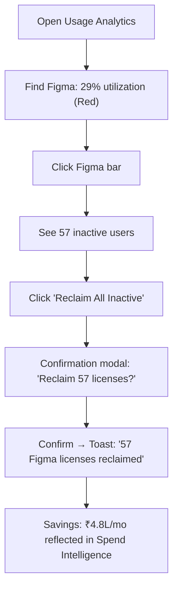

<div align="center">


# 📊 Usage Analytics

**Track license utilization across every app, department, and user**

`Home` · `Intelligence` · **Usage Analytics**

</div>

> **Home** · Intelligence · **Usage Analytics**

---

## Overview

Usage Analytics answers the critical question: **"Are we actually using what we're paying for?"** It tracks license utilization across every application, surfaces underused licenses, and provides department-level adoption metrics — powering optimization decisions throughout the platform.

---

## In This Article

- [KPI Summary Cards](#kpi-summary-cards)
- [Application Utilization Chart](#application-utilization-chart)
- [Department Usage Cards](#department-usage-cards)
- [Usage Leaderboard](#usage-leaderboard)
- [Interactions & Workflows](#interactions--workflows)
- [Validation Checklist](#validation-checklist)

---

## KPI Summary Cards

| # | Metric | Demo Value | Description |
|---|--------|-----------|-------------|
| 1 | **Average Utilization** | 67% | Mean utilization rate across all applications |
| 2 | **Fully Utilized** | 34 apps | Apps with >90% utilization — healthy |
| 3 | **Underutilized** | 23 apps | Apps with <50% utilization — optimization opportunity |
| 4 | **Unused Licenses** | 847 | Individual licenses with zero activity in 90 days |

```
┌──────────────┬──────────────┬──────────────┬──────────────┐
│  67%         │  34          │  23          │  847         │
│  Avg Util.   │  Fully Used  │  Underused   │  Unused Lic. │
│  📊          │  ✅          │  ⚠️          │  🔴          │
└──────────────┴──────────────┴──────────────┴──────────────┘
```

> [!TIP]
> The "847 Unused Licenses" represents immediate savings potential. Each unused license is money being spent with zero return. Click to see the breakdown by application.

<details>
<summary><strong>📊 How is utilization calculated?</strong></summary>

```
Utilization Rate = (Active Users ÷ Total Licensed Users) × 100

Where:
- Active User = Logged in at least once in the last 30 days
- Total Licensed = Number of paid seats/licenses purchased
```

**Utilization tiers:**

| Range | Status | Color | Action |
|-------|--------|-------|--------|
| 90–100% | ✅ Fully utilized | Green | None — healthy |
| 70–89% | 🟡 Moderate | Yellow | Monitor — may need attention |
| 50–69% | 🟠 Underutilized | Orange | Review — consider downgrades |
| 0–49% | 🔴 Critically low | Red | Act — reclaim or cancel |

</details>

---

## Application Utilization Chart

A horizontal bar chart showing utilization rate per application with color-coded status.

| Application | Licensed | Active | Utilization | Status |
|------------|----------|--------|-------------|--------|
| Google Workspace | 500 | 480 | **96%** | ✅ Green |
| GitHub Enterprise | 200 | 156 | **78%** | 🟡 Yellow |
| Jira | 120 | 89 | **74%** | 🟡 Yellow |
| Salesforce CRM | 200 | 145 | **73%** | 🟡 Yellow |
| Slack Enterprise | 500 | 312 | **62%** | 🟠 Orange |
| Figma | 80 | 23 | **29%** | 🔴 Red |

```
Google Workspace  ████████████████████████████████████████████████ 96%  ✅
GitHub Enterprise ███████████████████████████████████████░░░░░░░░░ 78%  🟡
Jira              ████████████████████████████████████░░░░░░░░░░░░ 74%  🟡
Salesforce CRM    ███████████████████████████████████░░░░░░░░░░░░░ 73%  🟡
Slack Enterprise  ███████████████████████████████░░░░░░░░░░░░░░░░░ 62%  🟠
Figma             ██████████████░░░░░░░░░░░░░░░░░░░░░░░░░░░░░░░░░ 29%  🔴
```

**Interactions:**

| Action | Result |
|--------|--------|
| Hover on any bar | Shows tooltip: "GitHub Enterprise: 156 of 200 licenses active (78%)" |
| Click on any bar | Opens detailed usage drilldown for that application |
| Click **"Reclaim"** button (on red bars) | Opens license reclamation modal |
| Click **"View Inactive Users"** | Shows list of users with no login in 90+ days |
| Toggle **"Show all / Top 10"** | Expand or collapse the chart |

<details>
<summary><strong>🔍 What does the drilldown look like?</strong></summary>

Clicking a bar expands an inline panel showing:

| Column | Example |
|--------|---------|
| **User** | Priya Mehta |
| **Department** | Marketing |
| **Last Login** | 45 days ago |
| **Status** | ⚠️ Inactive |
| **Feature Usage** | Low (only basic features) |
| **Action** | [Reclaim] [Notify] |

This lets you see exactly **who** is not using their license and take targeted action.

</details>

---

## Department Usage Cards

Six cards showing how each department utilizes their assigned applications.

| Department | Apps | Avg Utilization | Top App | Lowest App | Waste Est. |
|-----------|------|----------------|---------|-----------|------------|
| **Engineering** | 28 | 81% | GitHub (95%) | Figma (34%) | ₹2.1L/mo |
| **Sales** | 15 | 72% | Salesforce (78%) | LinkedIn Nav (45%) | ₹1.8L/mo |
| **Marketing** | 18 | 65% | HubSpot (82%) | Adobe CC (38%) | ₹1.5L/mo |
| **Product** | 12 | 74% | Jira (89%) | Miro (52%) | ₹0.9L/mo |
| **HR** | 8 | 85% | BambooHR (92%) | Learning Platform (61%) | ₹0.4L/mo |
| **Finance** | 6 | 88% | QuickBooks (95%) | Tableau (72%) | ₹0.3L/mo |

**Card layout:**

```
┌───────────────────────────────┐
│  🏗️ Engineering    28 apps    │
│                               │
│  Avg Utilization: 81%         │
│  ████████████████░░░░  81%    │
│                               │
│  ✅ Top: GitHub (95%)         │
│  🔴 Low: Figma (34%)         │
│  💸 Waste: ₹2.1L/mo          │
│                               │
│  [View Details]               │
└───────────────────────────────┘
```

**Interactions:**

| Action | Result |
|--------|--------|
| Click **"View Details"** | Opens department detail page with full app breakdown |
| Click Top/Low app name | Opens that app's usage data |
| Hover on utilization bar | Shows exact percentage |

> [!TIP]
> Focus on departments with high waste estimates first. Engineering at ₹2.1L/mo waste is likely driven by the Figma underutilization (34%) you can see in the details.

---

## Usage Leaderboard

A ranking of departments and individuals by SaaS adoption and efficiency.

### Department Ranking

| Rank | Department | Utilization | Trend | Status |
|------|-----------|------------|-------|--------|
| 🥇 1 | Finance | 88% | ↑ +3% | Star performer |
| 🥈 2 | HR | 85% | ↑ +1% | Consistent |
| 🥉 3 | Engineering | 81% | → 0% | Stable |
| 4 | Product | 74% | ↑ +2% | Improving |
| 5 | Sales | 72% | ↓ -3% | Declining |
| 6 | Marketing | 65% | ↓ -5% | Needs attention |

### Power Users (Top 5)

| User | Department | Apps Used | Utilization | Badge |
|------|-----------|----------|-------------|-------|
| Rahul Sharma | Engineering | 12 | 94% | 🏆 Champion |
| Anita Desai | Finance | 6 | 98% | ⭐ Super User |
| Vikram Singh | Product | 9 | 91% | ⭐ Super User |
| Priya Nair | HR | 7 | 89% | — |
| Amit Patel | Sales | 11 | 85% | — |

> [!TIP]
> Leaderboards create healthy competition between departments. Share these metrics in monthly reviews to drive better SaaS hygiene.

---

## Interactions & Workflows

### Scenario 1: "Reclaim unused Figma licenses"

> Figma has 29% utilization — 57 of 80 licenses are going unused.



1. Open **Usage Analytics** from sidebar
2. Find **Figma** in the utilization chart (29% — red bar)
3. Click the Figma bar to drill down
4. Review the inactive users list (57 users, no login in 90+ days)
5. Click **"Reclaim All Inactive"**
6. Confirm in the modal
7. 57 licenses are reclaimed → utilization jumps to ~100%

### Scenario 2: "Marketing's SaaS adoption is declining"

> Marketing utilization dropped 5% this month. Leadership wants answers.

1. Find Marketing in Department Usage Cards → 65%, ↓ -5%
2. Click **"View Details"**
3. Identify the culprits: Adobe CC (38%) and HubSpot (dropped from 90% to 82%)
4. Click Adobe CC → see user-level data
5. Find: 12 licenses purchased, only 4–5 active
6. Actions: Notify inactive users, or reclaim and downgrade the plan
7. Report: "Adobe CC adoption dropped due to team restructuring. Recommending plan downgrade."

### Scenario 3: "Quarterly utilization review for leadership"

1. Open Usage Analytics for KPI summary
2. Note key metrics: 67% avg utilization, 847 unused licenses
3. Check Leaderboard → Finance (88%) and HR (85%) are stars; Marketing (65%) needs work
4. Export department cards data
5. Cross-reference with [Spend Intelligence](spend-intelligence.md) for cost impact
6. Present: "Reclaiming 847 unused licenses could save ₹7.2L/month"

---

## Validation Checklist

### Page Load
- [ ] 4 KPI cards render (Avg Utilization, Fully Utilized, Underutilized, Unused Licenses)
- [ ] Application utilization chart loads with all apps
- [ ] Department usage cards render for all 6 departments
- [ ] Leaderboard section loads

### Utilization Chart
- [ ] Bars are color-coded (green/yellow/orange/red)
- [ ] Hover shows tooltip with exact numbers
- [ ] Click opens drilldown with user-level data
- [ ] "Reclaim" button appears on red bars
- [ ] Show all / Top 10 toggle works

### Department Cards
- [ ] All 6 department cards visible
- [ ] Each shows avg utilization, top/low app, and waste estimate
- [ ] Utilization bars render correctly
- [ ] "View Details" opens department breakdown
- [ ] App names are clickable

### Leaderboard
- [ ] Department ranking shows all 6 departments sorted by utilization
- [ ] Trend arrows colored correctly (green ↑, red ↓)
- [ ] Power Users table shows top 5 with badges
- [ ] Rankings update if utilization changes

### Interactions
- [ ] Clicking underutilized apps shows inactive user list
- [ ] "Reclaim All Inactive" shows confirmation modal
- [ ] Confirmation triggers success toast with count
- [ ] Reclaimed licenses reflect in KPI cards

---

## Related Resources

- 🔗 [SaaS Discovery](saas-discovery.md) — App inventory that usage data maps to
- 🔗 [Spend Intelligence](spend-intelligence.md) — Cost impact of underutilization
- 🔗 [Department Costs](../operations/department-costs.md) — Department-level spend & waste analysis
- 🔗 [Offboarding](../operations/offboarding.md) — Revoking licenses for departing employees
- 🔗 [AI Insights](../ai-features/ai-insights.md) — AI recommendations driven by usage data

---

---

<div align="center">

**Was this page helpful?** 👍 Yes · 👎 No · [Suggest an edit](https://github.com/saasiq/saasiq-documentation/edit/main/docs/intelligence/usage-analytics.md)

---

<a href="spend-intelligence.md">⬅️ Spend Intelligence</a>&nbsp;&nbsp;·&nbsp;&nbsp;<a href="../governance/index.md">Governance Module ➡️</a>

<sub>Last updated: March 2026 · SaaSIQ Documentation v1.0.0</sub>

</div>
