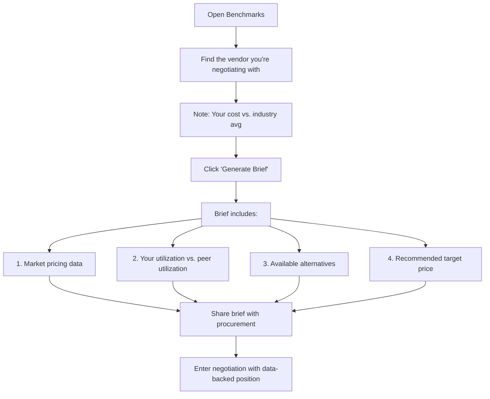

<div align="center" markdown>


# 📊 Benchmarks

**Compare your SaaS spending against industry peers for smarter negotiations**

`Home` · `Operations` · **Benchmarks**

</div>

> **Home** · Operations · **Benchmarks**

---

## Overview

Benchmarks compares your SaaS spend and pricing against **industry peers** — companies of similar size, industry, and region. It answers the critical question: **"Are we paying more than we should?"** and provides data-backed leverage for vendor negotiations.

---

## In This Article

- [Benchmark KPI Cards](#benchmark-kpi-cards)
- [Vendor Benchmark Table](#vendor-benchmark-table)
- [How to Use for Negotiations](#how-to-use-for-negotiations)
- [Validation Checklist](#validation-checklist)

---

## Benchmark KPI Cards

| # | Metric | Your Value | Industry Avg | Status |
|---|--------|-----------|-------------|--------|
| 1 | **SaaS Spend per Employee** | ₹8,500/mo | ₹7,200/mo | 🟡 18% above avg |
| 2 | **Apps per Employee** | 4.2 | 3.8 | 🟡 11% above avg |
| 3 | **Average Utilization** | 67% | 72% | 🟠 Below avg |
| 4 | **Vendor Count** | 156 | 120 | 🟡 30% above avg |

```
Your SaaS Spend/Employee         Industry Average
      ₹8,500                          ₹7,200
  ████████████████                ██████████████
  🟡 18% above                    benchmark
```

<details markdown>
<summary><strong>📊 How are benchmarks calculated?</strong></summary>

SaaSIQ aggregates anonymized data from its customer base, segmented by:

| Dimension | Your Segment |
|-----------|-------------|
| **Company Size** | 201–500 employees |
| **Industry** | Technology |
| **Region** | India |
| **Growth Stage** | Series B–C |

Benchmarks reflect the **median** values across 200+ companies matching your profile.

</details>

!!! tip
    Being above average on spend per employee isn't always bad — it depends on your utilization. If utilization is also high, you're getting value. If it's low (like 67% vs. 72% avg), you're overspending AND underusing.

---

## Vendor Benchmark Table

| Vendor | Your Cost/User/Mo | Industry Avg | Difference | Negotiation Tip |
|--------|------------------|-------------|-----------|-----------------|
| **Salesforce** | ₹1,380 | ₹1,150 | 🔴 +20% | Request volume discount; 200+ seats qualifies for Enterprise tier pricing |
| **Slack** | ₹300 | ₹250 | 🟡 +20% | Leverage Microsoft Teams (already in M365 bundle) as alternative |
| **Figma** | ₹875 | ₹720 | 🟡 +22% | Negotiate annual commitment; consider Figma Organization tier |
| **AWS** | Usage-based | Usage-based | 🟢 On par | Maximize Reserved Instances and Savings Plans |
| **Jira** | ₹710 | ₹680 | 🟢 +4% | Near benchmark — minor optimization possible |
| **GitHub** | ₹600 | ₹580 | 🟢 +3% | At benchmark — no action needed |

**Interactions:**

| Action | Result |
|--------|--------|
| Click any vendor row | Opens detailed benchmark comparison |
| Click **"Negotiation Tip"** icon | Expands full tip with data sources |
| Click **"Generate Brief"** | Creates negotiation brief with benchmark data |
| Sort by "Difference" | Prioritize vendors where you're overpaying most |

<details markdown>
<summary><strong>🔍 Detailed comparison: Salesforce (+20%)</strong></summary>

| Metric | Your Value | Industry P25 | Median | P75 |
|--------|-----------|-------------|--------|-----|
| Cost/user/month | ₹1,380 | ₹950 | ₹1,150 | ₹1,400 |
| Total annual | ₹24L | ₹16L | ₹20L | ₹26L |
| Utilization | 73% | 65% | 74% | 85% |
| Users | 200 | 100 | 180 | 350 |

**Analysis:** Your per-user cost puts you between the median and 75th percentile. With 200 users, you should be qualifying for volume discounts. Targetcost: ₹1,100/user/month (saving ₹56,000/month = ₹6.7L/year).

</details>

---

## How to Use for Negotiations

### Step-by-step: Using benchmarks in a vendor call



!!! important
    Never enter a vendor negotiation without benchmark data. Vendors know their pricing better than you do — benchmarks level the playing field.

---

## Validation Checklist

- [ ] 4 KPI cards show your value vs. industry average
- [ ] Status indicators correctly show above/below/at benchmark
- [ ] Vendor benchmark table shows all major vendors
- [ ] Difference column is color-coded (red >15%, yellow 5-15%, green <5%)
- [ ] Negotiation tips are present for each vendor
- [ ] Click vendor row opens detailed comparison
- [ ] "Generate Brief" creates downloadable document
- [ ] Sort by difference works

---

## Related Resources

- 🔗 [Spend Intelligence](../intelligence/spend-intelligence.md) — AI optimization recommendations
- 🔗 [Contracts](../governance/contracts.md) — Contract negotiation workflows
- 🔗 [Renewals](renewals.md) — Upcoming renewals to negotiate
- 🔗 [AI Copilot](../ai-features/ai-copilot.md) — Ask: "How does our Slack spend compare to benchmarks?"

---

---

<div align="center" markdown>

**Was this page helpful?** 👍 Yes · 👎 No · [Suggest an edit](https://github.com/saasiq/saasiq-documentation/edit/main/docs/operations/benchmarks.md)

---

<a href="renewals.md">⬅️ Renewals</a>&nbsp;&nbsp;·&nbsp;&nbsp;<a href="department-costs.md">Department Costs ➡️</a>

<sub>Last updated: March 2026 · SaaSIQ Documentation v1.0.0</sub>

</div>
