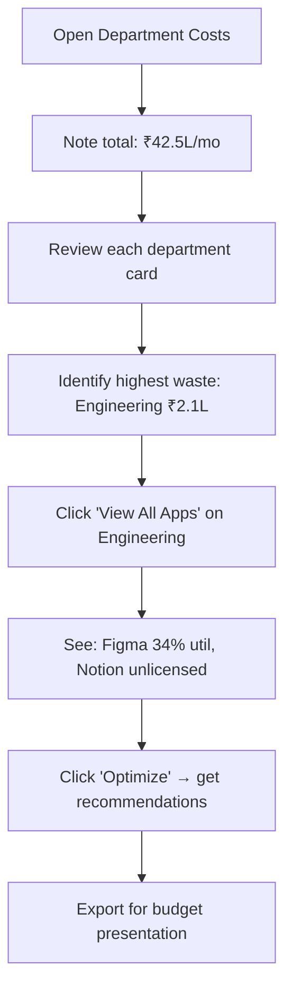

<div align="center">


# 🏢 Department Costs

**Per-department SaaS spend breakdown with waste analysis and optimization opportunities**

`Home` · `Operations` · **Department Costs**

</div>

> **Home** · Operations · **Department Costs**

---

## Overview

Department Costs provides a **per-department breakdown** of SaaS spending, showing exactly where money goes, which tools each department uses, and how much is being wasted on underutilized licenses. It enables department-level accountability and targeted cost optimization.

---

## In This Article

- [Summary Bar](#summary-bar)
- [Department Cards](#department-cards)
- [Waste Analysis Chart](#waste-analysis-chart)
- [Workflows & Scenarios](#workflows--scenarios)
- [Validation Checklist](#validation-checklist)

---

## Summary Bar

| Metric | Demo Value |
|--------|-----------|
| **Total Monthly SaaS Spend** | ₹42.5L |
| **Total Departments** | 6 |
| **Total Estimated Waste** | ₹7L/quarter (₹28L/year) |

---

## Department Cards

Six cards, one per department, showing spend breakdown and waste estimation.

| Department | Monthly Spend | # Apps | Top 3 Tools | Waste Est. |
|-----------|--------------|--------|------------|------------|
| **Engineering** | ₹14.2L (33%) | 28 | GitHub ₹4.2L, AWS ₹3.8L, Jira ₹2.1L | ₹2.1L/mo |
| **Sales** | ₹9.8L (23%) | 15 | Salesforce ₹4.8L, LinkedIn Nav ₹1.6L, ZoomInfo ₹1.2L | ₹1.8L/mo |
| **Marketing** | ₹6.4L (15%) | 18 | HubSpot ₹2.8L, Adobe CC ₹1.5L, Canva ₹0.6L | ₹1.5L/mo |
| **Product** | ₹5.1L (12%) | 12 | Jira ₹1.8L, Figma ₹1.4L, Miro ₹0.8L | ₹0.9L/mo |
| **HR** | ₹3.8L (9%) | 8 | BambooHR ₹1.8L, Learning Platform ₹0.9L, SurveyMonkey ₹0.4L | ₹0.4L/mo |
| **Finance** | ₹3.2L (8%) | 6 | QuickBooks ₹1.5L, Zoho Analytics ₹0.8L, Tableau ₹0.6L | ₹0.3L/mo |

**Card layout:**

```
┌────────────────────────────────────────────────┐
│  🏗️  Engineering                  ₹14.2L/mo    │
│      33% of total · 28 apps                    │
│                                                │
│  Top Tools:                                     │
│  ├─ GitHub Enterprise     ₹4.2L  ████████  95% │
│  ├─ AWS                   ₹3.8L  ███████   82% │
│  └─ Jira                  ₹2.1L  ███████   74% │
│                                                │
│  💸 Estimated Waste: ₹2.1L/mo                  │
│     Mainly from: Figma (34% util), Notion      │
│                                                │
│  [View All Apps]  [Optimize]                    │
└────────────────────────────────────────────────┘
```

**Interactions:**

| Action | Result |
|--------|--------|
| Click **"View All Apps"** | Expands to show every app in that department with spend + utilization |
| Click **"Optimize"** | Opens optimization recommendations specific to that department |
| Click any tool name | Opens that app in [SaaS Discovery](../intelligence/saas-discovery.md) |
| Hover on utilization bar | Shows exact utilization percentage |

---

## Waste Analysis Chart

A horizontal bar chart showing estimated waste per department, ranked from highest to lowest.

```
Engineering:  ████████████████████████████████████████████ ₹2.1L/mo
Sales:        ████████████████████████████████████████ ₹1.8L/mo
Marketing:    ██████████████████████████████ ₹1.5L/mo
Product:      ██████████████████ ₹0.9L/mo
HR:           ████████ ₹0.4L/mo
Finance:      ██████ ₹0.3L/mo
              ────────────────────────────────────────────
              Total: ₹7.0L/mo  (₹28L/quarter)
```

<details>
<summary><strong>📊 How is waste calculated?</strong></summary>

Waste = Cost of licenses with utilization < 50% that haven't been used in 60+ days.

| Component | Calculation |
|-----------|------------|
| **Unused licenses** | Licenses with zero logins in 60+ days × per-license cost |
| **Underutilized plans** | Apps where utilization <50% → cost of (total - active) licenses |
| **Duplicate tools** | When 2+ tools serve the same purpose (e.g., Zoom + Meet) |

</details>

**Interactions:**

| Action | Result |
|--------|--------|
| Hover on bar | Tooltip: "Engineering waste: ₹2.1L/mo — top source: Figma (₹1.2L)" |
| Click any bar | Opens that department's optimization view |

---

## Workflows & Scenarios

### Scenario 1: "Prepare department budget review"



### Scenario 2: "Department heads want to understand their spend"

1. Share the link to each department card with respective heads
2. Engineering lead sees: ₹14.2L/mo, 28 apps, ₹2.1L waste
3. They can click "View All Apps" to see every tool and its utilization
4. Action: Department head works with their team to reclaim unused licenses
5. Result: Waste decreases, tracked in next month's card

---

## Validation Checklist

- [ ] Summary bar shows total spend, department count, and waste
- [ ] 6 department cards render with all data
- [ ] Each card shows monthly spend, app count, top 3 tools, and waste
- [ ] Tool names are clickable
- [ ] Utilization bars render beside each tool
- [ ] "View All Apps" expands full app list
- [ ] "Optimize" opens department-specific recommendations
- [ ] Waste chart shows all departments ranked
- [ ] Total waste matches sum of individual waste amounts
- [ ] Hover tooltips work on chart bars and utilization bars

---

## Related Resources

- 🔗 [Spend Intelligence](../intelligence/spend-intelligence.md) — AI optimization across all departments
- 🔗 [Usage Analytics](../intelligence/usage-analytics.md) — Utilization data powering waste calculations
- 🔗 [Benchmarks](benchmarks.md) — How your per-department spend compares to industry

---

---

<div align="center">

**Was this page helpful?** 👍 Yes · 👎 No · [Suggest an edit](https://github.com/saasiq/saasiq-documentation/edit/main/docs/operations/department-costs.md)

---

<a href="benchmarks.md">⬅️ Benchmarks</a>&nbsp;&nbsp;·&nbsp;&nbsp;<a href="../administration/index.md">Administration Module ➡️</a>

<sub>Last updated: March 2026 · SaaSIQ Documentation v1.0.0</sub>

</div>
