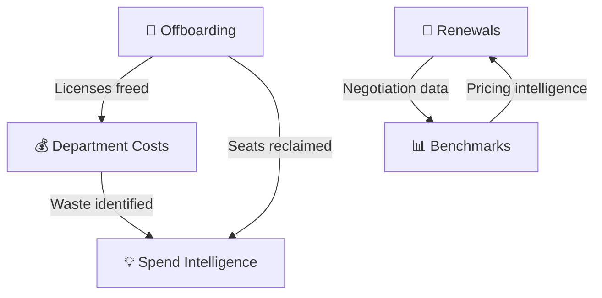

# :gear: Operations Module

**Day-to-day SaaS lifecycle management — offboarding, renewals, benchmarks, and costs.**

The Operations module is where **action gets taken**. From offboarding employees to managing renewals, benchmarking your spend, and analyzing department costs.

<a href="offboarding/" markdown>
:door:
Offboarding
How do we ensure ex-employees lose all access? Automated license revocation synced with HR.
8 pending · 45 completed · 3 overdue
</a>

<a href="renewals/" markdown>
:calendar:
Renewals
What's renewing soon? 30/60/90-day pipeline with AI-powered negotiation assistance.
₹12.8L savings YTD · 8 renewals in 90 days
</a>

<a href="benchmarks/" markdown>
:scales:
Benchmarks
Are we paying more than we should? Compare pricing against industry peers for negotiation leverage.
6 vendors benchmarked · 3 overpriced
</a>

<a href="department-costs/" markdown>
:office:
Department Costs
Which department is spending the most? Per-department breakdown with waste identification.
6 departments · ₹7L waste identified
</a>

---

## How These Features Connect

**Typical operational cycle:**

1. **Offboarding** recovers licenses when employees leave
2. **Renewals** surface upcoming contracts to review before auto-renewal
3. **Benchmarks** provide industry data to negotiate better pricing
4. **Department Costs** show where spend is going and where waste exists

---

## Related Resources

- :link: [Spend Intelligence](../intelligence/spend-intelligence.md) — Cost optimization recommendations
- :link: [Usage Analytics](../intelligence/usage-analytics.md) — License utilization data
- :link: [Contracts](../governance/contracts.md) — Contract detail view
