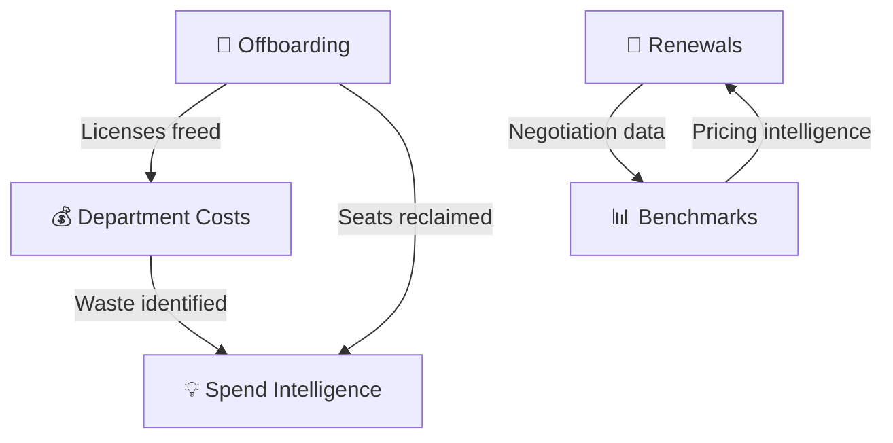

# ⚙️ Operations Module

**Day-to-day SaaS lifecycle management — offboarding, renewals, benchmarks, and costs**

`Home` · **Operations**

---

## Overview

The Operations module handles the **day-to-day lifecycle management** of your SaaS portfolio. From offboarding employees to managing renewals, benchmarking your spend, and analyzing department costs — this is where action gets taken.

---

## What's Inside

| Feature | Purpose | Key Question It Answers |
|---------|---------|------------------------|
| [Offboarding](offboarding.md) | Revoke SaaS access for departing employees | *"How do we ensure ex-employees lose all access?"* |
| [Renewals](renewals.md) | Track and manage contract renewals | *"What's renewing soon and what should we renegotiate?"* |
| [Benchmarks](benchmarks.md) | Compare spend against industry peers | *"Are we paying more than we should?"* |
| [Department Costs](department-costs.md) | Per-department SaaS spend analysis | *"Which department is spending the most and where's the waste?"* |

---

## How These Features Connect

**Typical operational cycle:**
1. **Offboarding** recovers licenses when employees leave
2. **Renewals** surface upcoming contracts to review before auto-renewal
3. **Benchmarks** provide industry data to negotiate better pricing
4. **Department Costs** show where spend is going and where waste exists

---

## Related Resources

- 🔗 [Spend Intelligence](../intelligence/spend-intelligence.md) — Cost optimization recommendations
- 🔗 [Usage Analytics](../intelligence/usage-analytics.md) — License utilization data
- 🔗 [Contracts](../governance/contracts.md) — Contract detail view

---

---

**Was this page helpful?** 👍 Yes · 👎 No · [Suggest an edit](https://github.com/saasiq/saasiq-documentation/edit/main/docs/operations/index.md)

---

<a href="../ai-features/ai-copilot.md">⬅️ AI Copilot</a>&nbsp;&nbsp;·&nbsp;&nbsp;<a href="offboarding.md">Offboarding ➡️</a>

Last updated: March 2026 · SaaSIQ Documentation v1.0.0

