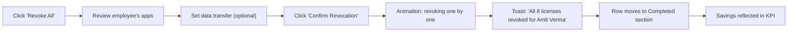
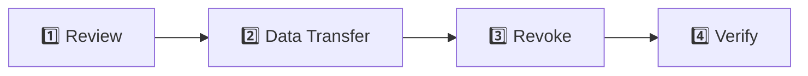
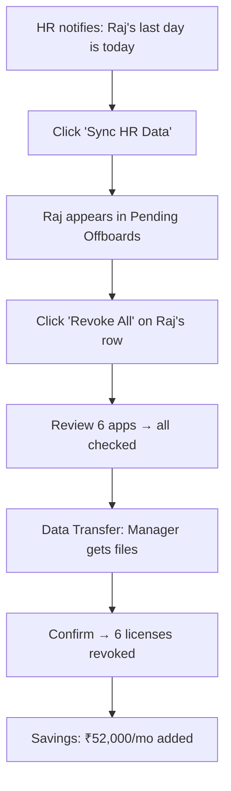

# 🚪 Offboarding

**Revoke SaaS access for departing employees instantly and securely**

`Home` · `Operations` · **Offboarding**

> **Home** · Operations · **Offboarding**

---

## Overview

The Offboarding module ensures that when employees leave your organization, **all their SaaS access is revoked** — preventing security risks, saving on unused licenses, and maintaining compliance. It integrates with your HR system to auto-detect departures and provides both individual and bulk license revocation.

> [!WARNING]
> Delayed offboarding is a security risk. Industry average shows 43% of companies have ex-employees still accessing SaaS tools weeks after departure. SaaSIQ automates this to near-zero.

---

## In This Article

- [KPI Summary Cards](#kpi-summary-cards)
- [Pending Offboards Table](#pending-offboards-table)
- [Completed Offboards](#completed-offboards)
- [Operations: Revoke, Bulk Revoke, HR Sync, Wizard](#operations)
- [Workflows & Scenarios](#workflows--scenarios)
- [Validation Checklist](#validation-checklist)

---

## KPI Summary Cards

| # | Metric | Demo Value | Description |
|---|--------|-----------|-------------|
| 1 | **Pending Offboards** | 5 | Employees who've left but still have active licenses |
| 2 | **Licenses to Revoke** | 23 | Total individual licenses to be revoked |
| 3 | **Monthly Savings** | ₹1.8L | Cost of licenses that will be freed by offboarding |
| 4 | **Avg Offboard Time** | 2.3 days | Average time from departure to full access revocation |

> [!IMPORTANT]
> Target an average offboard time under 24 hours. Same-day revocation is the gold standard for security.

---

## Pending Offboards Table

| Employee | Department | Last Day | Apps | Licenses | Est. Savings | Status | Actions |
|----------|-----------|----------|------|----------|-------------|--------|---------|
| Amit Verma | Engineering | Mar 1 | 8 | 8 | ₹45,000/mo | ⚠️ Overdue (7 days) | [Revoke All] [View] |
| Sneha Kapoor | Marketing | Mar 3 | 5 | 5 | ₹28,000/mo | ⚠️ Overdue (5 days) | [Revoke All] [View] |
| Raj Malhotra | Sales | Mar 5 | 6 | 6 | ₹52,000/mo | 🟡 Pending (3 days) | [Revoke All] [View] |
| Lisa Chen | Design | Mar 7 | 4 | 4 | ₹35,000/mo | 🟢 New (1 day) | [Revoke All] [View] |

**Bulk Action Banner:**

> ⚡ **5 employees pending offboarding** with 23 active licenses
>
> `Revoke All Pending` &nbsp; `Export Report` &nbsp; `Sync HR Data`

**Status definitions:**

| Status | Meaning | Color |
|--------|---------|-------|
| ⚠️ Overdue | Past employee's last day, licenses still active | Red |
| 🟡 Pending | Within grace period (1–3 days after last day) | Yellow |
| 🟢 New | Detected today, not yet processed | Green |

---

## Completed Offboards

<strong>📋 Recently completed offboards</strong>

| Employee | Department | Completed | Apps Revoked | Savings | Time to Complete |
|----------|-----------|-----------|-------------|---------|-----------------|
| Priya Mehta | Product | Feb 28 | 7 | ₹38,000/mo | 1.5 days |
| Karan Singh | Finance | Feb 25 | 4 | ₹22,000/mo | 0.5 days |
| Meera Patel | HR | Feb 20 | 3 | ₹15,000/mo | 2 days |

---

## Operations

### Revoke All (Individual)

**Trigger:** Click **"Revoke All"** on an employee row

**Modal: Offboard Employee**

| Section | Content |
|---------|---------|
| **Employee Info** | Name, department, last day, manager |
| **Active Licenses** | List of all apps with license details |
| **Data Transfer** | Option to transfer files/data to a designated person |
| **Revocation Scope** | Checkboxes per app (all checked by default) |
| **Timeline** | Immediate or scheduled |
| **Confirmation** | "This will revoke access to X apps for [Name]" |

**License list in modal:**

| App | License Type | Last Used | Action |
|-----|-------------|-----------|--------|
| Slack | Enterprise | Mar 1 | ☑️ Revoke |
| GitHub | Enterprise | Feb 28 | ☑️ Revoke |
| Jira | Standard | Feb 27 | ☑️ Revoke |
| Figma | Enterprise | Jan 15 | ☑️ Revoke |
| Google Workspace | Business | Mar 1 | ☑️ Revoke |

**Workflow:**

> [!TIP]
> Use the **"Data Transfer"** option before revoking. This lets you designate someone to receive the departing employee's files, projects, and ownership of shared resources.

---

### Bulk Revoke All Pending

**Trigger:** Click **"Revoke All Pending"** in the bulk action banner

| Step | Description |
|------|-------------|
| 1 | Confirmation: "Revoke 23 licenses across 5 employees?" |
| 2 | Data transfer prompt: "Transfer files to each employee's manager?" |
| 3 | Click "Confirm Bulk Revocation" |
| 4 | Progress bar: "Processing... Amit Verma (1/5)... Sneha Kapoor (2/5)..." |
| 5 | Completion toast: "All 23 licenses revoked. Saving ₹1.8L/month." |
| 6 | All rows move to Completed |

> [!WARNING]
> Bulk revocation is **irreversible** in a single action. Ensure all employees on the list have actually departed before confirming. Check with HR if any are on leave rather than departed.

---

### Sync HR Data

**Trigger:** Click **"Sync HR Data"** button

| Behavior | Description |
|----------|-------------|
| **Purpose** | Pull latest departure data from your HRIS (BambooHR, Workday, etc.) |
| **Animation** | Spinning sync icon with "Syncing with BambooHR..." |
| **Duration** | 2–3 seconds (simulated) |
| **On completion** | Toast: "HR sync complete — 2 new departures detected" |
| **Result** | New employees appear in the pending offboards table |

> [!NOTE]
> HR sync runs automatically every 24 hours. Use the manual sync button when you need real-time data (e.g., same-day termination).

---

### Offboard Wizard

**Trigger:** Click **"View"** on any employee to open the detailed wizard

A guided, step-by-step workflow for comprehensive offboarding:

| Step | Purpose | Actions |
|------|---------|---------|
| **Review** | See all employee's active apps and licenses | Confirm or adjust |
| **Data Transfer** | Transfer ownership of files, projects, shared drives | Select recipient per app |
| **Revoke** | Execute license revocation | Choose immediate or scheduled |
| **Verify** | Confirm all accesses are revoked | Run verification scan |

---

## Workflows & Scenarios

### Scenario 1: "Employee terminated today — immediate offboarding"

### Scenario 2: "Monthly offboarding audit"

1. Open **Offboarding** from sidebar
2. Check KPIs: 5 pending, 23 licenses, ₹1.8L savings available
3. Click **"Sync HR Data"** to ensure data is current
4. Review each pending row — verify with HR
5. For confirmed departures: Click **"Revoke All Pending"**
6. Export completion report for compliance records
7. Return next month and repeat

### Scenario 3: "Security alert — compromised employee account"

1. Open **Offboarding** (even if not on pending list)
2. Search for the employee or add manually
3. Click **"View"** → Offboard Wizard
4. Skip data transfer (urgent security)
5. Revoke ALL immediately
6. Run verification scan to confirm zero access
7. Report to security team: "All 8 app accesses revoked in 3 minutes"

---

## Validation Checklist

- [ ] 4 KPI cards render with values
- [ ] Pending table shows employees with status colors
- [ ] Bulk action banner shows total count
- [ ] "Revoke All" opens modal with correct app list
- [ ] License checkboxes work (select/deselect individual apps)
- [ ] "Data Transfer" option works before revocation
- [ ] Confirm revocation shows progress animation
- [ ] Success toast shows count and savings
- [ ] Row moves to completed section
- [ ] Bulk "Revoke All Pending" processes all employees
- [ ] "Sync HR Data" shows sync animation and result
- [ ] Completed offboards are visible in history
- [ ] KPI cards update after revocations

---

## Related Resources

- 🔗 [Settings — Team Members](../administration/settings.md) — User management
- 🔗 [Usage Analytics](../intelligence/usage-analytics.md) — Utilization data for departing employees
- 🔗 [Alerts & Notifications](../administration/alerts-notifications.md) — Offboarding overdue alerts

---

---

**Was this page helpful?** 👍 Yes · 👎 No · [Suggest an edit](https://github.com/saasiq/saasiq-documentation/edit/main/docs/operations/offboarding.md)

---

<a href="index.md">⬅️ Operations Overview</a>&nbsp;&nbsp;·&nbsp;&nbsp;<a href="renewals.md">Renewals ➡️</a>

Last updated: March 2026 · SaaSIQ Documentation v1.0.0

