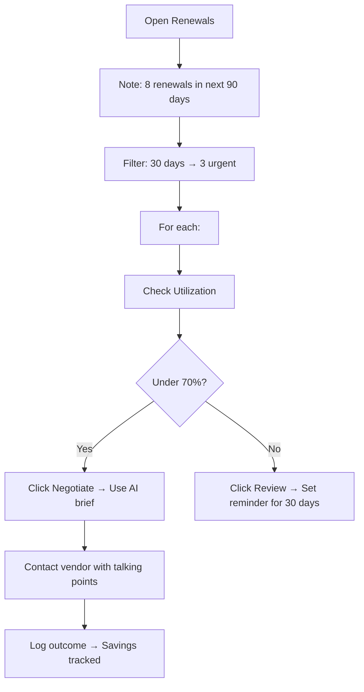

# 📅 Renewals

**Stay ahead of contract renewals with AI-assisted negotiation and reminders**

> **Home** · Operations · **Renewals**

---

## Overview

The Renewals page provides an **operational view** of all upcoming SaaS contract renewals with savings tracking, negotiation tools, and reminder workflows. While [Contracts](../governance/contracts.md) focuses on the full contract lifecycle, Renewals focuses on **what's coming up and what to do about it**.

---

## KPI Summary Cards

| # | Metric | Demo Value | Description |
|---|--------|-----------|-------------|
| 1 | **Renewing in 30 Days** | 3 | Contracts needing attention this month |
| 2 | **Renewing in 60 Days** | 5 | Contracts to prepare for next month |
| 3 | **Renewing in 90 Days** | 8 | Full pipeline view |
| 4 | **Negotiation Savings (YTD)** | ₹38L | Savings from completed negotiations this year |

!!! tip
    Focus on the 30-day number — these are contracts you need to act on NOW. Negotiations should ideally start 60+ days before renewal.

---

## Renewal Table

| Application | Vendor | Annual Cost | Renewal Date | Days Left | Utilization | Status | Action |
|------------|--------|------------|-------------|-----------|-------------|--------|--------|
| Slack Enterprise | Slack Technologies | ₹18,00,000 | Mar 15, 2026 | 7 | 62% | ⚠️ Urgent | [Negotiate] |
| Salesforce CRM | Salesforce Inc. | ₹24,00,000 | Apr 01, 2026 | 24 | 73% | 🟡 Soon | [Review] |
| AWS | Amazon | ₹36,00,000 | Apr 15, 2026 | 38 | — | 🟢 On Track | [Review] |
| Figma | Figma Inc. | ₹8,40,000 | May 01, 2026 | 54 | 29% | 🟢 On Track | [Review] |
| Notion | Notion Labs | ₹4,89,600 | May 20, 2026 | 73 | — | 🟢 On Track | [Review] |

**Table features:**

| Feature | Description |
|---------|-------------|
| **Utilization column** | Pulled live from [Usage Analytics](../intelligence/usage-analytics.md) — shows why negotiation matters |
| **Color-coded status** | ⚠️ Red (<14 days), 🟡 Yellow (<30 days), 🟢 Green (30+ days) |
| **"Negotiate" button** | Appears only on contracts within 30 days |
| **Sort/Filter** | By date, cost, status, or vendor |
| **Inline sparkline** | Cost trend arrow showing annual cost change |

!!! tip
    The Utilization column is your most powerful negotiation tool. Slack at 62% means you're paying for 500 seats but only using 312 — that's ammunition for a seat reduction or discount.

---

## Operations

### Negotiate

**Trigger:** Click **"Negotiate"** on urgent/soon renewals (same as [Contracts → Negotiate](../governance/contracts.md#negotiate-contract))

**Quick summary of what the modal provides:**
- Current pricing vs. industry benchmark
- Utilization-based talking points
- AI-generated negotiation brief
- Recommended actions (reduce seats, lock multi-year, request discount)
- One-click: Copy brief, email vendor, download PDF

### Review

**Trigger:** Click **"Review"** on any renewal row

Opens contract detail showing all tabs (Overview, Cost History, Usage, Compliance, Documents, Notes). See [Contracts → Review](../governance/contracts.md#review-contract) for full documentation.

### Set Reminder

**Trigger:** Available inside the Review modal

| Reminder Option | When |
|----------------|------|
| 90 days before | Start evaluation |
| 60 days before | Begin negotiations |
| 30 days before | Final decision needed |
| 7 days before | Last chance before auto-renew |
| Custom | Pick any date |

Reminders appear in [Alerts & Notifications](../administration/alerts-notifications.md) and optionally via email.

---

## Workflows & Scenarios

### Scenario: "Quarterly renewal planning"

---

## Validation Checklist

- [ ] 4 KPI cards render (30/60/90 day counts + YTD savings)
- [ ] Renewal table shows all upcoming renewals sorted by date
- [ ] Status colors match renewal urgency
- [ ] "Negotiate" appears only on <30 day renewals
- [ ] "Review" opens contract detail modal
- [ ] Utilization column shows live data from Usage Analytics
- [ ] Sort and filter controls work
- [ ] Set Reminder creates an alert

---

## Related Resources

- 🔗 [Contracts](../governance/contracts.md) — Full contract lifecycle management
- 🔗 [Benchmarks](benchmarks.md) — Pricing data for negotiations
- 🔗 [Spend Intelligence](../intelligence/spend-intelligence.md) — AI optimization recommendations
- 🔗 [AI Insights](../ai-features/ai-insights.md) — Proactive renewal risk predictions

---
