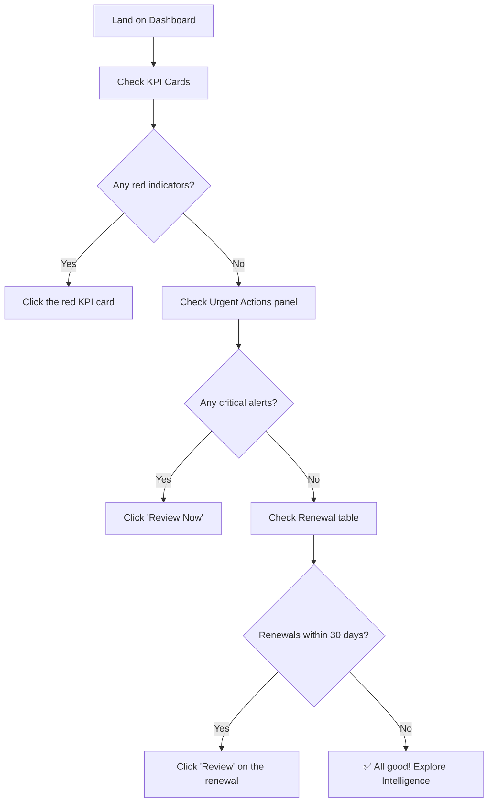

# 📊 Dashboard

**Your SaaS command center — the real-time health of your entire portfolio**

`Home` · `Overview` · **Dashboard**

---

## Overview

The Dashboard is your **SaaS command center** — the first screen you see after login. It provides a real-time snapshot of your organization's SaaS health across four key dimensions: **application count, spend, savings potential, and license utilization**.

Every metric on the Dashboard is clickable, leading you deeper into the relevant module for detailed analysis.

---

## In This Article

- [Page Layout](#page-layout)
- [Application Shell](#application-shell)
- [KPI Cards](#kpi-cards)
- [Charts & Visualizations](#charts--visualizations)
- [Urgent Actions Panel](#urgent-actions-panel)
- [Upcoming Renewals Table](#upcoming-renewals-table)
- [Top Apps by Spend Table](#top-apps-by-spend-table)
- [Floating Navigator](#floating-navigator)
- [Interactions & Workflows](#interactions--workflows)

---

## Page Layout

<table>
<tr>
<th colspan="2" align="left">
🟣 SaaSIQ &nbsp;&nbsp;&nbsp;🔍 Search... &nbsp;&nbsp;&nbsp; 🔔 3 &nbsp; 🏢 TechCorp ▾ &nbsp; 👤
</th>
</tr>
<tr>
<td width="140" valign="top">

**OVERVIEW**  
▸ Dashboard   
**INTELLIGENCE**  
▸ SaaS Discovery  
▸ Spend Intel  
▸ Usage   
**GOVERNANCE**  
▸ Compliance  
▸ Contracts  
▸ Policies   
**AI FEATURES**  
▸ Insights  
▸ Copilot   
**OPERATIONS**  
▸ Offboarding  
▸ Renewals  
▸ Benchmarks  
▸ Dept Cost

</td>
<td valign="top">

| KPI 1 | KPI 2 | KPI 3 | KPI 4 |
|:--:|:--:|:--:|:--:|
| **156** Total Apps | **₹42.5L** Monthly | **₹12.8L** Savings | **67%** Utilization |

**📈 Spend Trend** (12-month line chart) &nbsp;&nbsp; **🍩 Category Split** (donut chart)

> ⚠️ **URGENT ACTIONS**  
> • 3 shadow IT apps detected  
> • Slack renewal in 5 days  
> • 23 unused Figma licenses

**📅 Upcoming Renewals** (table) &nbsp;&nbsp;&nbsp; **📊 Top Apps by Spend** (table)

 

🧭 Floating Navigator

</td>
</tr>
</table>

---

## Application Shell

The application shell is the permanent outer frame that wraps every page in SaaSIQ. Understanding it is essential to navigating the platform.

### Top Bar

| Element | Position | Function | Interaction |
|---------|----------|----------|-------------|
| **🟣 SaaSIQ Logo** | Far left | Brand identity | Click → returns to Dashboard |
| **🔍 Search Bar** | Center | Global search across apps, users, and settings | Type to search → results dropdown |
| **🔔 Notification Bell** | Right | Shows unread alert count (badge) | Click → [Alerts panel](../administration/alerts-notifications.md) |
| **🏢 Org Switcher** | Right | Shows current org name | Click → [org switcher dropdown](../administration/organization-management.md) |
| **👤 User Avatar** | Far right | Profile and account menu | Click → dropdown (Profile, Help, Shortcuts, Logout) |

<strong>🔍 How does Global Search work?</strong>

1. Click the search bar or press `Ctrl + K` / `⌘ + K`
2. Type your query — searches across:
   - Application names (e.g., "Slack", "Figma")
   - User names (e.g., "Rahul Sharma")
   - Settings sections (e.g., "billing")
   - Dashboard sections (e.g., "compliance")
3. Results appear in a dropdown grouped by category
4. Click a result to navigate directly to that item
5. Press `Escape` to close

### Sidebar Navigation

The sidebar is your primary navigation. It's organized by **module groups** matching the platform architecture:

| Group | Menu Items | Badge |
|-------|-----------|-------|
| **OVERVIEW** | Dashboard | — |
| **INTELLIGENCE** | SaaS Discovery, Spend Intelligence, Usage Analytics | `8 new` on Discovery |
| **GOVERNANCE** | Compliance & Risk, Contracts, Policies | — |
| **AI FEATURES** | AI Insights, AI Copilot | — |
| **OPERATIONS** | Offboarding, Renewals, Benchmarks, Department Costs | `5` on Offboarding |

**Sidebar interactions:**

| Action | Result |
|--------|--------|
| Click any menu item | Navigates to that page; item highlights purple |
| Hover over collapsed item | Shows tooltip with full name |
| Active page | Has purple left border + purple text + darker background |
| Badge numbers | Update in real-time based on pending actions |

> [!TIP]
> The badge `8 new` on SaaS Discovery indicates newly detected applications. The badge `5` on Offboarding shows pending access revocations.

---

## KPI Cards

The four KPI cards at the top provide an at-a-glance summary of your SaaS health.

| # | Card | Value (Demo) | Trend | Icon | Click Action |
|---|------|-------------|-------|------|-------------|
| 1 | **Total Applications** | 156 | +12 this month ↑ | 📦 | → [SaaS Discovery](../intelligence/saas-discovery.md) |
| 2 | **Monthly Spend** | ₹42.5L | -8% vs last month ↓ | 💰 | → [Spend Intelligence](../intelligence/spend-intelligence.md) |
| 3 | **Potential Savings** | ₹12.8L | AI-identified | 🎯 | → [AI Insights](../ai-features/ai-insights.md) |
| 4 | **Avg Utilization** | 67% | +3% improvement ↑ | 📊 | → [Usage Analytics](../intelligence/usage-analytics.md) |

**Visual design:**
- Each card has a subtle gradient background matching its category color
- Trend indicators use green (↑ positive) or red (↓ negative) coloring
- Numbers animate from 0 on page load (counting up effect)

> [!TIP]
> Each KPI card is clickable. Clicking it navigates to the detailed module where you can drill down into the data behind that metric.

<strong>📊 How are these metrics calculated?</strong>

| Metric | Calculation |
|--------|------------|
| **Total Applications** | Count of unique apps discovered across all connected integrations + manually added apps |
| **Monthly Spend** | Sum of all contract costs prorated to monthly, plus usage-based billing from connected finance data |
| **Potential Savings** | AI-computed sum of: unused license costs + overlap savings + downgrade savings + negotiation room |
| **Avg Utilization** | Mean of (active users ÷ purchased licenses × 100) across all applications |

---

## Charts & Visualizations

### Spend Trend — Line Chart

| Property | Details |
|----------|---------|
| **Type** | Multi-line time series |
| **X-Axis** | 12 months (rolling) |
| **Y-Axis** | Monthly spend in ₹ Lakhs |
| **Lines** | Total Spend (solid), Optimized Spend (dashed) |
| **Interaction** | Hover any point → tooltip shows exact month, spend value, and change % |

**What to look for:**
- **Gap between lines** = Your savings opportunity
- **Upward trend** = SaaS spend growing (investigate in [Spend Intelligence](../intelligence/spend-intelligence.md))
- **Spikes** = Large one-time purchases or annual renewals

### Category Split — Donut Chart

| Property | Details |
|----------|---------|
| **Type** | Donut (ring) chart |
| **Segments** | Productivity, Development, Communication, Security, Design, Other |
| **Center** | Total monthly spend value |
| **Interaction** | Hover segment → shows category name, amount, and percentage |
| **Click** | Click segment → filters Spend Intelligence to that category |

**Demo data breakdown:**

| Category | Spend | Percentage |
|---------|-------|-----------|
| Productivity | ₹12.4L | 29% |
| Development | ₹9.8L | 23% |
| Communication | ₹7.6L | 18% |
| Security | ₹5.2L | 12% |
| Design | ₹4.3L | 10% |
| Other | ₹3.2L | 8% |

---

## Urgent Actions Panel

A highlighted section that surfaces the most critical items requiring your attention.

| # | Alert | Severity | Action Button | Leads To |
|---|-------|----------|--------------|----------|
| 1 | "3 shadow IT apps detected — unapproved tools found in Engineering" | 🔴 Critical | **Review Now** | [SaaS Discovery](../intelligence/saas-discovery.md) |
| 2 | "Slack Enterprise renewal in 5 days — ₹18L annual contract" | 🟡 Warning | **Review Renewal** | [Renewals](../operations/renewals.md) |
| 3 | "23 unused Figma licenses — saving opportunity ₹2.3L/year" | 🔵 Info | **Optimize** | [Usage Analytics](../intelligence/usage-analytics.md) |

**Interactions:**

| Action | Result |
|--------|--------|
| Click **"Review Now"** | Navigates to SaaS Discovery with shadow IT filter active |
| Click **"Review Renewal"** | Navigates to Renewals with Slack highlighted |
| Click **"Optimize"** | Navigates to Usage Analytics filtered to Figma |
| Click **"Dismiss"** (×) | Removes the alert from urgent actions (moves to alert history) |

> [!WARNING]
> Dismissing a critical alert does NOT resolve the underlying issue. Always investigate before dismissing.

---

## Upcoming Renewals Table

| Column | Sample Data |
|--------|------------|
| **Application** | Slack Enterprise |
| **Renewal Date** | Mar 15, 2026 |
| **Annual Cost** | ₹18,00,000 |
| **Status** | ⚠️ Due in 5 days |
| **Action** | `Review` button |

| Application | Renewal Date | Annual Cost | Status | Action |
|------------|-------------|-------------|--------|--------|
| Slack Enterprise | Mar 15, 2026 | ₹18,00,000 | ⚠️ 5 days | Review |
| Salesforce CRM | Apr 01, 2026 | ₹24,00,000 | 🟢 24 days | Review |
| AWS | Apr 15, 2026 | ₹36,00,000 | 🟢 38 days | Review |
| Figma | May 01, 2026 | ₹8,40,000 | 🟢 54 days | Review |

**Interactions:**

| Action | Result |
|--------|--------|
| Click app name | Opens app detail view in SaaS Discovery |
| Click **"Review"** | Opens renewal review modal (see [Renewals](../operations/renewals.md)) |
| Click **"View All Renewals"** | Navigates to [Renewals](../operations/renewals.md) page |
| Sort by column | Click column header to sort ascending/descending |

---

## Top Apps by Spend Table

| Application | Category | Monthly Cost | Users | Utilization | Trend |
|------------|----------|-------------|-------|------------|-------|
| Salesforce CRM | CRM | ₹2,00,000 | 145/200 | 73% | ↑ |
| Slack Enterprise | Communication | ₹1,50,000 | 312/500 | 62% | ↓ |
| AWS | Cloud | ₹3,00,000 | — | — | → |
| Jira | Project Mgmt | ₹85,000 | 89/120 | 74% | ↑ |
| Figma | Design | ₹70,000 | 23/80 | 29% | ↓ |

**Interactions:**

| Action | Result |
|--------|--------|
| Click app name | Opens app detail in SaaS Discovery |
| Click utilization % | Opens Usage Analytics filtered to that app |
| Click **"View All"** | Navigates to [Spend Intelligence](../intelligence/spend-intelligence.md) |
| Hover trend arrow | Tooltip shows month-over-month change |

> [!TIP]
> Red trend arrows (↓ in utilization, ↑ in spend) are signals to investigate. A 29% utilization on Figma is a clear optimization opportunity.

---

## Floating Navigator

A circular button (🧭) in the bottom-right corner that provides quick access to any section.

| Action | Result |
|--------|--------|
| Click 🧭 | Expands a radial menu with all page shortcuts |
| Click any shortcut | Navigates directly to that page |
| Click outside the menu | Closes the navigator |
| Press `Escape` | Closes the navigator |

**Available shortcuts from navigator:**
- Landing Page, Dashboard, SaaS Discovery, Spend Intelligence
- Usage Analytics, Compliance, Contracts, Policies
- AI Insights, AI Copilot, Offboarding, Renewals
- Benchmarks, Department Costs, Settings, Demo

---

## Interactions & Workflows

### Scenario 1: "I just logged in — what should I check first?"

### Scenario 2: "I want to reduce our SaaS spend"

1. **Check the KPI cards** — Note "Potential Savings" amount (₹12.8L)
2. **Click the Potential Savings card** → Goes to AI Insights
3. **Review each recommendation** → Apply, Review, or Dismiss
4. **Validate via Spend Intelligence** → Compare before/after
5. **Track via Dashboard** → Monthly Spend trend should decline

### Scenario 3: "I got notified about shadow IT"

1. **Check Urgent Actions** — "3 shadow IT apps detected"
2. **Click "Review Now"** → Opens SaaS Discovery in shadow IT view
3. **For each app** → Approve (add to managed) or Block (restrict access)
4. **Return to Dashboard** → Urgent action count decreases

---

## Validation Checklist

### Page Load
- [ ] Dashboard loads after login / clicking Dashboard in sidebar
- [ ] Top bar shows logo, search, notifications, org switcher, avatar
- [ ] Sidebar shows all 5 module groups with correct menu items
- [ ] Active page (Dashboard) is highlighted in sidebar

### KPI Cards
- [ ] All 4 KPI cards render with values, trends, and icons
- [ ] Numbers animate on page load
- [ ] Clicking each card navigates to the correct module
- [ ] Trend arrows are colored (green positive, red negative)

### Charts
- [ ] Spend Trend line chart renders with 12-month data
- [ ] Hover on data points shows tooltips
- [ ] Category donut chart shows all segments
- [ ] Center of donut shows total value
- [ ] Hovering a segment highlights it and shows details

### Tables
- [ ] Upcoming Renewals table shows entries sorted by date
- [ ] "Review" buttons are clickable
- [ ] Top Apps table shows app name, cost, utilization
- [ ] "View All" links navigate correctly

### Urgent Actions
- [ ] At least one urgent action visible
- [ ] Severity colors match alert level (red/yellow/blue)
- [ ] Action buttons navigate to correct pages
- [ ] Dismiss (×) removes the alert

### Navigation
- [ ] Floating navigator (🧭) expands on click
- [ ] All navigator shortcuts work
- [ ] Sidebar items navigate correctly
- [ ] Notification bell shows count and opens alerts

---

## Related Resources

- 🔗 [Quick Start Guide](../getting-started/quick-start.md) — Setting up your account
- 🔗 [SaaS Discovery](../intelligence/saas-discovery.md) — Deep dive into app inventory
- 🔗 [Spend Intelligence](../intelligence/spend-intelligence.md) — Cost optimization
- 🔗 [Alerts & Notifications](../administration/alerts-notifications.md) — Managing alerts
- 🔗 [Keyboard Shortcuts](../reference/keyboard-shortcuts.md) — Navigate faster

---

---

**Was this page helpful?** 👍 Yes · 👎 No · [Suggest an edit](https://github.com/saasiq/saasiq-documentation/edit/main/docs/overview/dashboard.md)

---

<a href="../getting-started/onboarding.md">⬅️ Onboarding Wizard</a>&nbsp;&nbsp;·&nbsp;&nbsp;<a href="../intelligence/index.md">Intelligence Module ➡️</a>

Last updated: March 2026 · SaaSIQ Documentation v1.0.0

